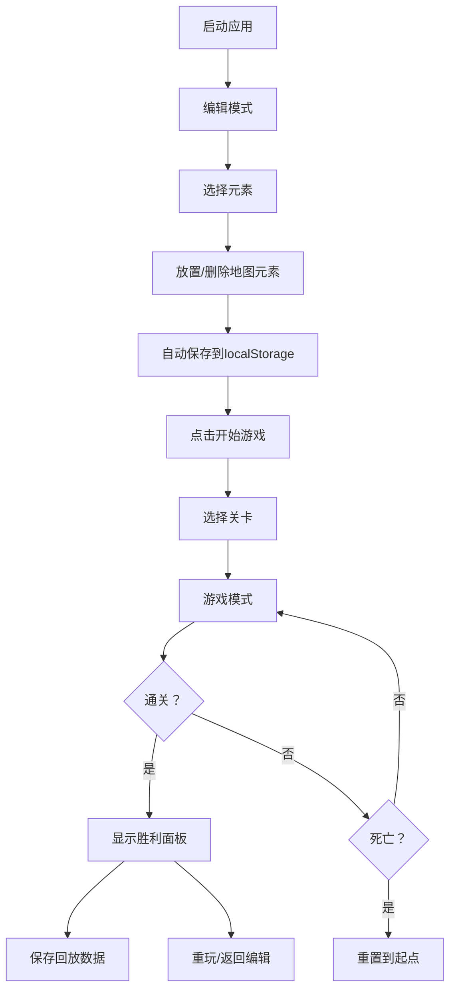

## 1. 产品概述

2D平台跳跃关卡编辑器与游戏运行应用，解决玩家难以快速设计并验证自定义关卡创意的问题。用户可以通过直观的网格编辑界面快速创建关卡，即时体验游戏效果，并保存和回放通关记录。

- **主要目的**：提供一个轻量级、低门槛的关卡设计工具，让玩家能够快速将创意转化为可游玩的关卡
- **目标用户**：平台跳跃游戏爱好者、独立游戏开发者、关卡设计学习者
- **产品价值**：无需编程基础，通过可视化编辑快速验证关卡设计，降低创意实现门槛

## 2. 核心功能

### 2.2 功能模块

1. **关卡编辑界面**：16x12网格编辑面板，元素工具栏，地图操作按钮
2. **游戏运行界面**：角色物理系统，碰撞检测，计时器，通关判定
3. **关卡管理系统**：本地存储，关卡选择，通关回放

### 2.3 页面详情

| 页面名称 | 模块名称 | 功能描述 |
|-----------|-------------|---------------------|
| 关卡编辑界面 | 网格编辑面板 | 16x12网格（每格32x32像素），支持左键放置、右键删除、拖拽批量填充 |
| 关卡编辑界面 | 元素工具栏 | 地面砖块（灰色方块）、尖刺陷阱（红色三角）、移动平台（浅蓝色长条）、终点旗帜（绿色竖条） |
| 关卡编辑界面 | 操作按钮 | 清空地图、保存关卡、切换到游戏模式 |
| 游戏运行界面 | 角色控制系统 | 左右移动、空格跳跃（支持二段跳，最高3格高度）、惯性物理 |
| 游戏运行界面 | 游戏状态系统 | 计时器（精确到0.01秒）、死亡重置、通关判定、胜利面板 |
| 游戏运行界面 | 动画系统 | 跳跃落地蹲伏动画（0.1秒）、胜利面板淡入动画 |
| 关卡管理系统 | 自动保存 | 编辑后自动保存到localStorage，最多存储5个关卡 |
| 关卡管理系统 | 关卡选择 | 游戏开始前可选择已保存的关卡进行游玩 |
| 关卡管理系统 | 通关回放 | 记录角色每一帧位置和状态，慢速回放通关过程 |

## 3. 核心流程

### 3.1 关卡编辑流程
用户打开应用默认进入编辑模式 → 选择工具栏元素 → 点击/拖拽网格放置元素 → 右键删除不需要的元素 → 编辑完成后自动保存 → 点击开始游戏按钮进入游戏模式

### 3.2 游戏游玩流程
进入游戏模式 → 选择关卡 → 角色出生在起点 → 控制角色移动跳跃 → 躲避尖刺陷阱 → 利用移动平台 → 到达终点旗帜 → 显示通关时间和重玩按钮

### 3.3 通关回放流程
通关后自动保存回放数据 → 在关卡选择界面选择回放 → 系统以慢速播放通关过程 → 显示角色移动路径和时间轴

## 4. 用户界面设计

### 4.1 设计风格
- **主题配色**：深色主题，背景色#1a1a2e，网格线#16213e
- **元素配色**：地面砖块#6b7280（灰色）、尖刺陷阱#ef4444（红色）、移动平台#93c5fd（浅蓝色）、终点旗帜#22c55e（绿色）、玩家角色#3b82f6（蓝色）
- **按钮样式**：圆角设计（border-radius: 6px），点击时有缩放反馈（scale: 1 → 0.95 → 1）
- **字体选择**：主标题使用 'JetBrains Mono' 等宽字体，正文使用 'Segoe UI' 系统字体
- **布局风格**：编辑界面左重右轻（网格区+工具栏），游戏界面全屏沉浸

### 4.2 页面设计概述

| 页面名称 | 模块名称 | UI元素 |
|-----------|-------------|-------------|
| 关卡编辑界面 | 网格编辑面板 | 16x12网格线、元素预览、悬停高亮、拖拽选区 |
| 关卡编辑界面 | 元素工具栏 | 图标+颜色方块、选中状态高亮、水平/垂直移动平台切换 |
| 关卡编辑界面 | 底部操作区 | 清空按钮（红色）、保存按钮（蓝色）、开始游戏按钮（绿色） |
| 游戏运行界面 | 游戏画布 | 全屏地图渲染、角色动画、移动平台运动轨迹 |
| 游戏运行界面 | 顶部状态栏 | 实时计时器、关卡名称、返回编辑按钮 |
| 游戏运行界面 | 胜利面板 | 半透明背景、绿色边框淡入动画、通关时间显示、重玩/返回按钮 |
| 关卡选择弹窗 | 关卡列表 | 关卡缩略图、创建时间、选择/删除操作 |

### 4.3 动效设计
- **按钮点击**：scale从1到0.95再弹回，时长150ms
- **胜利面板**：透明度从0到1，边框颜色从透明到绿色，时长300ms
- **元素放置**：元素从小放大到正常大小，时长100ms
- **蹲伏动画**：角色高度从100%压缩到80%再恢复，时长100ms
- **移动平台**：平滑往复运动，根据路径长度自动调整速度

### 4.4 响应式设计
- **桌面端优先**：针对桌面设备优化，Canvas固定尺寸（512x384像素）
- **窗口适配**：游戏模式下居中显示，保持原始比例
- **触控优化**：移动端支持触摸放置元素，但主要面向桌面用户

### 4.5 性能要求
- 编辑操作响应延迟 ≤ 50ms
- 游戏运行帧率稳定在 60fps
- 回放数据存储占用 ≤ 100KB/关卡
