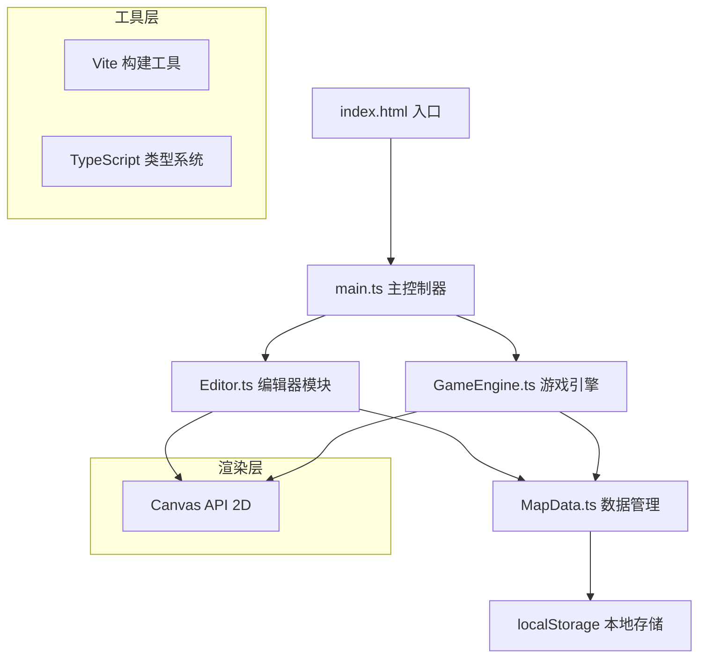

## 1. 架构设计



## 2. 技术描述

- **前端技术栈**：TypeScript 5.x + Canvas API + Vite 5.x
- **构建工具**：Vite 5.x，提供热更新和快速构建
- **类型系统**：TypeScript 严格模式（strict: true）
- **渲染引擎**：原生 Canvas 2D API，无需额外游戏引擎
- **数据存储**：浏览器 localStorage，无需后端服务
- **初始化方式**：npm create vite@latest . -- --template vanilla-ts

## 3. 文件结构

| 文件路径 | 职责描述 |
|----------|----------|
| [package.json](file:///c:/Users/Administrator/Desktop/VersionFast/VersionFast/tasks/auto63/package.json) | 项目依赖配置，包含 typescript、vite 依赖和 dev 启动脚本 |
| [index.html](file:///c:/Users/Administrator/Desktop/VersionFast/VersionFast/tasks/auto63/index.html) | 应用入口页面，包含 Canvas 容器和 UI 元素 |
| [tsconfig.json](file:///c:/Users/Administrator/Desktop/VersionFast/VersionFast/tasks/auto63/tsconfig.json) | TypeScript 配置，启用严格模式 |
| [vite.config.js](file:///c:/Users/Administrator/Desktop/VersionFast/VersionFast/tasks/auto63/vite.config.js) | Vite 基础构建配置 |
| [src/main.ts](file:///c:/Users/Administrator/Desktop/VersionFast/VersionFast/tasks/auto63/src/main.ts) | 主控制器，初始化画布，管理编辑/运行模式切换，协调各模块 |
| [src/Editor.ts](file:///c:/Users/Administrator/Desktop/VersionFast/VersionFast/tasks/auto63/src/Editor.ts) | 编辑器模块，网格绘制、元素放置/删除、鼠标事件、自动保存 |
| [src/GameEngine.ts](file:///c:/Users/Administrator/Desktop/VersionFast/VersionFast/tasks/auto63/src/GameEngine.ts) | 游戏引擎，物理碰撞、角色更新、通关/死亡检测、回放记录 |
| [src/MapData.ts](file:///c:/Users/Administrator/Desktop/VersionFast/VersionFast/tasks/auto63/src/MapData.ts) | 数据管理，地图结构定义、localStorage 读写、格式转换 |

## 4. 核心数据结构

### 4.1 地图元素类型

```typescript
enum TileType {
  EMPTY = 0,      // 空地
  GROUND = 1,     // 地面砖块（灰色方块）
  SPIKE = 2,      // 尖刺陷阱（红色三角）
  PLATFORM_H = 3, // 水平移动平台（浅蓝色长条）
  PLATFORM_V = 4, // 垂直移动平台（浅蓝色长条）
  GOAL = 5,       // 终点旗帜（绿色竖条）
}
```

### 4.2 地图数据结构

```typescript
interface MapData {
  id: string;
  name: string;
  createdAt: number;
  tiles: TileType[][]; // 12行 x 16列
  platforms: PlatformConfig[];
  replayData?: ReplayFrame[];
  bestTime?: number;
}

interface PlatformConfig {
  id: string;
  type: 'horizontal' | 'vertical';
  startX: number; // 格子坐标
  startY: number;
  endX: number;
  endY: number;
  speed: number;  // 像素/秒
}
```

### 4.3 回放数据结构

```typescript
interface ReplayFrame {
  timestamp: number;
  playerX: number;
  playerY: number;
  velocityX: number;
  velocityY: number;
  isGrounded: boolean;
  jumpCount: number;
  animationState: 'idle' | 'running' | 'jumping' | 'crouching';
}
```

### 4.4 玩家状态

```typescript
interface PlayerState {
  x: number;           // 像素坐标
  y: number;
  width: number;
  height: number;
  velocityX: number;
  velocityY: number;
  isGrounded: boolean;
  jumpCount: number;   // 当前跳跃次数（0,1,2）
  maxJumps: number;    // 最大跳跃次数（2）
  isCrouching: boolean;
  crouchTimer: number;
}
```

## 5. 核心算法

### 5.1 物理系统参数
```typescript
const GRAVITY = 1800;        // 重力加速度（像素/秒²）
const MOVE_SPEED = 250;      // 移动速度（像素/秒）
const JUMP_FORCE = -520;     // 跳跃力（像素/秒），最高3格
const FRICTION = 0.85;       // 摩擦系数
const MAX_FALL_SPEED = 900;  // 最大下落速度
```

### 5.2 碰撞检测算法
- **AABB碰撞检测**：玩家与砖块、移动平台的矩形碰撞
- **分轴检测**：先检测X轴碰撞，再检测Y轴碰撞，避免穿墙
- **平台边缘检测**：移动平台需要检测玩家是否站在平台上

### 5.3 渲染循环
- 使用 `requestAnimationFrame` 实现60fps稳定渲染
- 时间步长固定为 16.67ms（1/60秒），确保物理计算一致性
- 采用累加器模式处理可变帧率

## 6. 性能优化

### 6.1 编辑性能
- 仅在鼠标位置变化时重新计算悬停格子
- 拖拽填充使用脏矩形渲染，避免全量重绘
- 使用离屏Canvas缓存静态地图元素

### 6.2 游戏性能
- 碰撞检测只检测玩家周围3x3范围的砖块
- 移动平台状态每帧更新，但只在可见时渲染
- 回放数据使用增量编码压缩存储

## 7. 事件系统

### 7.1 编辑器事件
- `mousedown` / `touchstart`：开始放置/删除元素
- `mousemove` / `touchmove`：拖拽填充，更新悬停高亮
- `mouseup` / `touchend`：结束放置操作
- `contextmenu`：阻止默认右键菜单，支持右键删除

### 7.2 游戏事件
- `keydown`：空格跳跃，方向键/AD移动
- `keyup`：释放移动键，应用摩擦力
- `blur`：窗口失焦时暂停游戏
