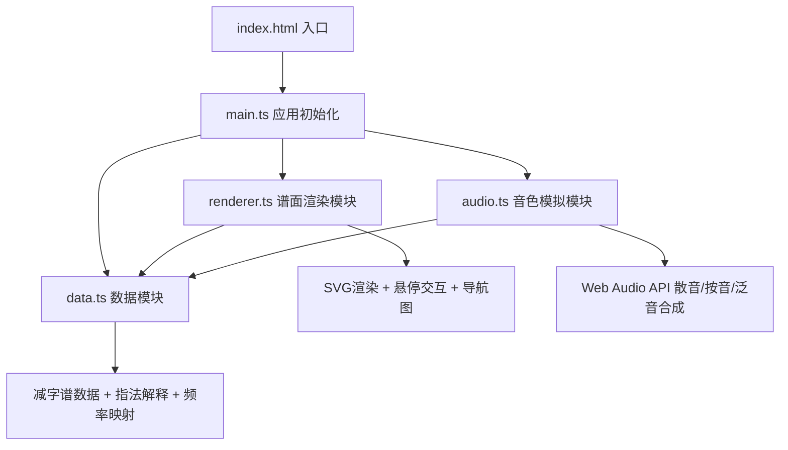

## 1. 架构设计



## 2. 技术描述
- **前端框架**：原生 TypeScript（无框架），使用模块化组织
- **构建工具**：Vite
- **音频引擎**：Web Audio API（OscillatorNode + GainNode + ConvolverNode）
- **图形渲染**：SVG 矢量图（动态生成）
- **样式方案**：原生 CSS（CSS Variables + CSS Animations）
- **字体方案**：Google Fonts（Ma Shan Zheng 书法字体 + Noto Serif SC 衬线字体）

## 3. 模块职责

### 3.1 src/data.ts - 数据层
- 存储10首古琴曲减字谱片段数据
- 每首曲目包含：曲名、减字谱字数组（每个字含左手信息、右手信息、弦数、徽位、技法类型）
- 指法解释映射（白话文描述）
- 琴弦频率映射表（散音频率、按音不同徽位的频率计算、泛音频率）
- 提供查询接口：`getPiece(id)`, `getJianziInfo(jianzi)`, `getFrequency(string, hui, technique)`

### 3.2 src/audio.ts - 音频层
- 封装 Web Audio API，单例模式管理 AudioContext
- 三种音色合成器：
  - 散音：基频 + 谐波叠加，ADSR包络，缓慢衰减，轻微颤音
  - 按音：基频为主，带有滑动音效果，衰减较散音快
  - 泛音：高次谐波为主，带卷积混响（空灵感），快速起音快速衰减
- 提供播放接口：`playNote(string: number, hui: number | null, technique: 'san' | 'an' | 'fan')`

### 3.3 src/renderer.ts - 渲染层
- SVG 减字谱渲染器：动态生成每个减字的 SVG（上下结构）
- 悬停交互：监听 mouseenter/mouseleave，添加外发光滤镜类
- 悬浮信息框：动态创建 DOM 元素，定位到减字附近，显示白话文释义
- 缩略导航图：生成完整谱面的缩小版 SVG，高亮当前视口位置，点击跳转
- 指法练习区渲染：七根琴弦 SVG，点击事件绑定，水波扩散动画

### 3.4 src/main.ts - 入口层
- 初始化 AudioContext（用户首次交互时）
- 初始化谱面渲染器
- 绑定全局事件（曲目切换、窗口 resize 响应式处理）

## 4. 核心数据结构

### 4.1 减字谱字数据结构
```typescript
interface Jianzi {
  id: string;
  leftHand: {
    finger: string;      // 左手手指：大、食、中、名、无
    hui: number | null;  // 徽位：1-13，null表示散音
    position: string;    // 位置描述（如"九徽"）
  };
  rightHand: {
    technique: string;   // 右手技法：勾、挑、抹、剔、打、摘、托、擘
    string: number;      // 弦数：1-7
  };
  techniqueType: 'san' | 'an' | 'fan';  // 散音、按音、泛音
  explanation: string;   // 白话文解释
}
```

### 4.2 曲目数据结构
```typescript
interface Piece {
  id: string;
  name: string;           // 曲目名称
  jianziList: Jianzi[];   // 减字谱字列表
}
```

## 5. 频率映射表
古琴标准定弦（正调F调）：
- 七弦：C3 (130.81 Hz) - 最细
- 六弦：D3 (146.83 Hz)
- 五弦：G3 (196.00 Hz)
- 四弦：A3 (220.00 Hz)
- 三弦：C4 (261.63 Hz)
- 二弦：D4 (293.66 Hz)
- 一弦：F4 (349.23 Hz) - 最粗

按音频率按徽位比例计算，泛音为对应位置的分数谐波。
