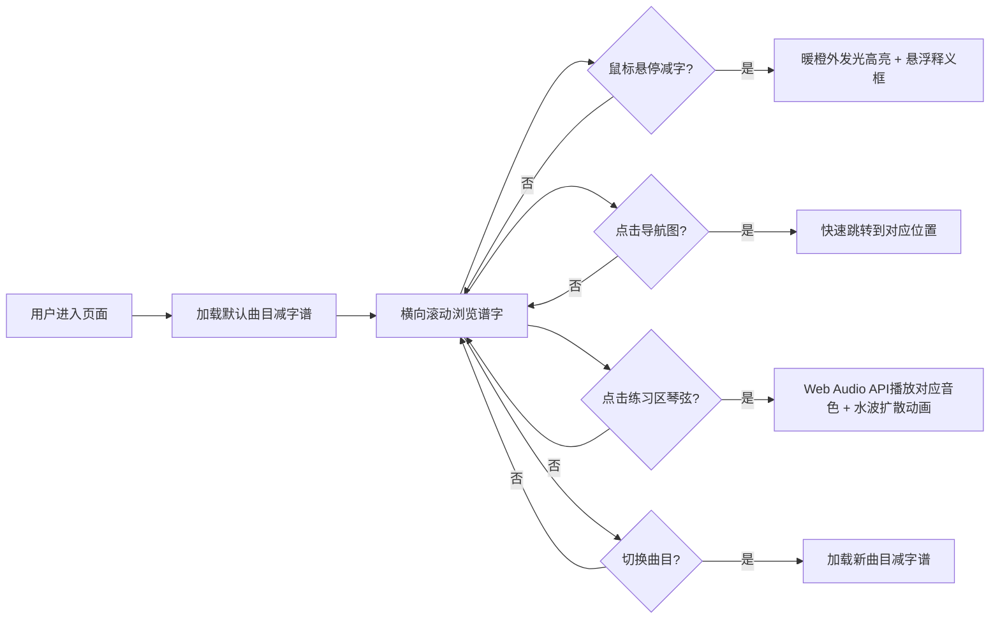

## 1. 产品概述
古琴减字谱交互式识读与练习平台，面向古琴学习者与爱好者，通过可视化交互方式帮助用户理解减字谱符号含义并进行指法练习。
- 解决古琴减字谱入门学习门槛高、符号含义抽象、缺乏即时听觉反馈等痛点
- 产品价值：降低古琴学习门槛，提供沉浸式的交互式学习体验

## 2. 核心功能

### 2.1 用户角色
| 角色 | 注册方式 | 核心权限 |
|------|----------|----------|
| 普通用户 | 无需注册，直接使用 | 浏览减字谱、悬停查看释义、点击播放音色、进行指法练习 |

### 2.2 功能模块
1. **减字谱展示模块**：SVG矢量图渲染减字谱，悬停高亮，悬浮信息框释义，缩略导航图
2. **音色模拟模块**：Web Audio API生成散音、按音、泛音三种古琴音色
3. **指法练习模块**：七弦琴弦可视化点击，对应音色播放，水波扩散动画
4. **曲目选择模块**：10首常见古琴曲减字谱片段切换

### 2.3 页面详情
| 页面名称 | 模块名称 | 功能描述 |
|----------|----------|----------|
| 主页面 | 减字谱展示区 | SVG渲染减字谱，横向滚动，悬停高亮暖橙外发光，悬浮框白话文释义 |
| 主页面 | 导航缩略图 | 右上角整段谱缩略图，点击快速跳转 |
| 主页面 | 指法练习区 | 底部固定七弦琴弦展示，点击播放对应音色并显示水波动画 |
| 主页面 | 曲目选择器 | 顶部曲目列表切换，选择不同古琴曲片段 |

## 3. 核心流程
用户进入页面后，默认加载第一首古琴曲减字谱。用户可横向滚动浏览谱字，鼠标悬停在任意减字上时触发高亮与释义弹窗。用户可通过右上角导航图快速跳转。用户在底部指法练习区点击琴弦，系统根据当前选中的减字（或默认散音）播放对应音色并显示水波动画。用户可通过顶部切换不同曲目进行学习。

## 4. 用户界面设计

### 4.1 设计风格
- **主色调**：墨黑(#1a1a1a)、朱红(#c41e3a)、暖橙(#ff8c42)
- **背景色**：米黄色仿古纸纹理(#f5ecd7)
- **字体**：标题用书法风格字体（如"Ma Shan Zheng"或"ZCOOL XiaoWei"），正文用思源宋体/衬线字体
- **视觉风格**：水墨风格，纸张纹理背景，减字谱书法字体呈现
- **按钮风格**：圆角矩形，朱红填充墨白文字，悬停微亮
- **浮窗效果**：半透明磨砂玻璃(backdrop-filter: blur)

### 4.2 页面设计概述
| 页面名称 | 模块名称 | UI元素 |
|----------|----------|--------|
| 主页面 | 减字谱展示区 | 米黄纸纹理背景，SVG减字谱横向排列，间距均匀，悬停暖橙外发光动画 |
| 主页面 | 导航缩略图 | 右上角固定，半透明磨砂边框，当前位置标记(朱红矩形)，点击跳转 |
| 主页面 | 指法练习区 | 底部固定，七根琴弦横向排列(由粗到细)，朱红色弦线，点击水波从中心扩散 |
| 主页面 | 曲目选择器 | 顶部水平排列，朱红下划线标记当前选中，悬停渐显 |
| 主页面 | 悬浮释义框 | 半透明磨砂玻璃，箭头指向减字，分上下两部分解释左右手操作，衬线字体 |

### 4.3 响应式设计
- **桌面端**：减字谱区占据主要空间，练习区为固定底栏(高度约140px)
- **平板横屏**：与桌面端类似，适当调整间距
- **手机竖屏**：减字谱字体放大(约1.5倍)，底栏增高(约200px)，琴弦加粗便于触摸，导航图移至底部或可折叠
- **触摸优化**：琴弦点击区域扩大，悬停改为触摸长按触发

## 5. 性能要求
- 悬停高亮响应时间 < 100ms（CSS transition实现）
- 音色播放延迟 < 50ms（Web Audio API提前初始化AudioContext）
- SVG渲染流畅，横向滚动无卡顿
- 水波动画使用CSS transform实现硬件加速
