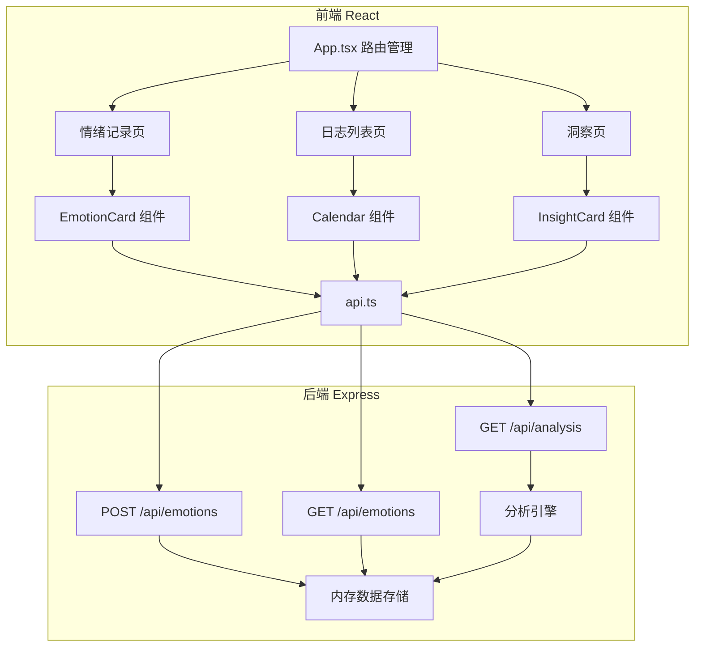
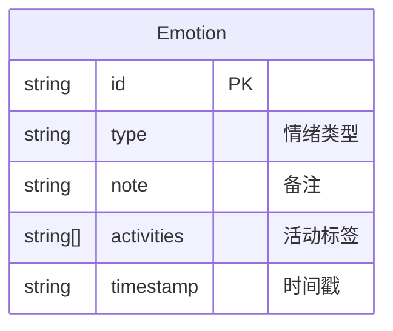

## 1. 架构设计



## 2. 技术说明
- 前端：React@18 + TypeScript + Tailwind CSS + Vite
- 初始化工具：vite-init（react-express-ts 模板）
- 状态管理：Zustand
- 图表库：Recharts
- 日期处理：date-fns
- 后端：Express@4（ESM + TypeScript）
- 数据库：内存存储（Map结构）

## 3. 路由定义
| 路由 | 用途 |
|------|------|
| / | 情绪记录页，快速记录情绪入口 |
| /journal | 日志列表页，月视图日历和趋势分析 |
| /insights | 洞察页，30天情绪模式分析 |

## 4. API 定义

### 4.1 数据类型

```typescript
interface Emotion {
  id: string;
  type: 'happy' | 'sad' | 'angry' | 'anxious' | 'calm' | 'tired';
  note: string;
  activities: string[];
  timestamp: string; // ISO 8601
}

interface EmotionAnalysis {
  topPairs: { emotion: string; activity: string; count: number }[];
  volatilePeriod: { period: string; volatility: number };
  recommendations: { activity: string; reason: string }[];
  emotionFrequency: { type: string; count: number }[];
  hourlyDistribution: { hour: number; emotions: Record<string, number> }[];
}
```

### 4.2 API 接口

| 方法 | 路径 | 请求体 | 响应 | 描述 |
|------|------|--------|------|------|
| POST | /api/emotions | `{ type, note, activities, timestamp }` | `{ success: boolean, emotion: Emotion }` | 提交情绪记录 |
| GET | /api/emotions | Query: `?start=xxx&end=xxx` | `{ emotions: Emotion[] }` | 获取日期范围内情绪记录 |
| GET | /api/analysis | - | `EmotionAnalysis` | 获取30天情绪模式分析 |

## 5. 服务器架构

```mermaid
graph LR
    "Controller 路由层" --> "Service 业务层"
    "Service 业务层" --> "Repository 数据层"
    "Repository 数据层" --> "内存存储 Map"
```

## 6. 数据模型

### 6.1 数据模型定义



### 6.2 数据存储

内存存储结构，使用 Map 以日期为 key 存储情绪记录列表：
- Key: `YYYY-MM-DD` 格式日期字符串
- Value: `Emotion[]` 当天情绪记录数组
