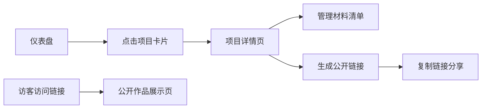

## 1. 产品概述
微型创意市集项目管理器是一款面向手工艺人和独立创作者的项目追踪工具，帮助用户管理多个手工项目的材料采购、进度跟踪、成本估算，并生成公开作品展示页面。

- 核心价值：简化创意项目管理流程，清晰追踪材料成本和项目进度，便捷分享作品成果
- 目标用户：小型手工艺人、独立创作者、手工爱好者
- 市场定位：轻量级、专注手工创作场景的项目管理工具

## 2. 核心 Features

### 2.1 用户角色
| 角色 | 注册方式 | 核心权限 |
|------|----------|----------|
| 创作者 | 无需注册（本地演示） | 创建/编辑项目、管理材料清单、生成公开链接 |
| 访客 | 无需注册 | 访问公开作品展示页面 |

### 2.2 功能模块
1. **项目仪表盘**：项目卡片列表展示、进度概览、快速进入详情
2. **项目详情页**：材料清单表格、成本自动汇总、项目阶段管理
3. **公开作品展示页**：成品照片轮播、项目信息展示、材料摘要

### 2.3 页面详情
| 页面名称 | 模块名称 | 功能描述 |
|----------|----------|----------|
| 仪表盘 | 项目卡片网格 | 自适应2-3列布局，显示项目名称、阶段标签、编辑时间、进度条 |
| 仪表盘 | 顶部导航 | 固定毛玻璃效果，页面标题，新建项目按钮 |
| 项目详情 | 项目信息区 | 编辑项目名称、阶段、进度、简介 |
| 项目详情 | 材料清单表格 | 增删材料记录，包含名称、数量、单价、采购链接 |
| 项目详情 | 成本汇总 | 自动计算总成本，表格底部粗体显示 |
| 项目详情 | 公开链接生成 | 一键生成可分享的公开页面链接 |
| 公开展示页 | 照片轮播 | 最多8张成品图，带圆点导航和左右箭头 |
| 公开展示页 | 项目信息 | 展示项目名称、简介、材料清单摘要 |

## 3. 核心流程

用户登录后进入仪表盘，浏览所有项目卡片，点击卡片进入项目详情页，在详情页管理材料清单和成本，生成公开链接分享给他人，访客通过链接访问公开作品展示页。

## 4. 用户界面设计

### 4.1 设计风格
- **主色调**：奶油白 #FDF8F0（背景），暖灰 #8B7D6B（文字）
- **阶段标签色**：淡紫 #D4C5F9（构思中）、浅橙 #F9D5B4（进行中）、淡绿 #B4E9C4（已完成）
- **按钮样式**：圆角pill形状，悬停缩放效果 transform: scale(1.03) 0.2s ease
- **字体**：系统无衬线字体 -apple-system, BlinkMacSystemFont, "Segoe UI", Roboto, sans-serif
- **布局风格**：卡片式布局，温暖极简风，充足留白
- **导航栏**：固定顶部半透明毛玻璃效果 backdrop-filter: blur(8px)

### 4.2 页面设计概述
| 页面名称 | 模块名称 | UI Elements |
|----------|----------|-------------|
| 仪表盘 | 项目卡片 | 0.3mm细边框，hover阴影2px→6px过渡0.2秒，柔和奶油白背景 |
| 仪表盘 | 进度条 | 彩色进度指示，与阶段标签色对应 |
| 项目详情 | 材料表格 | 新增行右侧滑入0.3s淡入，删除行左侧滑出 |
| 项目详情 | 成本汇总 | 粗体显示，位于表格底部 |
| 公开展示页 | 轮播图 | 0.4秒横向滑动过渡，圆点导航，左右箭头 |
| 公开展示页 | 页面布局 | 卡片式居中布局，渐变灰白背景 |

### 4.3 响应式
- **桌面端**：项目卡片2-3列自适应布局
- **平板端**：项目卡片2列布局
- **手机端**：项目卡片单列布局，按钮和表格全宽，优化触控区域
- **触摸优化**：按钮最小高度44px，表格支持横向滚动

### 4.4 动画与交互
- 页面切换：淡入切换动画 0.3秒
- 卡片hover：阴影放大，轻微上浮
- 按钮hover：缩放1.03倍
- 材料行增删：滑入滑出动画
- 图片加载：懒加载，淡入效果
