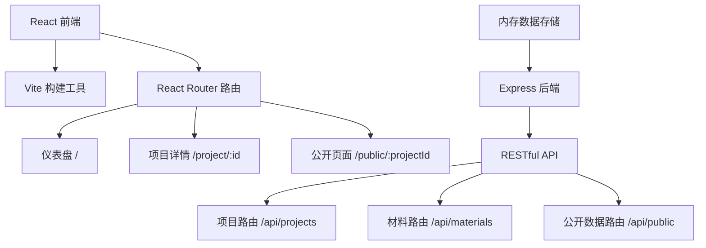
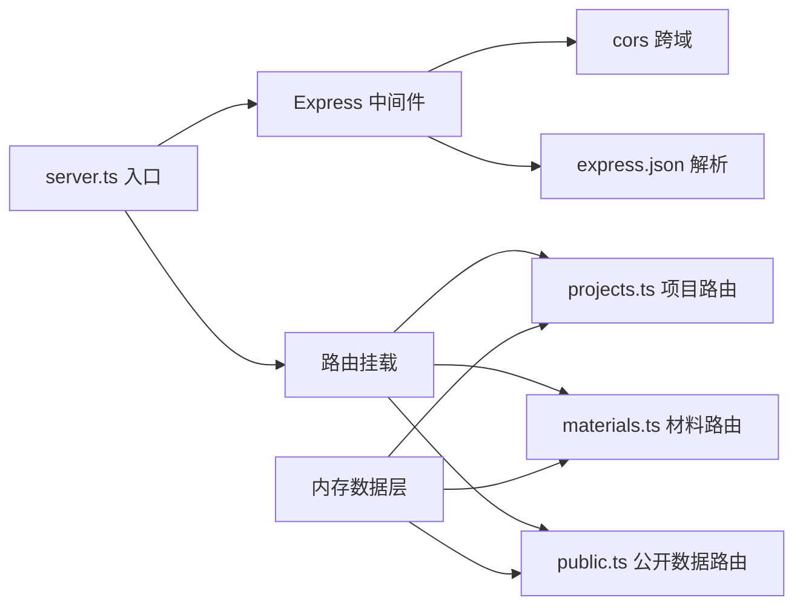
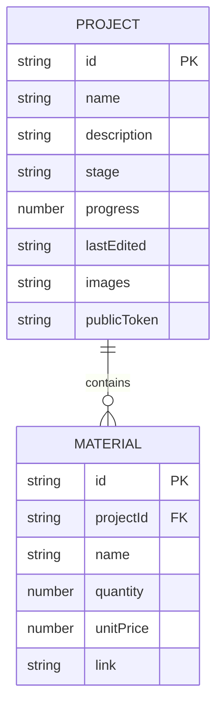

## 1. 架构设计



## 2. 技术描述

- **前端**：React@18 + TypeScript + Vite@5 + React Router DOM@6
- **样式**：原生CSS + CSS变量，全局样式统一管理
- **后端**：Express@4 + TypeScript + CORS
- **数据存储**：内存数组模拟（含初始演示数据）
- **构建工具**：Vite@5
- **唯一标识**：uuid@9
- **包管理器**：npm

## 3. 路由定义

| 前端路由 | 页面组件 | 用途 |
|----------|----------|------|
| `/` | Dashboard | 项目仪表盘，显示所有项目卡片 |
| `/project/:id` | ProjectDetail | 项目详情页，管理材料和成本 |
| `/public/:projectId` | PublicPage | 公开作品展示页（无需登录） |

| 后端API | 方法 | 用途 |
|---------|------|------|
| `/api/projects` | GET | 获取所有项目列表 |
| `/api/projects/:id` | GET | 获取单个项目详情 |
| `/api/projects/:id` | PUT | 更新项目信息 |
| `/api/materials/:projectId` | GET | 获取项目材料清单 |
| `/api/materials/:projectId` | POST | 添加材料 |
| `/api/materials/:projectId/:materialId` | PUT | 更新材料 |
| `/api/materials/:projectId/:materialId` | DELETE | 删除材料 |
| `/api/public/:projectId` | GET | 获取公开页面数据 |

## 4. API 类型定义

```typescript
interface Project {
  id: string;
  name: string;
  description: string;
  stage: '构思中' | '进行中' | '已完成';
  progress: number;
  lastEdited: string;
  images: string[];
  publicToken: string;
}

interface Material {
  id: string;
  projectId: string;
  name: string;
  quantity: number;
  unitPrice: number;
  link: string;
}

interface PublicProjectData {
  project: Project;
  materials: Material[];
  totalCost: number;
}
```

## 5. 服务器架构



## 6. 数据模型

### 6.1 数据结构



### 6.2 初始演示数据

项目数据包含3个示例项目：
1. 手工皮革钱包（进行中，65%）
2. 陶瓷茶具套装（构思中，20%）
3. 羊毛毡小动物（已完成，100%）

每个项目包含3-5条材料记录和2-6张示例图片。

## 7. 文件结构

```
.
├── package.json
├── index.html
├── vite.config.js
├── tsconfig.json
├── src/
│   ├── frontend/
│   │   ├── App.tsx
│   │   ├── components/
│   │   │   ├── Dashboard.tsx
│   │   │   ├── ProjectDetail.tsx
│   │   │   └── PublicPage.tsx
│   │   └── styles/
│   │       └── global.css
│   └── backend/
│       ├── server.ts
│       └── routes/
│           ├── projects.ts
│           ├── materials.ts
│           └── public.ts
```

## 8. 性能优化

- **数据加载**：仪表盘数据加载目标 < 800ms
- **图片优化**：图片懒加载，避免首屏过重
- **动画性能**：使用CSS transform和opacity属性实现动画
- **响应式**：使用CSS Grid和Flexbox自适应布局
