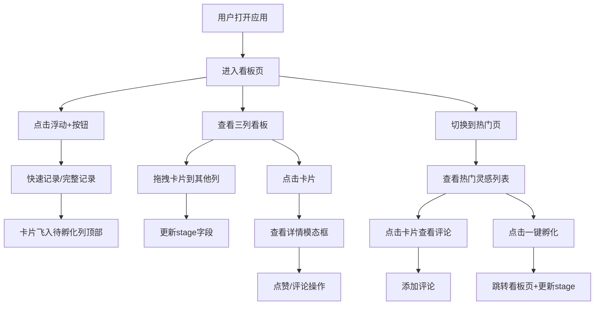

## 1. 产品概述

灵感孵化看板是一款面向创意工作者（插画师、音乐人、自媒体博主）的轻量级灵感管理工具，帮助用户快速记录零散点子、通过看板视图筛选孵化灵感，并基于热度算法推荐优质灵感，避免好想法被遗忘。

- 解决问题：创意工作者零散灵感缺乏系统化管理工具，好点子易丢失
- 目标用户：插画师、音乐人、自媒体博主等内容创作者
- 产品价值：提供便捷的灵感记录、可视化的阶段管理、智能化的热度推荐

---

## 2. 核心功能

### 2.1 用户角色

| 角色 | 注册方式 | 核心权限 |
|------|----------|----------|
| 普通用户 | 无需注册，本地使用 | 记录灵感、管理看板、点赞评论、查看热门 |

### 2.2 功能模块

1. **看板页**：三列看板（待孵化/孵化中/已实现）、卡片拖拽移动、浮动快速记录按钮
2. **热门页**：热度算法推荐、大图卡片展示、评论面板、一键孵化
3. **卡片组件**：点赞功能、评论功能、详情模态框、拖拽支持
4. **灵感记录**：快速记录（标题+短描述）、完整记录（标题+描述+标签+参考链接）

### 2.3 页面详情

| 页面名称 | 模块名称 | 功能描述 |
|----------|----------|----------|
| 看板页 | 三列看板 | 按stage分组显示卡片，每列顶部圆形徽章计数，卡片可跨列拖拽 |
| 看板页 | 浮动快速记录按钮 | 点击旋转45度展开两选项：快速记录/完整记录，提交后卡片飞入对应列顶部 |
| 看板页 | 快速记录模态框 | 输入标题和简短描述，提交后淡橙色背景卡片 |
| 看板页 | 完整记录模态框 | 输入标题、描述、标签、参考链接，提交后淡紫色背景卡片 |
| 卡片组件 | 卡片展示 | 渲染标题、描述摘要、点赞数、创建时间，hover阴影+微倾斜动画 |
| 卡片组件 | 点赞功能 | 爱心图标点击点赞/取消，点赞后变珊瑚红+跳动动画，显示点赞数 |
| 卡片组件 | 详情模态框 | 点击卡片从底部滑入，背景半透明模糊，展示完整内容 |
| 卡片组件 | 拖拽功能 | 支持在列间拖拽，拖拽结束0.3秒弹性回正动画 |
| 热门页 | 热门卡片列表 | 按热度算法（点赞*0.4+评论*0.3+新鲜度*0.3）降序推荐5-8条 |
| 热门页 | 大图卡片 | 宽400px高自适应，圆角12px，轻微投影，显示新鲜度指标 |
| 热门页 | 评论面板 | 点击弹出聊天气泡评论区，支持新增评论（≤200字），新评论从左滑入 |
| 热门页 | 一键孵化按钮 | 将stage设为孵化中并自动跳转至看板页 |

---

## 3. 核心流程

### 3.1 主流程描述

用户打开应用后进入看板页，可通过右下角浮动按钮快速或完整记录灵感，新卡片从按钮位置飞入"待孵化"列顶部。用户可通过拖拽将卡片在"待孵化→孵化中→已实现"三列间移动。点击卡片可查看详情、点赞或评论。用户切换至热门页，可查看本周按热度算法推荐的热门灵感，对感兴趣的灵感可一键孵化跳转至看板页。

### 3.2 流程图

---

## 4. 用户界面设计

### 4.1 设计风格

- **主色调**：极浅米色背景 `#FBF7F0`，半透明白色看板 `#FFFFFFE0`
- **强调色**：珊瑚红点赞 `#FF6B6B`，淡橙色快速记录卡片 `#FFF3E0`，淡紫色完整记录卡片 `#F3E5F5`
- **文字色**：深灰标题 `#4A4A4A`
- **按钮风格**：圆形悬浮按钮，带阴影，hover微放大，点击旋转动画
- **字体**：选用Playfair Display（标题）+ Nunito Sans（正文），提升创意感
- **布局风格**：卡片化设计，三列看板，卡片间距12px
- **图标风格**：emoji图标（💡🥚⭐）+ lucide-react图标库
- **动画**：弹性回正、脉冲跳动、滑入、飞入等微动效

### 4.2 页面设计概览

| 页面名称 | 模块名称 | UI元素 |
|----------|----------|--------|
| 看板页 | 导航栏 | 暖色调渐变Logo，看板/热门两个导航项，底部橙色下划线高亮 |
| 看板页 | 三列看板 | 半透明白色圆角容器，列标题深灰+emoji，右侧圆形徽章 |
| 看板页 | 卡片列表 | 卡片间距12px，hover阴影2→6px + rotate(0.5deg) |
| 看板页 | 浮动按钮 | 圆形+号按钮，固定右下角，点击旋转45度展开两选项 |
| 卡片组件 | 卡片内容 | 标题加粗，描述摘要截断，底部点赞数+创建时间 |
| 卡片组件 | 详情模态框 | 底部滑入，背景backdrop-blur，圆角顶部 |
| 热门页 | 热门卡片 | 宽400px大图布局，圆角12px，柔和阴影，新鲜度标签 |
| 热门页 | 评论面板 | 聊天气泡样式，新评论从左滑入，输入框圆角+内阴影 |

### 4.3 响应式设计

- **桌面优先**，768px断点自动切换为单列纵向布局
- 断点下：三列→纵向堆叠，卡片宽度100%，按钮尺寸自适应，大图卡片宽度100%
- 拖拽在移动端改为点击选择+点击目标列移动
- 所有文字大小使用rem单位自适应

### 4.4 性能要求

- 拖拽操作保持60fps帧率，使用transform/opacity避免重排
- 卡片列表虚拟滚动，每列同时渲染不超过20张
- 本地API请求响应时间500ms以内
- 使用骨架屏或脉冲动画表示加载状态
