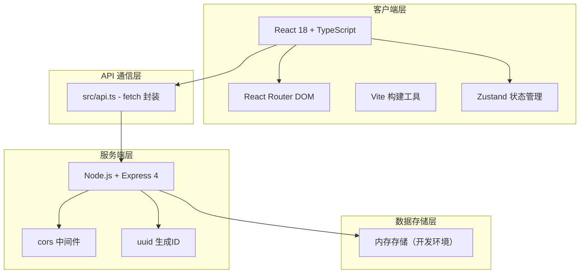
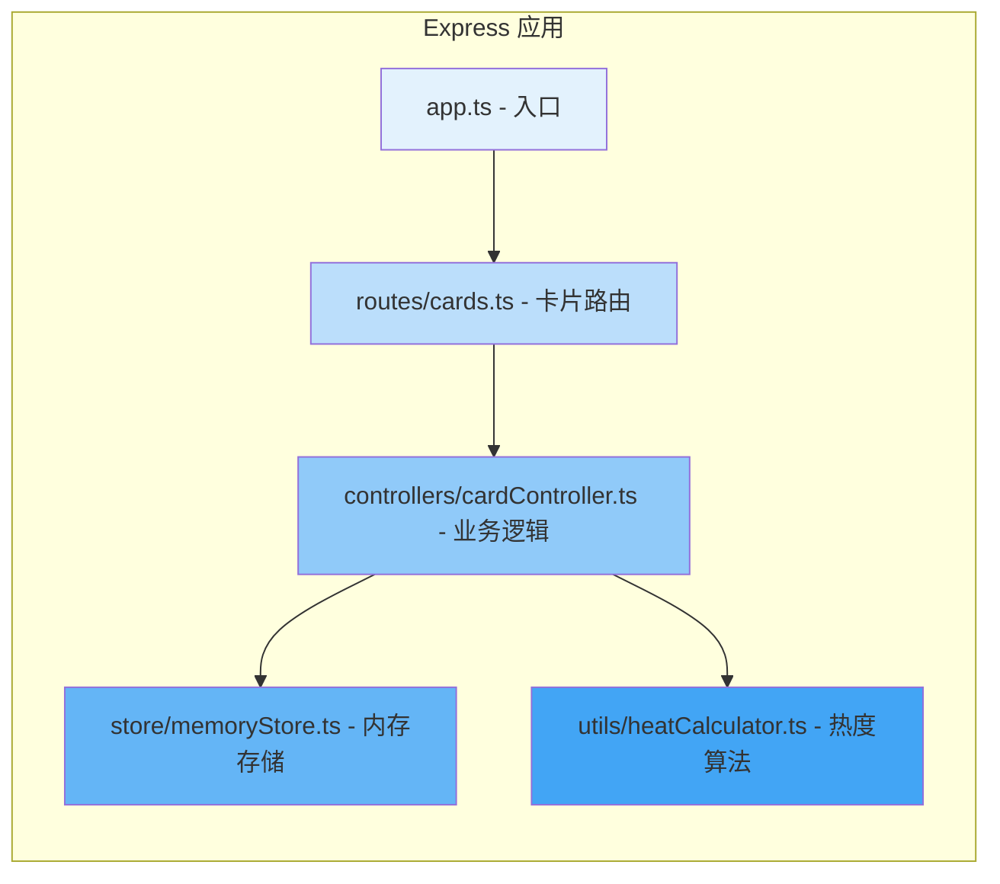
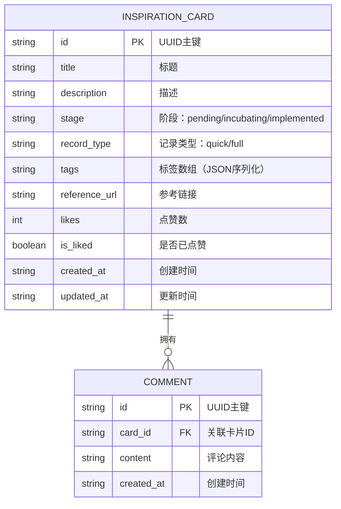

## 1. 架构设计



---

## 2. 技术栈说明

### 2.1 前端技术
- **框架**：React 18 + TypeScript（严格模式）
- **构建工具**：Vite（支持React HMR）
- **路由**：react-router-dom v6
- **状态管理**：Zustand（轻量级store）
- **样式**：原生CSS + CSS Variables（按设计规范）
- **图标**：lucide-react

### 2.2 后端技术
- **运行时**：Node.js
- **框架**：Express 4
- **中间件**：cors（跨域）、express.json（请求体解析）
- **工具库**：uuid（生成唯一ID）

### 2.3 开发工具
- **包管理器**：npm
- **启动脚本**：`npm run dev` 同时启动前端Vite和后端Express

---

## 3. 路由定义

### 3.1 前端路由

| 路由路径 | 页面组件 | 用途 |
|----------|----------|------|
| `/` 或 `/kanban` | KanbanPage | 灵感看板主页面，三列管理视图 |
| `/hot` | HotPage | 本周热门灵感推荐页面 |

### 3.2 后端API路由

| HTTP方法 | API路径 | 用途 |
|----------|---------|------|
| `GET` | `/api/cards` | 获取所有灵感卡片 |
| `GET` | `/api/cards/hot` | 获取本周热门灵感卡片（按热度算法排序） |
| `GET` | `/api/cards/:id` | 获取单个卡片详情 |
| `POST` | `/api/cards` | 创建新的灵感卡片 |
| `PATCH` | `/api/cards/:id` | 更新卡片字段（如stage） |
| `DELETE` | `/api/cards/:id` | 删除灵感卡片 |
| `POST` | `/api/cards/:id/like` | 点赞/取消点赞卡片（切换状态） |
| `GET` | `/api/cards/:id/comments` | 获取卡片评论列表 |
| `POST` | `/api/cards/:id/comments` | 为卡片添加新评论 |

---

## 4. API 数据定义

### 4.1 TypeScript 类型定义

```typescript
// 卡片阶段枚举
type CardStage = 'pending' | 'incubating' | 'implemented';

// 记录类型
type RecordType = 'quick' | 'full';

// 评论类型
interface Comment {
  id: string;
  cardId: string;
  content: string;
  createdAt: string; // ISO timestamp
}

// 灵感卡片类型
interface InspirationCard {
  id: string;
  title: string;
  description: string;
  stage: CardStage;
  recordType: RecordType;
  tags?: string[];
  referenceUrl?: string;
  likes: number;
  isLiked: boolean;
  comments: Comment[];
  createdAt: string; // ISO timestamp
  updatedAt: string; // ISO timestamp
}

// 热度卡片（带计算字段）
interface HotCard extends InspirationCard {
  heatScore: number;
  freshnessLabel: string; // e.g. "2小时前"
}

// API响应基础类型
interface ApiResponse<T> {
  success: boolean;
  data?: T;
  error?: string;
}
```

### 4.2 请求/响应示例

**POST /api/cards - 创建卡片**
```json
// 请求体
{
  "title": "水彩插画系列",
  "description": "以自然为主题的5幅水彩插画",
  "stage": "pending",
  "recordType": "full",
  "tags": ["插画", "水彩", "自然"],
  "referenceUrl": "https://example.com/reference"
}

// 响应体
{
  "success": true,
  "data": {
    "id": "uuid-xxx",
    "title": "水彩插画系列",
    "description": "以自然为主题的5幅水彩插画",
    "stage": "pending",
    "recordType": "full",
    "tags": ["插画", "水彩", "自然"],
    "referenceUrl": "https://example.com/reference",
    "likes": 0,
    "isLiked": false,
    "comments": [],
    "createdAt": "2026-06-12T10:00:00.000Z",
    "updatedAt": "2026-06-12T10:00:00.000Z"
  }
}
```

---

## 5. 服务端架构图



---

## 6. 数据模型

### 6.1 ER 图



### 6.2 热度算法说明

热度分数计算公式：
```
heatScore = (点赞数 × 0.4) + (评论数 × 0.3) + (新鲜度分数 × 0.3)
```

新鲜度分数计算：
```
- 时间差 t（单位：小时）
- freshScore = max(0, 100 - t × 2)
- 超过48小时的卡片新鲜度为0
- 仅考虑近7天内创建的卡片参与热门排行
```

示例：
- 1小时前创建 + 10赞 + 5评论 = (10×0.4)+(5×0.3)+(98×0.3) = 4+1.5+29.4 = 34.9
- 12小时前 + 20赞 + 10评论 = 8+3+(76×0.3) = 8+3+22.8 = 33.8

---

## 7. 文件结构与调用关系

```
项目根目录
├── package.json              # 项目依赖和启动脚本（npm run dev）
├── vite.config.js            # Vite构建配置（代理/api到后端）
├── tsconfig.json             # TypeScript严格模式配置
├── index.html                # 入口HTML
├── server/                   # 后端代码目录
│   ├── index.ts              # Express入口，挂载路由
│   ├── routes/
│   │   └── cards.ts          # 卡片相关路由定义 → 调用controllers
│   ├── controllers/
│   │   └── cardController.ts # 业务逻辑处理 → 调用store和utils
│   ├── store/
│   │   └── memoryStore.ts    # 内存数据存储和操作封装
│   ├── utils/
│   │   └── heatCalculator.ts # 热度和新鲜度计算工具
│   └── types/
│       └── index.ts          # 后端共享类型定义
├── src/                      # 前端代码目录
│   ├── main.tsx              # React入口，挂载App
│   ├── App.tsx               # 根组件，路由+主题 → 渲染pages
│   ├── api.ts                # fetch封装，统一错误和loading处理 → 被pages调用
│   ├── pages/
│   │   ├── KanbanPage.tsx    # 看板页 → 调用api，渲染components
│   │   └── HotPage.tsx       # 热门页 → 调用api，渲染评论组件
│   ├── components/
│   │   ├── KanbanCard.tsx    # 卡片组件 → 向KanbanPage发射事件
│   │   ├── KanbanColumn.tsx  # 看板列组件 → 渲染卡片列表
│   │   ├── CardDetailModal.tsx # 卡片详情模态框
│   │   ├── CommentPanel.tsx  # 评论面板组件
│   │   ├── QuickAddButton.tsx # 浮动快速添加按钮
│   │   ├── QuickRecordModal.tsx # 快速记录模态框
│   │   └── FullRecordModal.tsx  # 完整记录模态框
│   ├── hooks/
│   │   ├── useDragDrop.ts    # 拖拽逻辑Hook
│   │   └── useVirtualScroll.ts # 虚拟滚动Hook
│   ├── utils/
│   │   ├── time.ts           # 时间格式化工具
│   │   └── heat.ts           # 前端热度展示工具
│   ├── types/
│   │   └── index.ts          # 前端共享类型
│   └── styles/
│       ├── variables.css     # CSS变量（颜色、间距、动画时长）
│       └── global.css        # 全局样式
```

### 7.1 数据流向说明

```
用户操作 → 组件(components) → 事件回调 → 页面(pages)
                                      ↓
                                api.ts (fetch封装)
                                      ↓
                                Express 后端
                                      ↓
                              controllers → store
                                      ↓
                                返回JSON响应
                                      ↓
                                api.ts (解析响应)
                                      ↓
                              pages → 更新组件props
                                      ↓
                                components → 渲染UI
```
