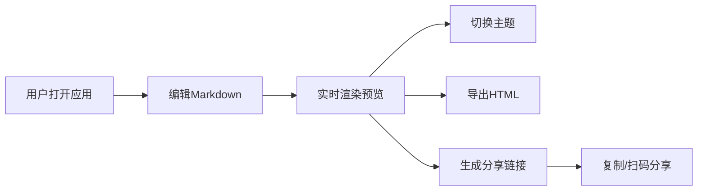

## 1. 产品概述

在线组件文档与交互演示生成器，帮助前端开发者通过Markdown和嵌入式交互组件实时编写文档，自动生成可分享的演示页面，解决传统截图录屏流程繁琐、内容更新困难的问题。

- 核心价值：将文档编写与交互演示融为一体，实现所见即所得的组件文档创作体验
- 目标用户：前端开发者、UI设计师、技术文档编写者
- 市场价值：提升组件文档编写效率，降低演示内容维护成本

## 2. 核心功能

### 2.1 用户角色
| 角色 | 注册方式 | 核心权限 |
|------|----------|----------|
| 普通用户 | 无需注册 | 编辑Markdown、预览渲染、切换主题、导出HTML、生成分享链接 |

### 2.2 功能模块
1. **双面板编辑器**：Markdown编辑区 + 实时预览区，支持拖拽调整宽度
2. **交互组件嵌入**：支持按钮、滑块、开关、单选组等预定义组件，在预览区真实可交互
3. **多主题系统**：浅色日间、深色夜间、暖色调纸质风三种主题，平滑切换
4. **导出与分享**：单文件HTML导出，基于localStorage的只读分享链接

### 2.3 页面详情
| 页面名称 | 模块名称 | 功能描述 |
|---------|----------|----------|
| 主页面 | 顶部工具栏 | 主题切换按钮、导出HTML按钮、生成分享链接按钮 |
| 主页面 | 左侧编辑区 | Markdown编辑器，带行号、语法高亮、自动补全括号 |
| 主页面 | 中间分割条 | 可拖拽调整左右面板宽度，高亮交互反馈 |
| 主页面 | 右侧预览区 | 实时渲染Markdown为HTML，支持交互组件、代码高亮 |
| 主页面 | 代码片段区 | 预览区下方显示交互组件对应的JSX代码片段 |
| 主页面 | 移动端选项卡 | 屏幕宽度<768px时，切换编辑/预览模式 |

## 3. 核心流程

用户打开应用 → 在左侧编辑区输入Markdown内容（可嵌入交互组件标签） → 右侧预览区200ms内实时渲染 → 可切换主题查看不同风格 → 点击导出按钮生成单HTML文件 → 点击分享按钮生成只读链接 → 复制链接或扫码分享

## 4. 用户界面设计

### 4.1 设计风格
- **主色调**：品牌色 #2C3E50，交互高亮 #4A90D9
- **配色方案**：
  - 浅色主题：背景 #FAFAFA，文字 #333333
  - 深色主题：背景 #1E1E2E，文字 #E0E0E0
  - 纸质主题：背景 #F5F0E6，文字 #4A4A4A
- **字体**：编辑区使用 Fira Code 等宽字体，预览区使用系统无衬线字体
- **布局风格**：分栏卡片式布局，1px实线边框，4px圆角
- **过渡动画**：所有状态切换0.2-0.3秒平滑渐变

### 4.2 页面设计概述
| 页面名称 | 模块名称 | UI元素 |
|---------|----------|--------|
| 主页面 | 顶部工具栏 | 按钮组、主题选择下拉框、图标按钮 |
| 主页面 | 编辑区 | 行号列、文本输入区、语法高亮层、括号自动补全 |
| 主页面 | 分割条 | 可拖拽区域、hover高亮效果、col-resize光标 |
| 主页面 | 预览区 | 卡片容器、Markdown渲染内容、交互组件、代码块高亮 |
| 主页面 | 代码片段区 | 代码块容器、复制按钮、语法高亮 |
| 主页面 | 移动端选项卡 | 切换按钮、激活状态指示、淡入淡出过渡 |

### 4.3 响应式
- **桌面端**（≥768px）：左右分栏布局，编辑区40%，预览区60%，可拖拽调整
- **移动端**（<768px）：上下堆叠，各占100%，通过选项卡切换模式，分割条隐藏
- 触摸优化：按钮最小尺寸44px，滑动手势支持

## 5. 性能约束
- 编辑响应延迟：输入到预览渲染完成 ≤ 200ms
- 导出文件大小：单HTML文件 ≤ 2MB
- 主题切换过渡：0.3秒平滑渐变
