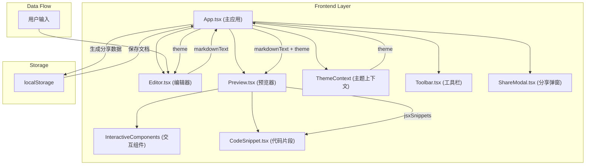
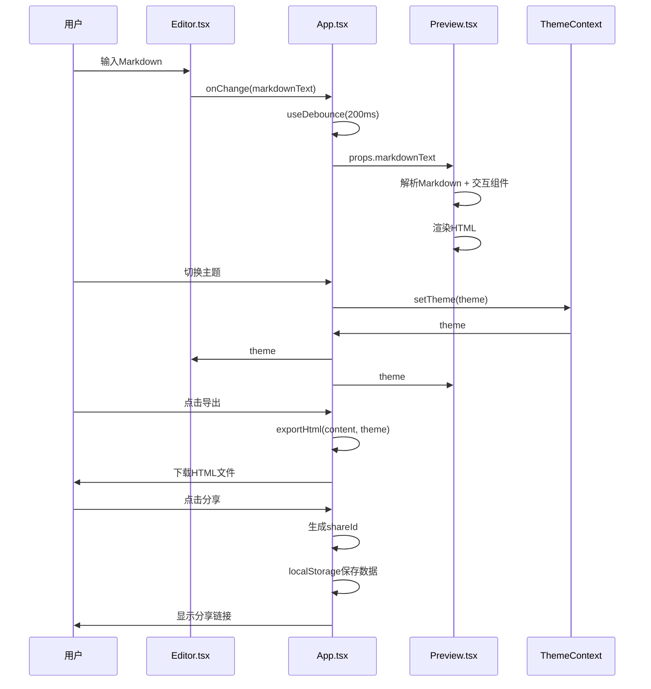

## 1. 架构设计



## 2. 技术描述

- **前端框架**：React@18 + TypeScript@5
- **构建工具**：Vite@5
- **核心依赖**：
  - react-markdown：Markdown解析渲染
  - react-syntax-highlighter：代码块语法高亮
  - lucide-react：图标库
- **状态管理**：React useState + useContext + useCallback
- **样式方案**：CSS Modules + CSS Variables + 内联样式
- **数据存储**：localStorage（纯前端，无后端）

## 3. 文件结构与调用关系

| 文件路径 | 职责 | 调用关系 |
|---------|------|----------|
| `package.json` | 项目依赖配置 | 被 npm 读取 |
| `vite.config.js` | Vite构建配置 | 被 Vite 读取 |
| `tsconfig.json` | TypeScript编译配置 | 被 tsc 读取 |
| `index.html` | 应用入口HTML | 被 Vite 加载 |
| `src/App.tsx` | 主应用组件，状态管理，布局控制 | 调用 Editor, Preview, Toolbar, ShareModal |
| `src/components/Editor.tsx` | Markdown编辑器，行号，语法高亮，括号补全 | 向 App 输出 markdownText |
| `src/components/Preview.tsx` | Markdown渲染，交互组件解析，代码高亮 | 从 App 接收 markdownText, theme |
| `src/components/Toolbar.tsx` | 主题切换，导出，分享按钮 | 调用 App 的回调函数 |
| `src/components/ShareModal.tsx` | 分享链接弹窗，二维码 | 从 App 接收 shareUrl |
| `src/components/CodeSnippet.tsx` | JSX代码片段显示与复制 | 从 Preview 接收 jsxCode |
| `src/components/interactive/` | 交互组件（Button, Slider, Switch, RadioGroup） | 被 Preview 调用 |
| `src/contexts/ThemeContext.tsx` | 主题上下文提供者 | 被 App 使用 |
| `src/hooks/useDebounce.ts` | 防抖Hook | 被 App 使用 |
| `src/hooks/useResize.ts` | 拖拽调整Hook | 被 App 使用 |
| `src/utils/exportHtml.ts` | HTML导出工具 | 被 Toolbar 调用 |
| `src/utils/markdownParser.ts` | Markdown解析扩展 | 被 Preview 使用 |
| `src/types/index.ts` | TypeScript类型定义 | 被所有组件引用 |

## 4. 数据流向



## 5. 关键技术实现

### 5.1 交互组件解析
- 使用正则匹配自定义标签 `<Button>`, `<Slider>`, `<Switch>`, `<RadioGroup>`
- 将匹配到的标签转换为React组件进行渲染
- 提取组件属性并传递给对应组件
- 记录使用的组件并生成JSX代码片段

### 5.2 主题系统
- 定义三套CSS变量主题（light, dark, paper）
- 使用React Context管理全局主题状态
- CSS transition实现0.3秒平滑切换
- 代码高亮主题同步切换（github-light, one-dark, monokai）

### 5.3 性能优化
- 使用useCallback避免不必要的重渲染
- useDebounce控制预览更新频率（200ms）
- React.memo优化子组件渲染
- 代码分割：按需加载语法高亮主题

### 5.4 导出功能
- 内联所有CSS样式到style标签
- 内联所有必要的JavaScript
- 压缩HTML内容
- 使用Blob + URL.createObjectURL实现下载

## 6. 类型定义

```typescript
type Theme = 'light' | 'dark' | 'paper';

interface ThemeConfig {
  name: string;
  editorBg: string;
  editorColor: string;
  previewBg: string;
  previewColor: string;
  borderColor: string;
  codeTheme: string;
}

interface InteractiveComponent {
  type: 'Button' | 'Slider' | 'Switch' | 'RadioGroup';
  props: Record<string, any>;
  children?: string;
  jsxCode: string;
}

interface AppState {
  markdown: string;
  theme: Theme;
  leftWidth: number;
  mobileMode: 'edit' | 'preview';
  showShareModal: boolean;
  shareId: string | null;
}
```
