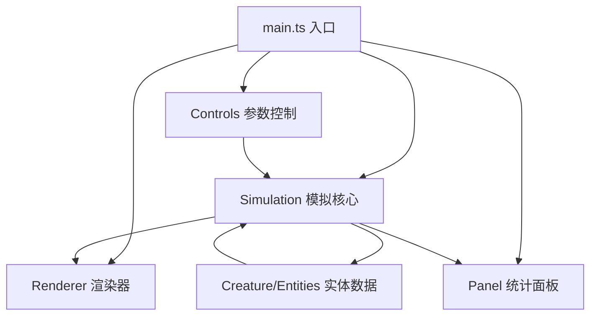

## 1. 架构设计



## 2. 技术栈描述

- **前端**：TypeScript + 原生 Canvas API + Vite
- **构建工具**：Vite
- **不使用任何游戏引擎**，全部逻辑自行实现

## 3. 文件结构

```
src/
├── core/
│   └── simulation.ts      # 生物种群状态更新、碰撞检测、捕食逻辑
├── entities/
│   └── creature.ts        # Creature接口、Fish类、Plankton类定义
├── renderer/
│   └── renderer.ts        # Canvas绘制所有生物和背景
├── ui/
│   ├── panel.ts           # 统计面板Canvas绘制(柱状图、折线图)
│   └── controls.ts        # 参数滑块和快照按钮DOM交互
└── main.ts                # 应用入口，初始化所有模块，启动游戏循环
```

## 4. 核心数据结构

### 4.1 Creature 接口

```typescript
interface Creature {
    id: number;
    type: 'fish' | 'bigFish' | 'plankton';
    x: number;
    y: number;
    vx: number;
    vy: number;
    age: number;
    lifespan: number;
    directionChangeTimer: number;
    eaten: number; // 捕食/进食计数
}
```

### 4.2 Simulation 状态

```typescript
interface SimulationState {
    creatures: Creature[];
    planktonSpawnInterval: number; // 1-8秒
    bigFishPredationRadius: number; // 50-150像素
    smallFishBreedingThreshold: number; // 2-6条
    predationHistory: number[]; // 最近60秒每秒捕食次数
    populationHistory: { fish: number; bigFish: number; plankton: number }[]; // 最近10秒每秒数据
}
```

### 4.3 Snapshot 快照

```typescript
interface Snapshot {
    id: number;
    creatures: Creature[];
    thumbnail: ImageData;
    timestamp: number;
}
```

## 5. 性能优化策略

- 目标帧率：稳定60FPS
- 生物总数超过200条时，自动裁剪浮游生物至100条
- 使用requestAnimationFrame进行渲染循环
- 合理使用脏标记优化，避免每帧全量重绘(必要时)
