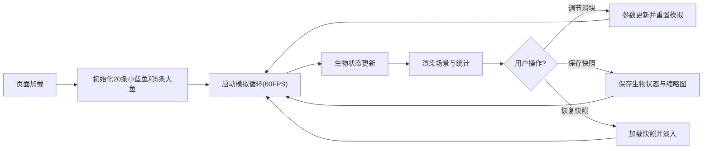

## 1. 产品概述

2D海洋生态系统演化模拟应用，用于直观观察不同生物种群在有限空间内的捕食、繁殖和消亡动态平衡过程。面向生物爱好者、教育工作者和研究人员，提供可交互的生态模拟实验平台。

## 2. 核心功能

### 2.1 功能模块

1. **主场景页面**：生物种群模拟、演化统计面板、参数调节区、快照管理

### 2.2 页面详情

| 页面名称 | 模块名称 | 功能描述 |
|-----------|-------------|---------------------|
| 主场景页面 | 生物种群模拟 | 800x600像素海洋场景，包含小蓝鱼、大鱼、浮游生物三种生物，实时模拟移动、捕食、繁殖、死亡行为 |
| 主场景页面 | 演化统计面板 | 柱状图显示各物种数量、折线图显示捕食成功率、种群波动指数显示 |
| 主场景页面 | 参数调节区 | 三个滑块控制浮游生物刷新间隔、大鱼捕食半径、小蓝鱼繁殖阈值 |
| 主场景页面 | 快照管理 | 保存最多5个快照、缩略图预览、点击恢复、淡入动画 |

## 3. 核心流程

用户打开页面 → 加载初始生物种群 → 实时观察生态演化过程 → 通过滑块调节参数 → 模拟重置 → 保存/恢复快照状态

## 4. 用户界面设计

### 4.1 设计风格

- **主色调**：深蓝渐变背景(#0B3D91 → #1B5E9E)，灰色标题栏(#333)，深灰统计面板(#2A2A2A)
- **生物颜色**：小蓝鱼(蓝色三角形)、大鱼(橙色菱形)、浮游生物(绿色小圆点)
- **交互元素**：圆角滑块轨道(高6px)、圆形滑块头(半径10px，拖拽时放大到12px并发光)
- **字体**：16px无衬线字体，白色文字
- **动画效果**：水波光效(5秒周期缓慢旋转)、快照恢复淡入(0.4秒)、点击缩放反馈(0.15秒)

### 4.2 页面布局

- 顶部：标题栏(灰色背景，白色标题)
- 中央：主场景(占70%宽度，深蓝渐变背景，800x600像素海洋场景)
- 底部：统计面板(高120px，三栏布局，宽度比例3:3:4)
  - 左：柱状图(物种数量)
  - 中：折线图(捕食成功率) + 波动指数
  - 右：参数调节滑块区
- 右下角：快照缩略图区(最多5个120x90像素缩略图)

### 4.3 响应式

桌面端优先设计，主场景保持固定800x600像素比例，统计面板自适应宽度。
