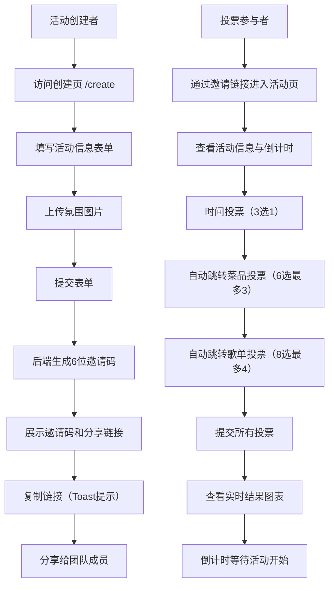

## 1. 产品概述

团队休闲酒会在线筹办平台是一个轻量级Web应用，旨在帮助小团队快速筹办内部年会或下午茶活动。通过投票机制民主决定酒会时间、菜单菜品和音乐歌单，并实时展示收集结果与活动倒计时。

- **目标用户**：公司小团队、部门组织者、活动策划者
- **解决问题**：传统活动筹备沟通成本高、意见难统一，缺乏直观的投票与展示工具
- **核心价值**：5分钟创建活动、全员参与投票、实时结果可视化、倒计时营造期待感

## 2. 核心功能

### 2.1 用户角色
| 角色 | 说明 | 核心权限 |
|------|------|----------|
| 活动创建者 | 发起活动的组织者 | 创建活动、设置投票选项、查看结果 |
| 投票参与者 | 收到邀请码的团队成员 | 参与投票、查看实时结果 |

### 2.2 功能模块
1. **活动发起模块**：创建活动表单，生成邀请码和分享链接
2. **投票模块**：时间单选、菜品多选、歌单多选，带进度指示
3. **结果展示模块**：横向柱状图/堆叠条形图实时展示票数
4. **倒计时模块**：活动开始前的天时分秒倒计时
5. **分享模块**：一键复制邀请码和分享链接，带Toast提示

### 2.3 页面详情
| 页面名称 | 模块名称 | 功能描述 |
|-----------|-------------|---------------------|
| 创建页 `/create` | 活动信息表单 | 输入活动名称、日期时间（带月份翻页动画）、地点、欢迎语、上传氛围图片（base64） |
| 创建页 `/create` | 表单验证提交 | 所有字段非空校验，提交后生成6位邀请码和分享链接，显示复制按钮 |
| 创建页 `/create` | Toast提示 | 复制成功后弹出"已复制"toast，0.3秒淡出 |
| 活动页 `/event/:code` | 活动信息展示 | 显示活动名称、地点、欢迎语、背景图 |
| 活动页 `/event/:code` | 倒计时组件 | 数字翻转动画，0.5秒刷新，活动结束后灰显 |
| 活动页 `/event/:code` | 投票面板 | 3道题顺序展示，每题自动跳转下一题，底部渐变进度条 |
| 活动页 `/event/:code` | 时间投票 | 3个时间段单选，卡片式选项，选中高亮 |
| 活动页 `/event/:code` | 菜品投票 | 6道菜多选（最多3道），缩略图+介绍卡片 |
| 活动页 `/event/:code` | 歌单投票 | 8首歌多选（最多4首），歌名+歌手列表 |
| 活动页 `/event/:code` | 结果图表 | 时间：马卡龙横向柱状图；菜品/歌单：横向堆叠条形图 |

## 3. 核心流程

### 主要用户流程
创建者访问首页 → 填写活动信息并上传图片 → 提交生成邀请码 → 复制链接分享给团队 → 成员通过链接进入活动页 → 依次完成3道投票题 → 查看实时投票结果 → 倒计时等待活动开始

## 4. 用户界面设计

### 4.1 设计风格
- **主色调**：暖色调主题，背景淡米色 `#FFF8F0`
- **强调色渐变**：按钮渐变 `#F5A623 → #F7C948`（金黄渐变）
- **进度条渐变**：绿到金 `#4CAF50 → #FFD700`
- **图表配色**：马卡龙色系（粉蓝#A8D8EA、粉红#F7B8B8、淡紫#D4B8E8等）
- **卡片样式**：白色背景、2px圆角、5px阴影，hover时8px阴影+上移3px，0.2s过渡
- **按钮样式**：8px圆角、渐变背景、hover亮度提升10%
- **字体**：标题圆润字体，正文简洁易读
- **整体氛围**：温馨、轻松、愉悦的聚会感

### 4.2 页面设计概述
| 页面名称 | 模块名称 | UI元素 |
|-----------|-------------|-------------|
| 创建页 | 表单卡片 | 居中卡片布局、分组输入框、日期选择器带月份翻页动画、图片上传拖拽区域 |
| 创建页 | 结果展示 | 大字号邀请码、链接输入框+复制按钮、Toast从底部滑入 |
| 活动页 | 顶部Hero | 全屏氛围背景图、活动标题叠加渐变遮罩、欢迎语卡片、倒计时组件 |
| 活动页 | 投票面板 | 题序进度指示、卡片式选项、选中态边框加粗+浅背景、提交按钮 |
| 活动页 | 进度条 | 固定底部、绿金渐变填充、0.5s填充动画 |
| 活动页 | 结果图表 | 横向柱状图柱宽0.3s过渡、堆叠条形图不同色块、数值标签 |
| 活动页 | 倒计时 | 4格数字卡片、数字翻转0.5s、活动结束后灰色+文字"活动已结束" |

### 4.3 响应式
- 桌面优先设计，最大内容宽度960px居中
- 移动端自适应：卡片内边距缩小、选项卡片网格从3列变1列
- 触摸优化：按钮最小高度44px、选项点击区域放大
- 倒计时组件在移动端横向滚动适配

### 4.4 动画与微交互
- 日期选择器：月份切换翻页滑动动画
- Toast提示：底部滑入→0.3秒淡出
- 进度条：0.5秒平滑宽度过渡
- 柱状图：柱宽0.3秒平滑变化
- 数字倒计时：每0.5秒3D翻转动画
- 卡片hover：0.2秒阴影加深+上移3px
- 题目切换：渐隐渐显过渡效果
