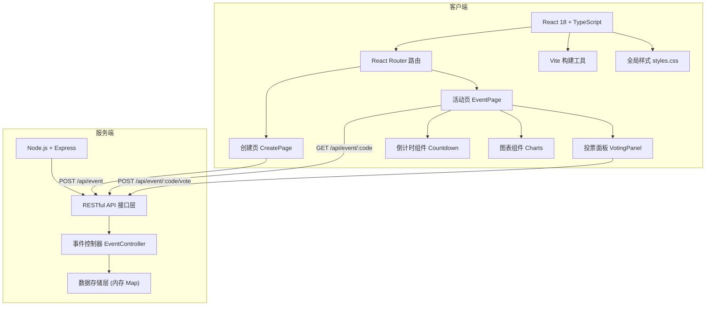
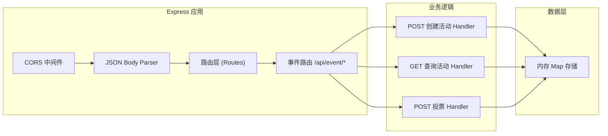
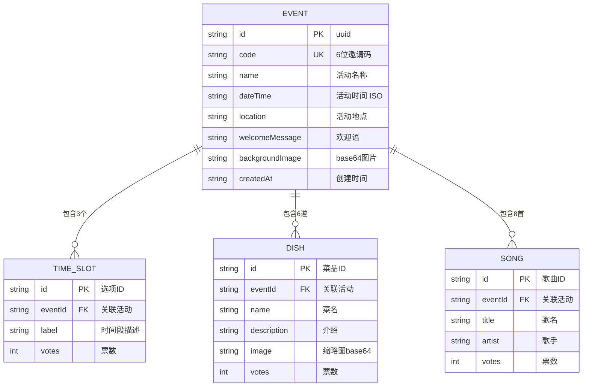

## 1. 架构设计



## 2. 技术描述

- **前端框架**：React 18 + TypeScript
- **构建工具**：Vite（快速HMR，ESBuild打包）
- **路由管理**：React Router DOM v6
- **状态管理**：React Hooks（useState、useEffect、useParams），无需额外状态库
- **后端服务**：Node.js + Express 4（CORS中间件）
- **数据存储**：JavaScript Map（内存存储，进程级数据）
- **ID生成**：uuid 库（活动唯一ID），自定义6位邀请码生成
- **样式方案**：原生CSS（CSS变量主题、CSS动画、响应式媒体查询）
- **图表方案**：纯CSS实现横向柱状图/堆叠条形图（无额外图表库依赖）
- **端口配置**：后端 3001 端口，Vite 开发代理转发

## 3. 路由定义
| 路由路径 | 页面组件 | 说明 |
|-------|---------|------|
| `/` | 重定向到 `/create` | 首页默认跳转到创建页 |
| `/create` | CreatePage | 活动创建页面，表单+结果展示 |
| `/event/:code` | EventPage | 活动详情页，投票+结果+倒计时 |
| `*` | 重定向到 `/create` | 404页面跳转到创建页 |

## 4. API 定义

### TypeScript 类型定义
```typescript
// 活动创建请求
interface CreateEventRequest {
  name: string;
  dateTime: string;
  location: string;
  welcomeMessage: string;
  backgroundImage: string; // base64
  timeSlots: TimeSlot[];
  dishes: Dish[];
  songs: Song[];
}

// 时间段
interface TimeSlot {
  id: string;
  label: string;
  votes: number;
}

// 菜品
interface Dish {
  id: string;
  name: string;
  description: string;
  image: string; // base64缩略图
  votes: number;
}

// 歌曲
interface Song {
  id: string;
  title: string;
  artist: string;
  votes: number;
}

// 活动对象
interface Event {
  id: string;
  code: string; // 6位邀请码
  name: string;
  dateTime: string;
  location: string;
  welcomeMessage: string;
  backgroundImage: string;
  timeSlots: TimeSlot[];
  dishes: Dish[];
  songs: Song[];
  createdAt: string;
}

// 投票请求
interface VoteRequest {
  timeSlotId?: string;
  dishIds?: string[];
  songIds?: string[];
}

// 投票响应
interface VoteResponse {
  success: boolean;
  event: Event;
}
```

### API 接口列表

| 方法 | 路径 | 说明 | 请求体 | 响应体 |
|------|------|------|--------|--------|
| POST | `/api/event` | 创建活动 | `CreateEventRequest` | `{ event: Event, shareLink: string }` |
| GET | `/api/event/:code` | 查询活动信息 | - | `Event` |
| POST | `/api/event/:code/vote` | 提交投票 | `VoteRequest` | `VoteResponse` |

## 5. 服务器架构图



## 6. 数据模型

### 6.1 数据模型定义



### 6.2 内存数据结构

数据存储在 Node.js 进程内存中，使用 Map 结构：
```typescript
// Key: 6位邀请码 (string)
// Value: Event 对象
const eventsStore = new Map<string, Event>();
```

**预置默认选项数据**：
- 时间槽：3个默认选项（如"下午2:00-4:00"、"下午4:00-6:00"、"晚上6:00-8:00"）
- 菜品：6道默认菜品，含名称、介绍、占位图
- 歌单：8首热门派对歌曲，含歌名和歌手

**邀请码生成规则**：
- 6位大写字母+数字组合（排除易混淆字符I/O/0/1）
- 生成时检查 Map 中是否已存在，确保唯一性
- 使用加密随机数生成器

**性能约束**：
- 页面加载1.5秒内可交互 → Vite按需编译 + 无重型依赖
- 投票数据变更DOM更新<100ms → React状态局部更新 + CSS过渡
