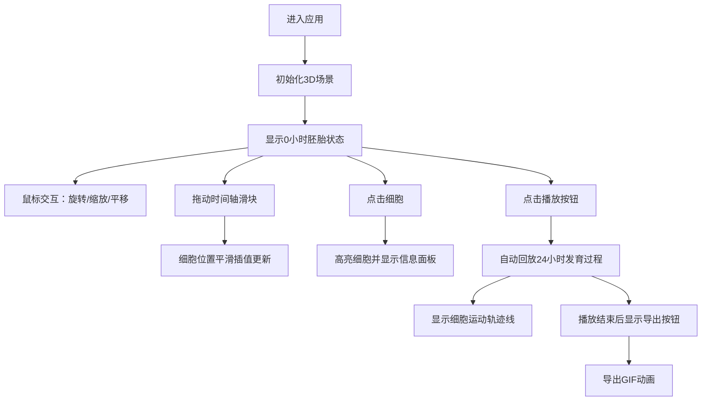

## 1. 产品概述

果蝇胚胎发育模拟器是一款交互式三维可视化教学工具，帮助生物爱好者和学生直观理解果蝇胚胎发育过程中细胞迁移、分裂和分化形成不同器官原基的动态过程。

- **核心价值**：解决传统教学依赖静态2D示意图或固定动画，无法随意旋转、缩放视角并实时调节发育时间点的问题
- **目标用户**：生物爱好者、学生、教育工作者
- **产品定位**：沉浸式、可交互的生物发育过程可视化教学工具

## 2. 核心功能

### 2.1 用户角色

| 角色 | 注册方式 | 核心权限 |
|------|---------|---------|
| 普通用户 | 无需注册，直接使用 | 浏览3D模型、调节时间轴、查询细胞信息、回放发育过程 |

### 2.2 功能模块

1. **三维胚胎模型展示**：椭球形果蝇胚胎外壳 + 内部多色细胞群 + 鼠标交互控制
2. **发育时间轴控制**：底部滑块调节发育时间（0-24小时）+ 平滑过渡动画 + 阶段文字描述
3. **细胞标记与信息查询**：点击细胞高亮显示 + 右侧信息面板展示细胞详情 + Shift多选对比
4. **发育轨迹回放与导出**：自动播放发育过程 + 细胞运动轨迹线 + GIF导出功能

### 2.3 页面详情

| 页面名称 | 模块名称 | 功能描述 |
|---------|---------|---------|
| 主页面 | 3D场景区域 | 展示椭球形胚胎模型和内部细胞，支持鼠标旋转、缩放、平移 |
| 主页面 | 左侧操作面板 | 时间轴滑块控件、播放/暂停按钮 |
| 主页面 | 右侧信息面板 | 细胞信息展示、操作按钮、发育阶段描述 |
| 主页面 | 参考网格 | 20x20浅灰色网格辅助空间感知 |

## 3. 核心流程

用户打开应用 → 看到初始状态（0小时发育阶段）的胚胎模型 → 通过鼠标旋转/缩放观察整体结构 → 拖动时间轴滑块观察细胞随时间变化 → 点击细胞查看详细信息 → 点击播放按钮自动回放完整发育过程 → 可导出GIF动画记录

## 4. 用户界面设计

### 4.1 设计风格

- **设计方向**：科技感深色主题，强调生物发育的神秘感和科学性
- **主色调**：深紫蓝背景 #1E1E2E，营造沉浸式科研氛围
- **辅助色**：浅粉色半透明胚胎外壳、蓝色头部细胞 #4169E1、橙色神经细胞 #FF8C00、紫色生殖细胞 #8A2BE2
- **文字颜色**：白色 #E0E0E0
- **按钮风格**：圆角矩形（8px圆角），hover时半透明白色背景过渡（0.15秒）
- **字体**：Inter 字体族，现代无衬线字体，适合科学类应用
- **布局风格**：三栏式布局，中间3D场景为主，两侧控制面板为辅
- **视觉氛围**：深色背景配合发光细胞效果，营造显微观察的沉浸感

### 4.2 页面设计概览

| 页面名称 | 模块名称 | UI元素 |
|---------|---------|--------|
| 主页面 | 3D场景区域 | 椭球形胚胎、多色细胞球、参考网格、阴影效果 |
| 主页面 | 左侧时间轴面板 | 时间标签、细长滑块（4px高，14px拖动点）、播放/暂停按钮 |
| 主页面 | 右侧信息面板 | 细胞名称、坐标信息、分裂次数、操作按钮、发育阶段描述 |
| 主页面 | 细胞高亮效果 | 白色外发光效果（半径0.5单位） |

### 4.3 响应式设计

- **设计原则**：桌面端优先，移动端适配
- **桌面端**（≥768px）：三栏布局，左右面板各120px宽，中间3D场景占80%宽度
- **移动端**（<768px）：上下布局，左右面板变为底部横向固定栏（高度80px），3D场景占满剩余空间
- **触摸优化**：支持触屏手势缩放和平移

### 4.4 3D场景指引

- **环境与氛围**：深色背景配合柔和环境光，模拟显微镜观察效果
- **光照设置**：环境光 + 方向光，开启阴影投射，增强立体感
- **相机设置**：透视相机，75度视角，初始位置 (15, 10, 15)，看向场景中心
- **构图与焦点**：胚胎模型位于场景中心，细胞群分布在内部，视觉焦点明确
- **交互与动画**：
  - 鼠标拖拽旋转视角
  - 滚轮缩放（0.5-20单位距离）
  - 右键按住平移场景
  - 时间轴变化时细胞位置0.6秒平滑插值过渡
  - 信息面板0.2秒淡入动画
- **后处理效果**：细胞外发光效果，增强视觉层次
- **性能要求**：60FPS稳定运行，拖动/旋转时无卡顿
