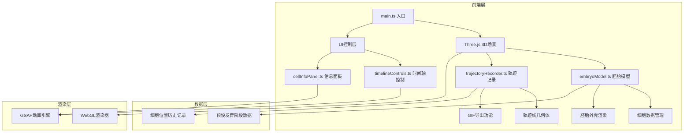

## 1. 架构设计



## 2. 技术描述

- **前端框架**：原生 TypeScript + Three.js（非React，按用户要求）
- **构建工具**：Vite 5.x
- **3D渲染**：Three.js 最新版
- **动画引擎**：GSAP (GreenSock) 3.x
- **样式方案**：原生 CSS + CSS 变量
- **开发语言**：TypeScript 5.x（严格模式）
- **后端**：无后端，纯前端应用
- **数据库**：无数据库，使用预设数据

## 3. 项目文件结构

| 文件路径 | 用途 |
|---------|------|
| package.json | 项目依赖和脚本配置 |
| index.html | 入口HTML页面 |
| vite.config.js | Vite构建配置 |
| tsconfig.json | TypeScript编译配置 |
| src/main.ts | 应用入口，初始化场景/相机/渲染器 |
| src/embryoModel.ts | 胚胎模型和细胞群管理 |
| src/timelineControls.ts | 时间轴滑块和播放控制 |
| src/cellInfoPanel.ts | 右侧信息面板UI |
| src/trajectoryRecorder.ts | 细胞轨迹记录和导出 |

## 4. 核心模块接口定义

### 4.1 细胞数据类型

```typescript
interface CellData {
  id: string;
  name: string;
  type: 'head' | 'nerve' | 'germ';
  position: { x: number; y: number; z: number };
  divisionCount: number;
  color: string;
}

interface TimePointData {
  time: number;
  cells: CellData[];
  stageName: string;
  description: string;
}
```

### 4.2 EmbryoModel 接口

```typescript
class EmbryoModel {
  constructor(scene: THREE.Scene);
  updateCells(time: number): void;
  getCellAtPosition(intersects: THREE.Intersection[]): CellData | null;
  highlightCell(cellId: string): void;
  clearHighlights(): void;
  getSelectedCells(): CellData[];
  toggleMultiSelect(enabled: boolean): void;
}
```

### 4.3 TimelineControls 接口

```typescript
class TimelineControls {
  constructor(container: HTMLElement, onTimeChange: (time: number) => void);
  setTime(time: number): void;
  getTime(): number;
  play(speed?: number): void;
  pause(): void;
  isPlaying(): boolean;
}
```

### 4.4 CellInfoPanel 接口

```typescript
class CellInfoPanel {
  constructor(container: HTMLElement);
  updateCellInfo(cells: CellData[]): void;
  setStageDescription(description: string): void;
  show(): void;
  hide(): void;
}
```

### 4.5 TrajectoryRecorder 接口

```typescript
class TrajectoryRecorder {
  constructor(scene: THREE.Scene);
  record(time: number, cells: CellData[]): void;
  showTrajectories(visible: boolean): void;
  async exportAnimation(): Promise<void>;
}
```

## 5. 性能优化策略

### 5.1 渲染优化
- 使用 BufferGeometry 减少绘制调用
- 细胞使用 InstancedMesh 进行批处理渲染
- 合理设置相机远裁面，减少不必要的渲染
- 启用 frustumCulling 视锥体剔除

### 5.2 动画优化
- 使用 GSAP 的 ticker 同步动画循环
- 细胞位置插值使用 requestAnimationFrame
- 减少不必要的矩阵计算

### 5.3 内存管理
- 及时释放不再使用的几何体和材质
- 轨迹数据按时间点采样，控制数据量

## 6. 发育阶段数据设计

| 时间点 | 阶段名称 | 细胞数量 | 主要特征 |
|--------|---------|---------|---------|
| 0h | 受精期 | 少量极细胞 | 仅尾部显示少数生殖细胞前体 |
| 6h | 卵裂期 | 逐渐增多 | 细胞开始分裂，分布在胚胎表面 |
| 12h | 细胞迁移期 | 大量细胞 | 细胞向头部和腹侧迁移，形成原基 |
| 18h | 器官发生期 | 细胞分化 | 头部、胸部、腹侧原基清晰可见 |
| 24h | 器官形成期 | 结构完整 | 各器官原基形态稳定，位置明确 |
