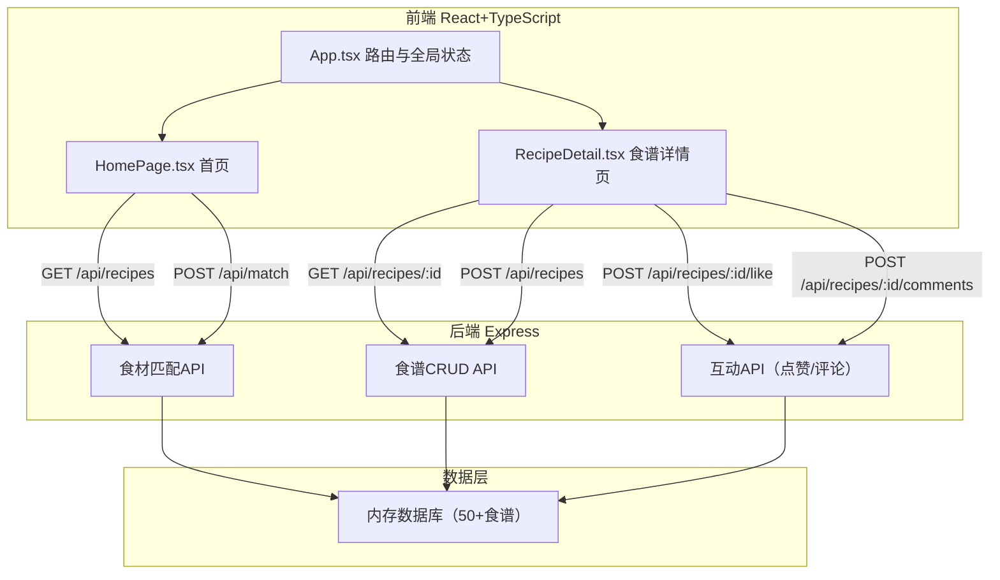
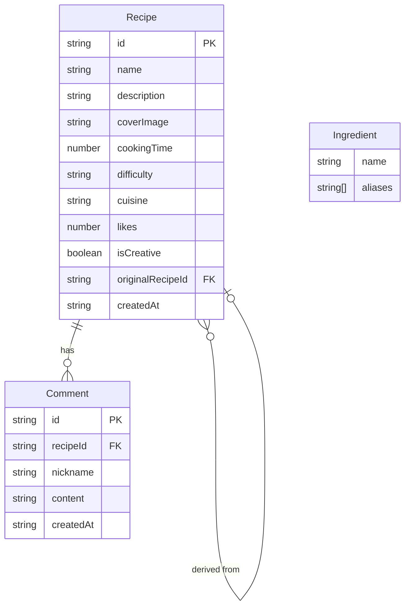

## 1. 架构设计



## 2. 技术说明

- 前端：React@18 + TypeScript + Vite + TailwindCSS + Zustand
- 初始化工具：vite-init（react-express-ts模板）
- 后端：Express@4 + TypeScript
- 数据库：内存数据（50+预置食谱），无需外部数据库
- 通信方式：RESTful API，Vite开发代理转发 /api 到后端

## 3. 路由定义

| 路由 | 用途 |
|------|------|
| / | 首页，展示推荐食谱、食材输入、搜索筛选 |
| /recipe/:id | 食谱详情页，展示步骤、点赞/评论 |

## 4. API定义

### 4.1 食谱相关

```
GET    /api/recipes              # 获取食谱列表（支持搜索、筛选、分页）
       ?search=关键词
       ?cuisine=中餐|西餐|日料|甜品
       ?difficulty=简单|中等|困难
       &cookingTime=<15|15-30|>30
       &page=1&limit=20

GET    /api/recipes/:id          # 获取食谱详情

POST   /api/recipes              # 创建新食谱（创意版）
       body: { name, description, coverImage, ingredients[], steps[], cookingTime, difficulty, cuisine, originalRecipeId }

POST   /api/match                # 食材匹配
       body: { ingredients: string[] }
       response: { recipes: [{ ...recipe, matchScore: number }] }
```

### 4.2 互动相关

```
POST   /api/recipes/:id/like     # 点赞/取消点赞
       response: { liked: boolean, likeCount: number }

GET    /api/recipes/:id/comments # 获取评论（最近10条）
       ?limit=10

POST   /api/recipes/:id/comments # 发表评论
       body: { nickname: string, content: string }
```

### 4.3 食材自动补全

```
GET    /api/ingredients/search   # 模糊搜索食材
       ?q=番茄
       response: { suggestions: string[] }
```

### 4.4 热门推荐

```
GET    /api/recipes/top          # 获取点赞最多的3份食谱
```

### 4.5 TypeScript类型定义

```typescript
interface Recipe {
  id: string;
  name: string;
  description: string;
  coverImage: string;
  ingredients: string[];
  steps: string[];
  cookingTime: number;
  difficulty: '简单' | '中等' | '困难';
  cuisine: '中餐' | '西餐' | '日料' | '甜品';
  likes: number;
  comments: Comment[];
  author: { nickname: string; avatar: string };
  originalRecipeId?: string;
  isCreative: boolean;
  createdAt: string;
}

interface Comment {
  id: string;
  nickname: string;
  avatar: string;
  content: string;
  createdAt: string;
}

interface MatchResult {
  recipe: Recipe;
  matchScore: number;
}
```

## 5. 服务器架构图


## 6. 数据模型

### 6.1 数据模型定义



### 6.2 初始数据

预置50+食谱数据，涵盖中餐、西餐、日料、甜品四个菜系，包含完整的食材清单、步骤、烹饪时间和难度。食材数据库包含常见中英文食材及别名映射，支持模糊搜索自动补全。
