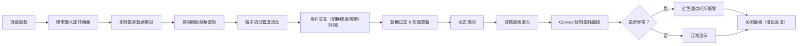

## 1. 产品概述
基于建筑信息模型（BIM）的楼宇能耗实时监控看板，将楼宇各区域的电、水、气能耗数据映射到三维建筑模型上，通过颜色渐变、动态粒子流和数据图表实现能耗状态的直观可视化与实时监控。

- 面向楼宇管理员和能耗分析人员，解决传统监控界面数据抽象、难以定位能耗异常区域的问题
- 产品价值：以三维可视化为核心，提供沉浸式能耗监控体验，快速识别高能耗区域和异常报警

## 2. 核心功能

### 2.1 功能模块
1. **三维建筑模型**：多楼层、多房间的 BIM 模型展示，房间颜色根据能耗值冷色→暖色渐变
2. **悬浮数据面板**：毛玻璃效果的半透明面板，包含楼层选择器、能耗类型切换（电/水/气）、时间范围滑块
3. **房间详情面板**：点击房间从侧面滑入，展示 24 小时能耗曲线图、当前值、异常报警标记
4. **粒子流特效**：从供能节点沿管道路径流动的粒子，速率随能耗大小动态变化
5. **动画系统**：模型渐入旋转加载、颜色平滑过渡、面板滑入滑出、异常红点闪烁

### 2.3 页面详情
| 页面名称 | 模块名称 | 功能描述 |
|---------|---------|---------|
| 主监控看板 | 三维场景层 | Three.js 渲染楼宇模型，支持 OrbitControls 旋转缩放 |
| 主监控看板 | 悬浮控制面板 | 楼层选择、能耗类型切换、时间范围调节，带微动效交互 |
| 主监控看板 | 详情侧栏 | Canvas 绘制 24 小时能耗曲线，异常标记，滑入滑出动画 |
| 主监控看板 | 粒子特效层 | 供能管道粒子流动画，速率映射能耗值 |
| 主监控看板 | 状态提示 | 异常区域红色闪烁圆点报警 |

## 3. 核心流程
用户打开页面后，楼宇模型以渐入旋转动画加载完成，默认展示全部楼层的电力能耗。用户可通过悬浮面板切换楼层、选择能耗类型（电/水/气）、调节时间范围，模型房间颜色实时响应更新。点击任意房间，右侧详情面板滑入，展示该房间 24 小时能耗曲线及当前值，若存在异常数据则红色圆点闪烁。用户可点击关闭按钮或点击空白区域收起详情面板。

## 4. 用户界面设计

### 4.1 设计风格
- **主色调**：深灰蓝色（#0f1923 背景，#1a2733 面板）
- **高亮色**：霓虹青（#00e5ff）用于正常高亮和数据流
- **警报色**：橙色（#ff6b35）用于高能耗和异常标记
- **按钮样式**：玻璃拟态（backdrop-filter）、圆角 8px、悬停发光阴影
- **字体**：JetBrains Mono（等宽科技感）+ 系统无衬线字体
- **布局**：全屏 3D 画布 + 左上悬浮控制面板 + 右侧详情抽屉
- **动效**：CSS transition 微动效、Three.js TWEEN 颜色插值、requestAnimationFrame 粒子动画

### 4.2 页面设计概述
| 页面名称 | 模块名称 | UI 元素 |
|---------|---------|---------|
| 主监控看板 | 三维场景层 | 深色空间背景、蓝色雾效、楼层半透明叠加、房间发光描边 |
| 主监控看板 | 悬浮控制面板 | 毛玻璃背景、霓虹青边框辉光、分段按钮切换、线性滑块、悬停 scale(1.03) |
| 主监控看板 | 详情侧栏 | 右侧滑入 transform: translateX、顶部关闭按钮、Canvas 曲线图、异常徽章脉冲动画 |
| 主监控看板 | 粒子特效层 | 霓虹青发光点精灵、沿贝塞尔曲线运动、模糊叠加 |

### 4.3 响应性
桌面端优先，画布自适应窗口尺寸，控制面板固定定位，详情侧栏宽度固定 360px。

### 4.4 3D 场景指引
- **环境**：深灰蓝背景 + 指数雾效（FogExp2）营造空间深度
- **光照**：AmbientLight 基础光 + 2 盏 DirectionalLight 主光 + 房间自发光（emissive）
- **相机**：PerspectiveCamera，初始位置俯视 45°，OrbitControls 限制俯仰角
- **构图**：楼宇居中，地面网格辅助线（GridHelper），粒子层在模型上方
- **交互**：OrbitControls 旋转缩放、Raycaster 房间拾取、hover 房间高亮描边
- **后处理**：房间 emissive + 粒子 additive blending 模拟辉光，避免使用 EffectComposer 以保障 60fps
- **性能**：房间使用 Mesh 合并策略（同楼层共享几何体），粒子使用 BufferGeometry + Points，目标 50 房间加载 < 2s

