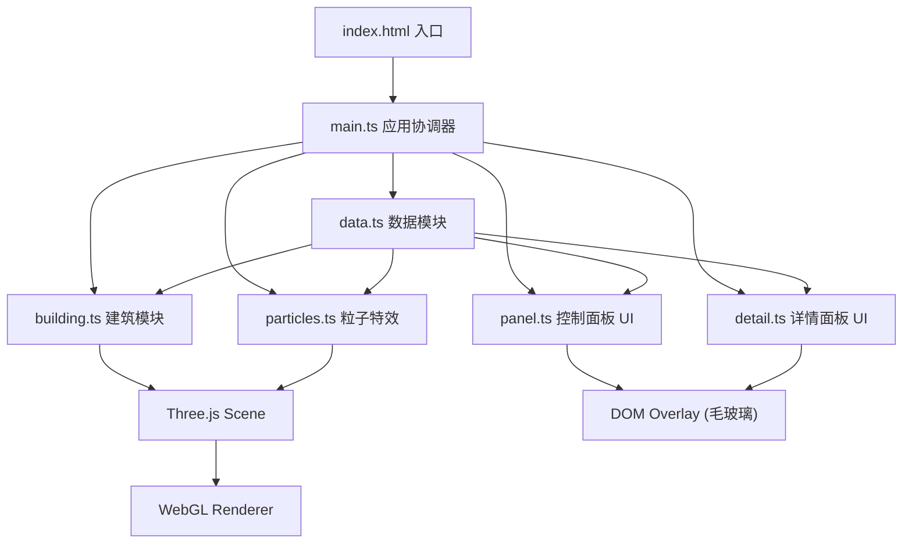

## 1. 架构设计



## 2. 技术说明
- **前端**：TypeScript (strict 模式, target ES2020) + Three.js (r160+) + D3.js (v7) + Vite (v5)
- **构建工具**：Vite，使用原生 ES Module HMR
- **后端**：无后端，全部数据由 data.ts 模拟生成
- **状态管理**：模块间通过回调函数和事件订阅（自定义 EventEmitter 模式）通信

## 3. 模块职责与接口定义

### 3.1 src/main.ts — 应用入口
- 初始化 THREE.Scene、PerspectiveCamera、WebGLRenderer、OrbitControls
- 创建并协调 BuildingModel、EnergyData、ControlPanel、DetailPanel、ParticleSystem 实例
- 启动 requestAnimationFrame 渲染循环，统一触发各模块 update
- 监听窗口 resize，适配画布尺寸

### 3.2 src/model/building.ts — 建筑模块
```typescript
interface RoomInfo { id: string; floor: number; name: string; position: THREE.Vector3; size: THREE.Vector3; }
interface BuildingModel {
  group: THREE.Group;
  rooms: Map<string, THREE.Mesh>;
  roomInfo: Map<string, RoomInfo>;
  generate(floors: number, roomsPerFloor: number): void;
  updateRoomEnergy(roomId: string, value: number, type: EnergyType): void;
  highlightRoom(roomId: string | null): void;
  getRoomByIntersect(intersect: THREE.Intersection): string | null;
}
```
- 使用 THREE.BoxGeometry 组合生成楼层和房间
- 房间材质使用 MeshStandardMaterial，通过 emissive 和 color 双通道实现能耗颜色映射
- 颜色插值使用冷色 (#00e5ff) → 暖色 (#ff6b35) 的 D3 scaleLinear

### 3.3 src/model/data.ts — 数据模块
```typescript
type EnergyType = 'electricity' | 'water' | 'gas';
interface EnergyDataPoint { timestamp: number; value: number; }
interface EnergyData {
  subscribe(callback: (data: RoomEnergyMap) => void): () => void;
  setFloor(floor: number | 'all'): void;
  setType(type: EnergyType): void;
  setTimeRange(hours: number): void;
  getRoomCurrent(roomId: string, type: EnergyType): number;
  getRoomHistory(roomId: string, type: EnergyType, hours: number): EnergyDataPoint[];
  hasAnomaly(roomId: string, type: EnergyType): boolean;
}
```
- 内部每 2 秒用 setInterval 模拟实时数据波动
- 数据结构：按 roomId → EnergyType → 时间序列数组存储
- 使用 D3 做数值归一化和异常检测（3σ 原则）

### 3.4 src/ui/panel.ts — 控制面板
```typescript
interface ControlPanel {
  mount(container: HTMLElement): void;
  onFloorChange(cb: (f: number | 'all') => void): void;
  onTypeChange(cb: (t: EnergyType) => void): void;
  onTimeRangeChange(cb: (h: number) => void): void;
}
```
- DOM 渲染：楼层选择下拉、电/水/气分段按钮、时间范围滑块
- 使用 CSS backdrop-filter: blur(16px) 实现毛玻璃
- 交互微动效：hover scale(1.03)、box-shadow 发光、transition 0.2s ease

### 3.5 src/ui/detail.ts — 详情面板
```typescript
interface DetailPanel {
  mount(container: HTMLElement): void;
  show(roomId: string, roomInfo: RoomInfo): void;
  hide(): void;
  update(data: EnergyDataPoint[], current: number, anomaly: boolean): void;
}
```
- 从右侧 transform: translateX(100%) → 0 滑入
- 内部 Canvas 2D 绑定 D3 line() 生成 24 小时能耗曲线 path
- 异常状态：红色圆点 CSS @keyframes pulse 闪烁动画

### 3.6 src/effects/particles.ts — 粒子特效
```typescript
interface ParticleSystem {
  points: THREE.Points;
  init(paths: THREE.CatmullRomCurve3[]): void;
  update(delta: number, energyMultiplier: number): void;
}
```
- 使用 THREE.BufferGeometry + PointsMaterial (sizeAttenuation, transparent, additive blending)
- 每条供能路径生成 N 个粒子，按曲线 t 参数从 0→1 循环运动
- 粒子运动速度 = 基础速度 × energyMultiplier（来自总能耗归一化）

## 4. 文件清单
```
├── package.json
├── index.html
├── vite.config.js
├── tsconfig.json
└── src/
    ├── main.ts
    ├── model/
    │   ├── building.ts
    │   └── data.ts
    ├── ui/
    │   ├── panel.ts
    │   └── detail.ts
    └── effects/
        └── particles.ts
```

## 5. 性能指标
- **帧率**：稳定 60fps（Chrome DevTools Performance 监测）
- **加载时间**：50 房间模型初始化 < 2s（Performance.now 打点）
- **内存**：Three.js 场景三角形 < 50k，BufferGeometry 复用

