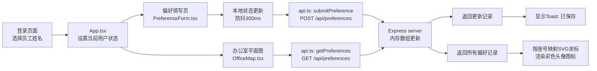

## 1. 产品概述

办公室偏好收集与展示应用是一个轻量级团队协作工具，帮助小团队记录和可视化展示员工的个性化办公偏好，提升团队幸福感和协作效率。

- **主要目的**：收集员工办公偏好（工位位置、温度、植物、零食等），并以虚拟办公室平面图形式可视化展示
- **解决问题**：远程/混合办公模式下，团队成员之间缺乏对彼此办公习惯的了解，容易造成不必要的干扰
- **目标用户**：10-50人的小团队，远程办公或开放式办公环境的团队成员
- **产品价值**：通过有趣的可视化方式促进团队成员相互了解，营造更舒适包容的办公文化

---

## 2. 核心功能

### 2.1 用户角色

| 角色 | 注册方式 | 核心权限 |
|------|----------|----------|
| 团队成员 | 从预设员工列表选择姓名登录 | 填写自己的偏好、查看全员偏好分布、点击工位查看详情 |

### 2.2 功能模块

1. **登录页面**：员工姓名下拉选择器、登录按钮
2. **偏好填写页面**：8项偏好调节控件（滑块/选择器/单选组）、实时防抖保存、保存提示
3. **办公室平面图页面**：10×8网格工位图、彩色头像图标、悬停气泡卡片、点击缩放详情面板

### 2.3 页面详情

| 页面名称 | 模块名称 | 功能描述 |
|----------|----------|----------|
| 登录页面 | 员工选择器 | 下拉列表展示10个预设员工姓名，无需密码 |
| 登录页面 | 登录操作区 | 登录按钮，点击后校验并跳转至偏好填写页 |
| 偏好填写页面 | 用户信息栏 | 顶部显示当前登录用户名，提供导航链接 |
| 偏好填写页面 | 工位朝向选择 | 下拉选择：东/南/西/北 |
| 偏好填写页面 | 空调温度滑块 | 16-30℃范围，步长1℃，实时显示当前值 |
| 偏好填写页面 | 屏幕亮度滑块 | 0-100%范围，滑动调节 |
| 偏好填写页面 | 植物偏好单选组 | 多肉/绿萝/仙人掌/不要植物，带表情图标 |
| 偏好填写页面 | 零食口味单选组 | 甜/咸/辣/混合，带口味emoji |
| 偏好填写页面 | 噪音容忍度滑块 | 1-7分，带分段标签（安静/适中/吵闹） |
| 偏好填写页面 | 灯光类型按钮组 | 自然光/暖光/冷光，带色块预览 |
| 偏好填写页面 | 休息偏好卡片组 | 靠窗/靠门/远离通道，120×90px卡片带icon |
| 偏好填写页面 | 保存提示Toast | 防抖保存后右上角显示绿色"已保存"提示，0.5s淡出 |
| 办公室平面图 | 网格布局 | 10×8网格，每格40×40px，间距4px |
| 办公室平面图 | 工位头像 | 圆形彩色图标，底色随机但一致，直径40px |
| 办公室平面图 | 头像呼吸动画 | 自己工位显示脉冲呼吸效果（scale 1.0→1.05，2s周期） |
| 办公室平面图 | 悬停气泡卡片 | 200px宽，4px圆角，显示姓名+偏好摘要+动态提示语 |
| 办公室平面图 | 详情面板 | 点击工位后自动缩放平移居中，显示完整偏好+发送谢谢按钮 |

---

## 3. 核心流程

### 用户主流程

1. 用户打开应用进入登录页面
2. 从下拉列表选择自己的姓名，点击登录
3. 跳转至偏好填写页面，顶部显示用户名
4. 逐项调节8个偏好项，每次修改触发300ms防抖保存
5. 保存成功后右上角短暂显示"已保存"提示
6. 导航至办公室平面图，查看10×8网格工位分布
7. 悬停任意工位查看偏好摘要卡片
8. 点击工位图标，页面自动平移缩放使该工位居中，展开详情面板
9. 可在详情面板点击"发送谢谢"按钮

### 数据流转流程

---

## 4. 用户界面设计

### 4.1 设计风格

- **主色**：#5B7B8A 蓝灰色（沉稳专业）
- **辅色**：#F4E9D8 米白色（温暖柔和，背景和卡片）
- **强调色**：#C98B7B 暖褐色（按钮、交互元素）
- **辅助灰**：#F8F6F3 极浅灰（偏好项卡片底）
- **整体氛围**：柔和温暖、舒适居家感，降低办公的冰冷感

- **按钮样式**：提交按钮带渐变背景（#F4E9D8 → #5B7B8A），悬停时渐变反转，0.3s过渡动画
- **卡片样式**：圆角12px，内边距16px，浅灰底色，卡片间距16px
- **字体**：标题使用温暖有特色的衬线/半衬线字体，正文使用清晰易读的无衬线字体
- **布局**：最大宽度1200px居中，卡片式分组，呼吸感留白
- **图标/emoji**：植物和零食偏好使用emoji表情，灯光偏好使用色块预览，休息偏好使用lucide图标

### 4.2 页面设计概览

| 页面名称 | 模块名称 | UI元素 |
|----------|----------|--------|
| 登录页面 | 选择器区域 | 居中卡片布局，温暖米白背景，主色下拉选择框，渐变登录按钮，页面淡入动画 |
| 偏好填写页面 | 顶部导航栏 | 左侧显示用户名（主色粗体），右侧导航链接（平面图/退出），辅色背景 |
| 偏好填写页面 | 偏好表单区 | 两列卡片网格（移动端单列），每张卡片浅灰底+12px圆角，标签文字主色，交互元素强调色 |
| 偏好填写页面 | 保存Toast | 右上角定位，绿色背景+白色文字，fadeIn→stay→fadeOut 0.5s动画 |
| 办公室平面图 | 页面布局 | 顶部导航栏+平面图主体，米白色背景营造空间感 |
| 办公室平面图 | SVG网格 | 10×8浅灰虚线框网格，4px间距，整体居中，空工位灰色虚线 |
| 办公室平面图 | 工位头像 | 圆形图标直径40px，员工姓名首字母白色叠加，自己工位呼吸脉冲动画 |
| 办公室平面图 | 悬停气泡 | 200px宽弹出卡片，4px圆角0.5px浅灰边框，阴影提升层次感 |
| 办公室平面图 | 详情面板 | 工位缩放平移0.3s ease过渡，侧边滑出完整偏好卡片，"发送谢谢"强调色按钮 |

### 4.3 响应式设计

- **设计策略**：桌面优先（Desktop-first），移动端自适应
- **断点**：768px
- **表单区域**：≥768px为两列卡片网格；<768px变为单列布局
- **平面图网格**：≥768px每格40×40px；<768px缩小为30×30px并启用横向滚动容器
- **详情面板**：桌面端侧边滑出；移动端底部弹出
- **触摸优化**：移动端所有可点击区域≥44×44px，滑块控件加粗便于触摸操作

---
