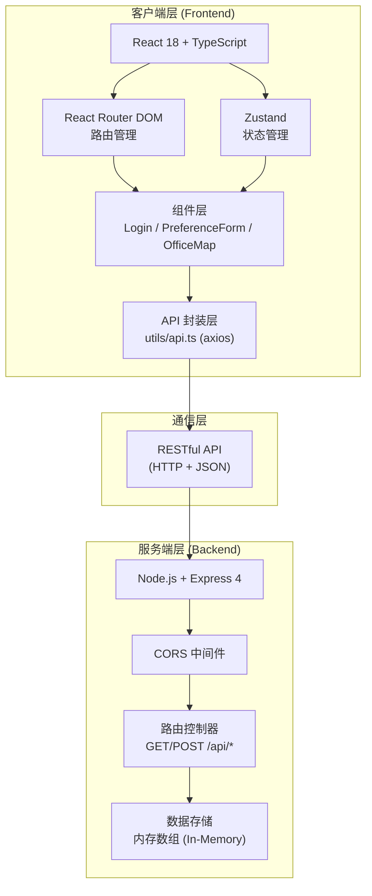
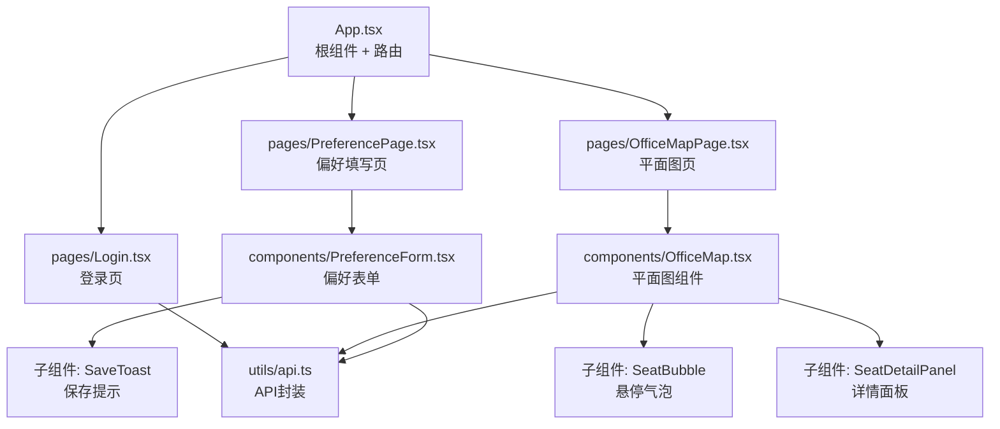
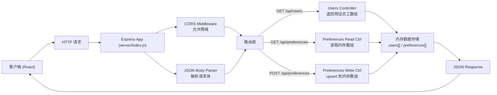
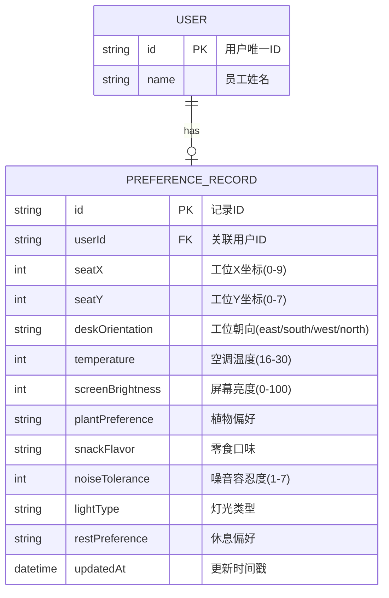

## 1. 架构设计

### 系统整体架构



### 前端组件调用关系



---

## 2. 技术说明

### 技术栈选择

| 层级 | 技术选型 | 版本 | 说明 |
|------|----------|------|------|
| 前端框架 | React | 18.x | 组件化开发，生态成熟 |
| 前端语言 | TypeScript | 5.x | 类型安全，减少运行时错误 |
| 构建工具 | Vite | 5.x | 快速开发构建，HMR |
| 路由管理 | react-router-dom | 6.x | SPA路由导航 |
| 状态管理 | zustand | 4.x | 轻量级全局状态（当前用户、偏好列表） |
| HTTP客户端 | axios | 1.x | 统一封装API请求 |
| 图标库 | lucide-react | 最新 | 休息偏好、导航图标 |
| UI样式 | 原生CSS + CSS变量 | - | 不使用Tailwind，精确控制配色和动画 |
| 后端框架 | Express | 4.x | 轻量级HTTP服务器 |
| 后端中间件 | cors | 最新 | 跨域资源共享 |
| 工具库 | uuid | 最新 | 生成唯一ID |

### 初始化方式

使用 `react-express-ts` 模板通过 vite-init 初始化项目，随后按用户需求调整依赖（移除tailwind，按用户指定的文件结构组织代码）。

---

## 3. 路由定义

### 前端路由 (React Router)

| 路由路径 | 页面组件 | 目的 |
|----------|----------|------|
| `/login` | `pages/Login.tsx` | 用户登录页，选择员工姓名 |
| `/preference` | `pages/PreferencePage.tsx` | 偏好填写页，8项偏好调节 |
| `/office-map` | `pages/OfficeMapPage.tsx` | 办公室平面图，可视化展示 |
| `*` | 重定向到 `/login` | 未匹配路由默认跳转登录 |

### 后端路由 (Express)

| 方法 | 路由路径 | 控制器函数 | 用途 |
|------|----------|------------|------|
| GET | `/api/users` | `getUsers()` | 获取预设的10名员工列表 |
| GET | `/api/preferences` | `getPreferences()` | 获取所有已提交的偏好记录 |
| POST | `/api/preferences` | `submitPreference()` | 提交/更新用户偏好记录 |

---

## 4. API 定义

### 4.1 类型定义 (TypeScript)

```typescript
// ============ 基础实体类型 ============
interface User {
  id: string;
  name: string;
}

// ============ 偏好项枚举 ============
type DeskOrientation = 'east' | 'south' | 'west' | 'north';
type PlantPreference = 'succulent' | 'pothos' | 'cactus' | 'none';
type SnackFlavor = 'sweet' | 'salty' | 'spicy' | 'mixed';
type LightType = 'natural' | 'warm' | 'cool';
type RestPreference = 'window' | 'door' | 'away';

// ============ 偏好对象 ============
interface UserPreferences {
  deskOrientation: DeskOrientation;      // 工位朝向
  temperature: number;                    // 空调温度 16-30
  screenBrightness: number;               // 屏幕亮度 0-100
  plantPreference: PlantPreference;       // 植物偏好
  snackFlavor: SnackFlavor;               // 零食口味
  noiseTolerance: number;                 // 噪音容忍度 1-7
  lightType: LightType;                   // 灯光类型
  restPreference: RestPreference;         // 休息偏好
}

// ============ 偏好记录（带座号） ============
interface PreferenceRecord {
  id: string;                              // 记录唯一ID
  userId: string;                          // 用户ID
  seatX: number;                           // 工位X坐标 0-9
  seatY: number;                           // 工位Y坐标 0-7
  preferences: UserPreferences;            // 偏好对象
  updatedAt: string;                       // 更新时间 ISO格式
}

// ============ API 请求/响应 ============
// GET /api/users
interface GetUsersResponse {
  users: User[];
}

// GET /api/preferences
interface GetPreferencesResponse {
  preferences: PreferenceRecord[];
}

// POST /api/preferences
interface SubmitPreferenceRequest {
  userId: string;
  seatX: number;
  seatY: number;
  preferences: UserPreferences;
}
interface SubmitPreferenceResponse {
  success: boolean;
  record: PreferenceRecord;
}
```

### 4.2 API 封装函数 (src/utils/api.ts)

```typescript
import axios from 'axios';

const api = axios.create({ baseURL: '/api' });

// 获取员工列表
export const getUsers = (): Promise<User[]> =>
  api.get<GetUsersResponse>('/users').then(r => r.data.users);

// 获取所有偏好记录
export const getPreferences = (): Promise<PreferenceRecord[]> =>
  api.get<GetPreferencesResponse>('/preferences').then(r => r.data.preferences);

// 提交偏好
export const submitPreference = (
  data: SubmitPreferenceRequest
): Promise<PreferenceRecord> =>
  api.post<SubmitPreferenceResponse>('/preferences', data)
     .then(r => r.data.record);
```

---

## 5. 后端服务架构图



### 后端文件结构

```
server/
└── index.js          # Express 服务器入口（路由+内存存储+中间件）
```

---

## 6. 数据模型

### 6.1 ER 数据模型图



### 6.2 内存数据初始化 (server/index.js)

```javascript
// ---------- 预设员工数据 ----------
const USERS = [
  { id: 'u1',  name: '张明远' },
  { id: 'u2',  name: '李思涵' },
  { id: 'u3',  name: '王子轩' },
  { id: 'u4',  name: '赵雨欣' },
  { id: 'u5',  name: '陈浩然' },
  { id: 'u6',  name: '刘雅婷' },
  { id: 'u7',  name: '周俊杰' },
  { id: 'u8',  name: '吴晓梦' },
  { id: 'u9',  name: '郑凯文' },
  { id: 'u10', name: '孙若曦' },
];

// ---------- 座号分配策略 ----------
// 用户ID按顺序映射到 10×8 网格的前N个连续坐标
// userId: u1 → (0,0), u2 → (1,0), u3 → (2,0) ...
function getSeatByUserId(userId) {
  const index = USERS.findIndex(u => u.id === userId);
  const x = index % 10;  // 列: 0-9
  const y = Math.floor(index / 10); // 行: 0-7
  return { seatX: x, seatY: y };
}

// ---------- 偏好存储数组 ----------
let preferencesDB = []; // 元素结构同 PreferenceRecord
```

---

## 7. 性能与优化措施

| 约束目标 | 实现方案 |
|----------|----------|
| 表单防抖保存 300ms | `lodash.debounce` 或自定义 `useDebounce` hook 包裹提交函数 |
| 首次加载 API < 1s | 使用 Promise.all 并发请求 `getUsers + getPreferences`，Express 内存读写极快 |
| 50 工位渲染 < 200ms | 纯 SVG 渲染、避免深层嵌套、头像颜色使用简单哈希算法计算、React 合理 memo |
| 工位缩放平移动画 | CSS `transform: translate() scale()` + `transition: 0.3s ease`，GPU 加速 |
| Toast 提示 | 挂载在 Portal，独立渲染节点，避免影响表单 re-render |
| 悬停气泡 | 事件委托 + mouseenter/mouseleave，避免频繁 re-render |

---
