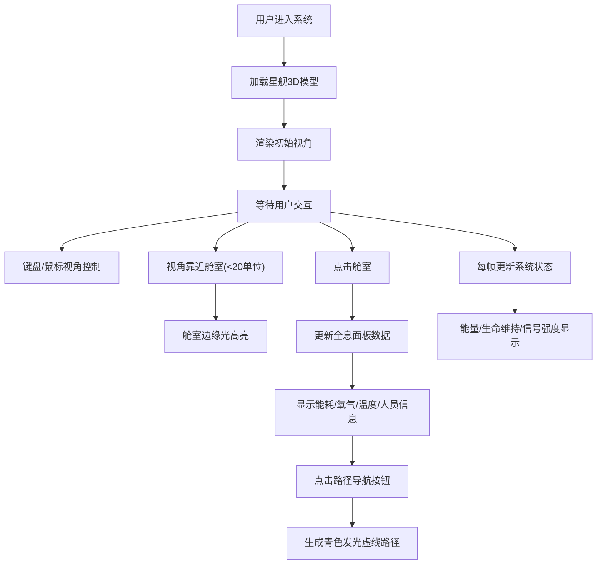

## 1. 产品概述

星舰内部全息导航系统是一个基于WebGL的3D交互式可视化应用，允许用户在太空船的三维结构模型中自由穿梭，查看各舱室功能分区、生命维持系统状态以及通道路径。系统旨在为舰船操作人员提供直观的全息导航和状态监控体验。

- 目标用户：舰船指挥人员、维护工程师、导航操作员
- 产品价值：通过沉浸式3D交互提高舰船运维效率，快速定位舱室和监控系统状态

## 2. 核心功能

### 2.1 用户角色
| 角色 | 注册方式 | 核心权限 |
|------|----------|----------|
| 操作员 | 无需注册 | 浏览星舰3D模型、查看舱室数据、路径导航 |

### 2.2 功能模块
1. **场景导航模块**：加载星舰3D模型、键盘/鼠标交互、惯性阻尼、舱室高亮
2. **全息信息面板模块**：右侧毛玻璃面板、舱室数据展示、路径导航按钮
3. **系统状态模块**：左上角全局指标（能量、生命维持、信号强度）

### 2.3 页面详情
| 页面名称 | 模块名称 | 功能描述 |
|----------|----------|----------|
| 主界面 | 场景导航模块 | WASD平移、鼠标拖拽旋转、滚轮缩放、20单位内舱室边缘光高亮、0.5秒惯性阻尼 |
| 主界面 | 全息信息面板模块 | 点击舱室显示能耗环形进度条、氧气浮动动画、温度异常闪烁、人员图标计数、路径导航按钮 |
| 主界面 | 系统状态模块 | 总能量余量进度条（低于20%红闪）、生命维持三色状态、五格信号强度图标 |

## 3. 核心流程

用户进入系统后查看星舰3D全景，通过键盘鼠标自由探索舰船结构。当视角靠近舱室时自动高亮轮廓，点击舱室触发右侧全息面板展示实时数据，可点击路径导航按钮生成发光引导路径。左上角持续显示全局系统状态指标。

## 4. 用户界面设计

### 4.1 设计风格
- 主色：深空黑色 #0A0A1A
- 强调色：科技蓝 #00BFFF、青色 #00FFFF
- 舱室区分配色：指挥舱淡蓝#ADD8E6、生活区淡绿#98FB98、引擎室橙红#FF8C00、货舱灰#B0C4DE、气闸舱淡紫#DDA0DD
- 字体：Orbitron（谷歌等宽科技感字体）
- 按钮：悬停0.3秒亮度渐变 + 0.5px发光外扩
- 面板：右侧半透明毛玻璃效果（背景模糊8px，白色文字阴影）

### 4.2 页面设计概览
| 页面名称 | 模块名称 | UI元素 |
|----------|----------|--------|
| 主界面 | 3D场景 | 全屏Three.js画布、五舱室半透明模型、边缘光高亮、路径虚线动画 |
| 主界面 | 全息信息面板 | 右侧固定面板、环形能耗进度条、数值动画、毛玻璃背景、导航按钮 |
| 主界面 | 系统状态 | 左上角固定三指标、能量进度条、状态圆点、信号格图标 |

### 4.3 响应式
- 基准分辨率：1920x1080
- 适配分辨率：1366x768、1440x900
- 面板宽度自适应，字体大小按视口宽度等比缩放（使用vw单位 + clamp限制）

### 4.4 3D场景指引
- 环境：深空黑色背景，微弱环境光 + 方向光营造科技氛围
- 照明：AmbientLight(0x404040) + DirectionalLight(0xffffff, 0.8) + 各舱室点光源
- 相机：PerspectiveCamera，初始位置可俯瞰全舰，支持透视变换
- 交互：WASD平移、鼠标左键拖拽旋转、滚轮缩放、0.5秒惯性阻尼衰减
- 后处理：舱室边缘发光效果（使用OutlinePass或自定义Shader实现边缘光）
- 性能目标：不低于30FPS，动画过渡0.3秒内完成
