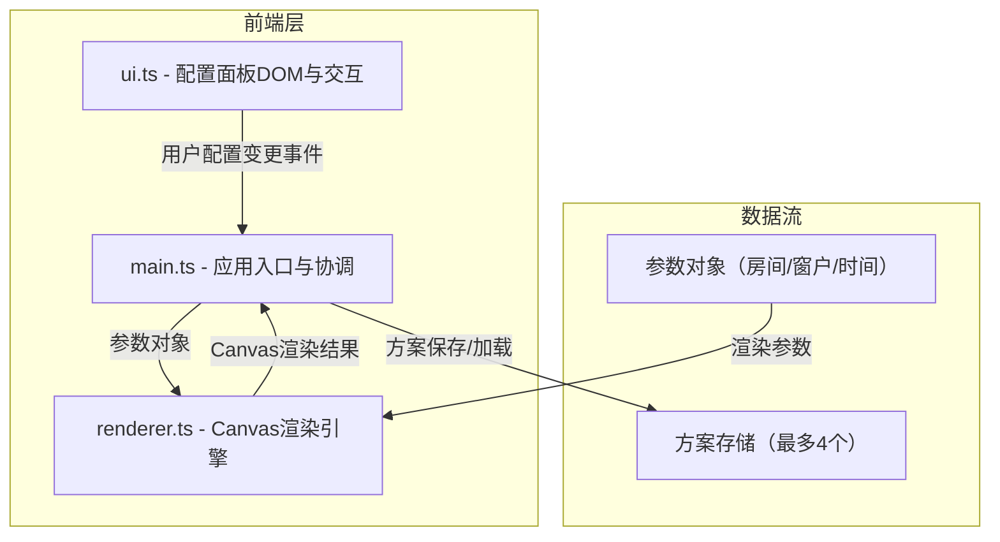

## 1. 架构设计



## 2. 技术说明

- 前端：TypeScript + Vite + 纯Canvas 2D（不使用任何第三方3D库）
- 初始化工具：Vite
- 后端：无
- 数据库：无（方案数据存储在内存中，可扩展为localStorage）

## 3. 文件结构

| 文件路径 | 职责 |
|----------|------|
| package.json | 依赖声明（vite, typescript），启动脚本 |
| index.html | 入口页面，深色背景和全屏渲染容器 |
| tsconfig.json | TypeScript严格模式配置，ES2020目标 |
| vite.config.js | Vite构建配置 |
| src/main.ts | 应用入口，初始化UI事件绑定和渲染循环，协调配置面板和渲染引擎 |
| src/renderer.ts | 核心渲染引擎，房间绘制、光照计算、阴影投射、材质渲染 |
| src/ui.ts | 左侧配置面板DOM创建、事件绑定、滑块/选择器/按钮交互逻辑 |

## 4. 核心数据类型定义

```typescript
interface RoomParams {
  length: number;
  width: number;
  wallColorIndex: number;
  floorMaterial: 'wood' | 'tile' | 'carpet';
}

interface WindowParams {
  orientation: 'east' | 'south' | 'west' | 'north';
  width: number;
  height: number;
  sillHeight: number;
  transmittance: number;
}

interface LightParams {
  timeHour: number;
  timeMinute: number;
  windows: WindowParams[];
}

interface Scheme {
  id: string;
  label: string;
  room: RoomParams;
  light: LightParams;
  thumbnail: string;
}

interface RenderParams {
  room: RoomParams;
  light: LightParams;
  viewMode: 'top' | 'perspective';
}
```

## 5. 渲染引擎架构

### 5.1 光照计算

- 根据时间、纬度（默认北纬40°）计算太阳高度角和方位角
- 太阳位置公式：基于日期和时间的赤纬角和时角计算
- 每个窗户作为面光源，根据朝向和太阳角度计算入射光方向

### 5.2 阴影投射

- 基于光线追踪的2D阴影投射算法
- 硬阴影：模糊半径2px，用于小面积窗户
- 软阴影：模糊半径12px，用于大面积窗户或低透光率窗户
- 阴影边缘模糊度与窗户面积成正比

### 5.3 材质渲染

- 木地板：漫反射暖棕色，粗糙度0.4
- 瓷砖：漫反射浅灰白色，粗糙度0.1（高光反射）
- 地毯：漫反射深色，粗糙度0.85（接近纯漫反射）

### 5.4 渲染管线

1. 清空画布
2. 绘制房间结构（墙壁、地板）
3. 计算光照方向和强度
4. 绘制窗户光源
5. 投射阴影到地面和墙面
6. 应用材质纹理和光照着色
7. 渲染家具简图（可选）
8. 叠加参数水印

## 6. UI交互架构

### 6.1 事件流

- 用户操作 → ui.ts 捕获事件 → 回调通知 main.ts → main.ts 更新参数 → 调用 renderer.ts 重绘

### 6.2 动画系统

- 时间切换：0.5秒关键帧插值渐变
- 视图切换：0.3秒淡入淡出
- 面板折叠：0.3秒滑动动画
- 渲染循环：requestAnimationFrame，目标30fps
