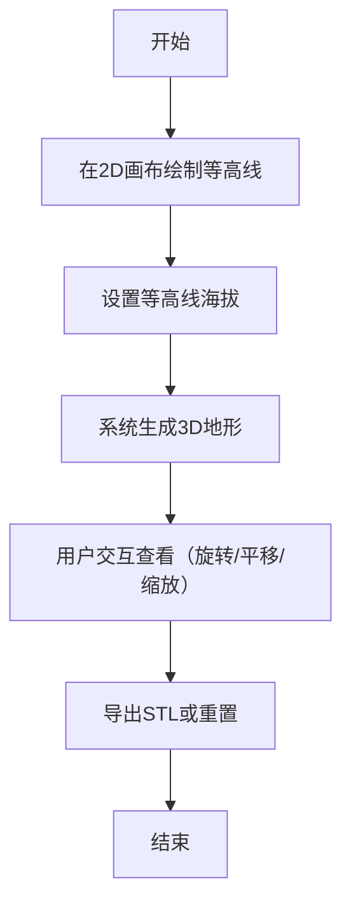

## 1. 产品概述

交互式等高线地形生成器，用于地质勘探和教学演示场景。用户通过绘制2D等高线，系统自动生成色彩渲染的3D地貌模型，直观展示地表起伏和海拔分布。

- **主要用途**：地质勘探可视化、地理教学演示、地形设计辅助
- **解决问题**：将抽象的等高线图转化为直观可交互的3D模型
- **目标用户**：地质工作者、地理教师、学生、地形设计人员
- **市场价值**：提供低成本、高效率的地形可视化工具，提升教学和设计效率

## 2. 核心功能

### 2.1 用户角色

| 角色 | 注册方式 | 核心权限 |
|------|----------|----------|
| 普通用户 | 无需注册，本地运行 | 绘制等高线、生成地形、导出STL、重置场景 |

### 2.2 功能模块

1. **等高线绘制模块**：2D画布绘制封闭等高线，设置海拔，拖拽微调，撤销操作
2. **3D地形生成模块**：双三次插值算法生成高度图，自适应分辨率网格，渐变色彩渲染
3. **视角操控模块**：旋转、平移、缩放，阻尼惯性效果，等高线叠加，悬停信息显示
4. **导出与重置模块**：STL文件导出，一键重置带淡出动画
5. **等高线列表管理模块**：列表显示、选中高亮、拖拽排序

### 2.3 页面详情

| 页面名称 | 模块名称 | 功能描述 |
|-----------|-------------|---------------------|
| 主页面 | 2D绘图画布 | 600x600像素方格纸画布，支持点击绘制、拖拽微调、撤销操作 |
| 主页面 | 右侧控制面板 | 海拔输入、等高线列表、导出/重置按钮 |
| 主页面 | 3D场景视口 | Three.js渲染的3D地形，支持视角操控、悬停信息显示 |

## 3. 核心流程

用户在左侧2D画布上点击绘制封闭等高线 → 设置每条等高线的海拔高度 → 系统实时插值生成3D地形 → 用户可旋转/平移/缩放查看地形 → 可选择导出STL文件或重置场景

## 4. 用户界面设计

### 4.1 设计风格

- **主色调**：暗色主题，背景#1a1a2e，面板#16213e
- **辅助色**：低海拔#228B22（绿色）、中海拔#DAA520（黄色）、高海拔#8B4513（棕色）、雪顶白色
- **按钮样式**：圆角8px，悬浮缩放1.05，点击水波纹效果
- **字体**：白色#FFFFFF，14px，现代无衬线字体
- **布局风格**：三栏布局（左：2D画布，中：3D场景，右：控制面板）
- **毛玻璃效果**：半透明面板rgba(22,33,62,0.85)，模糊半径10px

### 4.2 页面设计概述

| 页面名称 | 模块名称 | UI元素 |
|-----------|-------------|-------------|
| 主页面 | 2D绘图画布 | 浅灰方格纸背景，#e0e0e0，20px网格，绘制的彩色等高线 |
| 主页面 | 3D场景 | 渐变天空盒（#FFDAB9→#1E3A5F），彩色地形，半透明白色等高线叠加 |
| 主页面 | 控制面板 | 海拔渐变条（垂直）、等高线列表、功能按钮、操作提示 |

### 4.3 响应式设计

- **桌面端**（≥768px）：三栏布局，左右面板固定宽度，中间3D场景自适应
- **移动端**（<768px）：顶部工具栏，底部浮动面板，3D场景占满视口主体
- **触控优化**：支持双指缩放、单指旋转等手势操作

### 4.4 3D场景设计

- **环境**：渐变天空盒，地平线淡橙色#FFDAB9，顶部深蓝色#1E3A5F
- **光照**：半球光（天空色+地面色）+ 方向光（模拟太阳光，带阴影）
- **相机**：透视相机，初始视角45度俯角，可环绕地形旋转
- **后期处理**：抗锯齿，色调映射，轻微泛光增强立体感
- **交互**：OrbitControls带0.3秒阻尼，悬停显示海拔坐标
- **性能**：128x128基础网格，坡度大的区域256x256细节网格，三角面≤100,000
