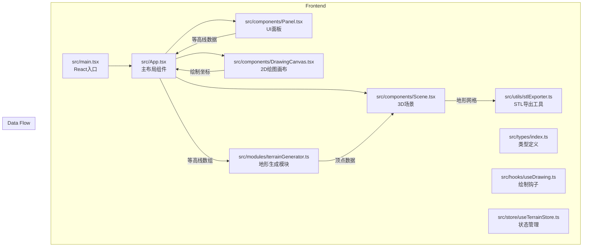
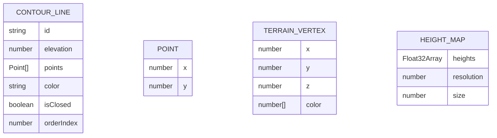

## 1. 架构设计



## 2. 技术描述

- **前端框架**：React@18 + TypeScript@5 + Vite@5
- **3D渲染**：Three.js@0.160 + @react-three/fiber@8 + @react-three/drei@9 + @react-three/postprocessing@2
- **状态管理**：Zustand@4
- **样式方案**：TailwindCSS@3
- **初始化工具**：Vite (react-ts模板)
- **后端**：无（纯前端应用）
- **数据库**：无（本地存储可选）

### 核心依赖版本
- react: ^18.2.0
- react-dom: ^18.2.0
- three: ^0.160.0
- @types/react: ^18.2.0
- @types/react-dom: ^18.2.0
- @types/three: ^0.160.0
- typescript: ^5.3.0
- vite: ^5.0.0
- zustand: ^4.4.0
- tailwindcss: ^3.4.0
- lucide-react: ^0.300.0

## 3. 路由定义

| 路由 | 用途 |
|-------|---------|
| / | 主页面，包含2D画布、3D场景和控制面板 |

## 4. API 定义（无后端）

本项目为纯前端应用，无后端API。

## 5. 数据模型

### 5.1 数据模型定义



### 5.2 TypeScript 类型定义

```typescript
// src/types/index.ts

export interface Point {
  x: number;
  y: number;
}

export interface ContourLine {
  id: string;
  elevation: number;
  points: Point[];
  color: string;
  isClosed: boolean;
  orderIndex: number;
}

export interface TerrainVertex {
  x: number;
  y: number;
  z: number;
  color: [number, number, number];
}

export interface HeightMap {
  heights: Float32Array;
  resolution: number;
  size: number;
}

export interface HoverInfo {
  elevation: number;
  position: { x: number; y: number };
  screenX: number;
  screenY: number;
}

export interface TerrainState {
  contours: ContourLine[];
  selectedContourId: string | null;
  heightMap: HeightMap | null;
  isGenerating: boolean;
  hoverInfo: HoverInfo | null;
  addContour: (contour: ContourLine) => void;
  updateContour: (id: string, updates: Partial<ContourLine>) => void;
  removeContour: (id: string) => void;
  selectContour: (id: string | null) => void;
  reorderContours: (contours: ContourLine[]) => void;
  setHeightMap: (heightMap: HeightMap | null) => void;
  setHoverInfo: (info: HoverInfo | null) => void;
  reset: () => void;
  undo: () => void;
}
```

## 6. 项目文件结构

```
.
├── index.html                 # 入口HTML
├── package.json              # 依赖配置
├── vite.config.ts            # Vite配置
├── tsconfig.json             # TypeScript配置
├── tailwind.config.js        # TailwindCSS配置
├── postcss.config.js         # PostCSS配置
└── src/
    ├── main.tsx              # React入口
    ├── App.tsx               # 主应用组件
    ├── types/
    │   └── index.ts          # 类型定义
    ├── components/
    │   ├── Panel.tsx         # 控制面板组件
    │   ├── Scene.tsx         # 3D场景组件
    │   ├── DrawingCanvas.tsx # 2D绘图画布组件
    │   ├── ContourList.tsx   # 等高线列表组件
    │   ├── ElevationSlider.tsx # 海拔滑块组件
    │   ├── Toolbar.tsx       # 工具栏组件
    │   ├── HoverTooltip.tsx  # 悬停提示组件
    │   └── RippleButton.tsx  # 水波纹按钮组件
    ├── modules/
    │   └── terrainGenerator.ts # 地形生成模块
    ├── utils/
    │   ├── bicubicInterpolation.ts # 双三次插值
    │   ├── colorGradient.ts  # 颜色渐变工具
    │   ├── stlExporter.ts    # STL导出工具
    │   └── contourUtils.ts   # 等高线工具函数
    ├── hooks/
    │   ├── useDrawing.ts     # 绘制逻辑钩子
    │   ├── useTerrainGeneration.ts # 地形生成钩子
    │   └── useRipple.ts      # 水波纹效果钩子
    ├── store/
    │   └── useTerrainStore.ts # Zustand状态管理
    └── styles/
        └── index.css         # 全局样式
```

## 7. 核心算法说明

### 7.1 双三次插值算法 (Bicubic Interpolation)

用于根据离散的等高线点生成平滑的高度图。算法对每个网格点，使用周围16个控制点进行三次多项式插值，确保C1连续性。

### 7.2 自适应网格细分

根据高度梯度（坡度）动态调整网格分辨率：
- 坡度 < 15°：使用128x128基础网格
- 15° ≤ 坡度 < 45°：使用192x192网格
- 坡度 ≥ 45°：使用256x256细节网格

### 7.3 海拔颜色映射

五段式渐变映射，过渡带宽5米：
- < 0米：半透明蓝色 (rgba(0, 100, 255, 0.7))
- 0-200米：#228B22 森林绿 → #32CD32 酸橙绿
- 200-500米：#32CD32 → #DAA520 金菊黄
- 500-800米：#DAA520 → #8B4513 马鞍棕
- > 800米：#8B4513 → #FFFFFF 雪白

## 8. 性能优化策略

1. **Web Workers**：地形插值计算在Web Worker中执行，避免阻塞主线程
2. **增量更新**：仅在等高线变化时重新计算高度图
3. **LOD (Level of Detail)**：根据相机距离动态调整地形网格精度
4. **BufferGeometry**：使用Three.js BufferGeometry减少绘制调用
5. **材质复用**：共享材质实例，减少GPU内存占用
6. **帧率监控**：自动在低端设备上降低渲染分辨率
