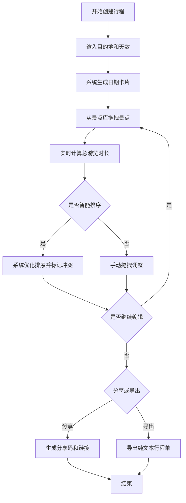

## 1. 产品概述

旅行行程规划助手是一款帮助旅行者快速规划和分享多日行程路线的Web应用。针对自由行用户在计划旅行时，面对海量景点信息、交通衔接和住宿选择难以高效整合的痛点，提供可视化拖拽编辑、智能排序优化和便捷分享导出功能。

- 目标用户：计划自由行的旅行者、旅游爱好者
- 核心价值：将零散的景点信息高效整合为有序、可执行的行程单

## 2. 核心功能

### 2.1 功能模块

1. **行程创建与编辑模块**：创建行程、设置目的地城市和天数、拖拽景点到时段卡片、查看景点详情
2. **智能排序与优化模块**：基于地理距离和开放时间自动排序、时间冲突标记、实时游览时长计算
3. **行程分享与导出模块**：生成分享码和链接、复制到剪贴板、导出纯文本行程单

### 2.2 页面详情

| 页面名称 | 模块名称 | 功能描述 |
|-----------|-------------|---------------------|
| 主行程规划页 | 景点库 | 搜索过滤、分类浏览、景点卡片拖拽源 |
| 主行程规划页 | 行程编辑区 | 日期卡片、时段列表、景点拖放排序、冲突标记 |
| 主行程规划页 | 顶部操作栏 | 行程基本信息、智能排序、分享导出、总时长显示 |
| 主行程规划页 | 今日提示 | 浮动灯泡按钮、Tips弹窗 |
| 分享查看页 | 行程展示 | 只读模式展示分享的行程内容 |

## 3. 核心流程

用户创建行程后，从左侧景点库拖拽景点到右侧日程的各个时段，系统实时计算总游览时长。用户可使用智能排序功能自动优化行程顺序，标记冲突景点。完成编辑后可生成分享链接或导出纯文本行程单。

## 4. 用户界面设计

### 4.1 设计风格

- 主色调：#2E8B57（蓝绿色），辅助色：#F0F8FF（淡蓝白色），强调色：#FF6B6B（珊瑚红）
- 按钮风格：圆角8px，平滑过渡0.2秒，悬停时阴影加深
- 字体：使用现代无衬线字体，标题加粗，正文清晰易读
- 布局：左右分栏设计，左侧景点库320px，右侧卡片式日程布局
- 图标风格：简洁线性图标，灯泡提示使用圆形浮动按钮

### 4.2 页面设计概览

| 页面名称 | 模块名称 | UI元素 |
|-----------|-------------|-------------|
| 主行程规划页 | 景点库 | 白色背景卡片、圆角8px、轻微阴影、悬停上移2px、搜索框、分类过滤标签 |
| 主行程规划页 | 行程编辑区 | 日期卡片显示日期和星期、时段分区（上午/下午/晚间）、景点卡片带详情按钮、冲突时红色抖动动画 |
| 主行程规划页 | 顶部操作栏 | 目的地输入、天数选择器（3-14天）、智能排序按钮、分享/导出按钮、总时长显示 |
| 主行程规划页 | 今日提示 | 右上角圆形浮动按钮、灯泡图标、点击弹出圆角16px带蓝色渐变边框的Tips弹窗 |

### 4.3 响应式设计

- 桌面端（>768px）：左右分栏布局，左侧景点库固定320px宽度
- 移动端（≤768px）：景点库折叠为底部抽屉，在主行程区域下方滑动展开
- 所有触摸操作优化，确保拖拽和点击的可用性
