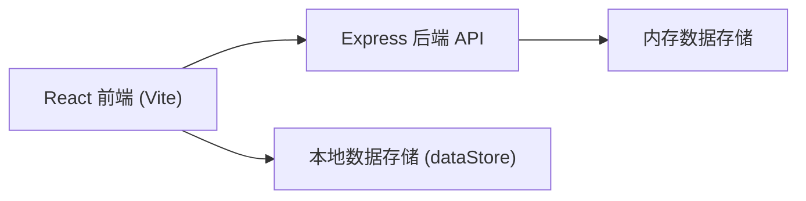
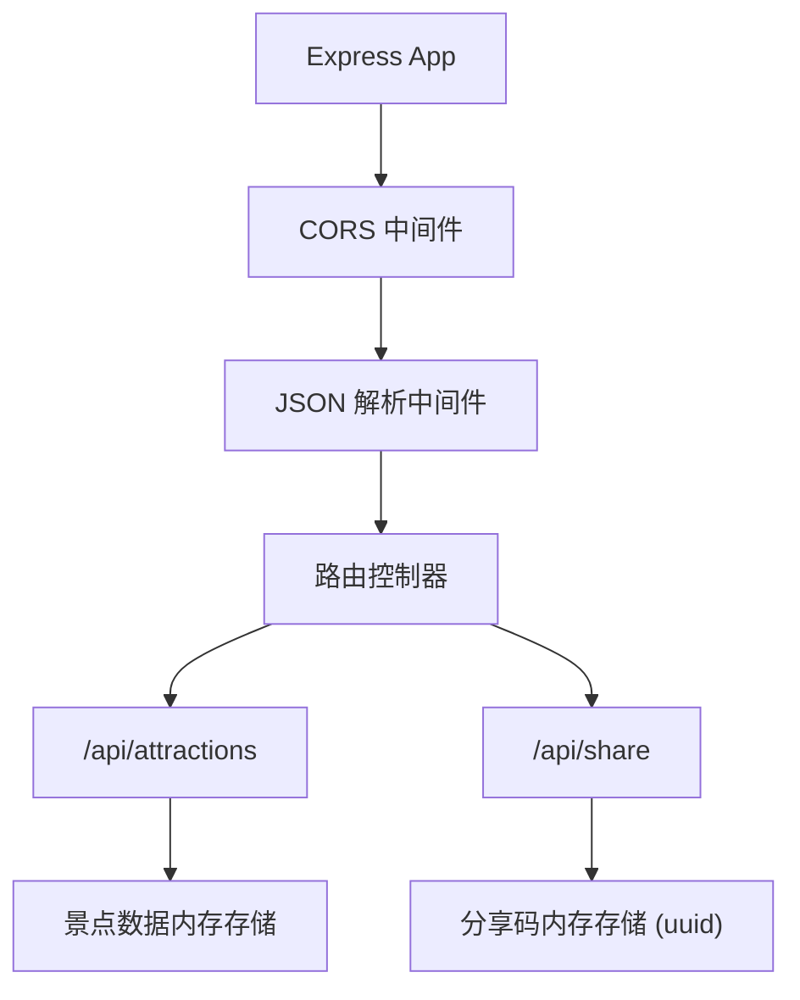
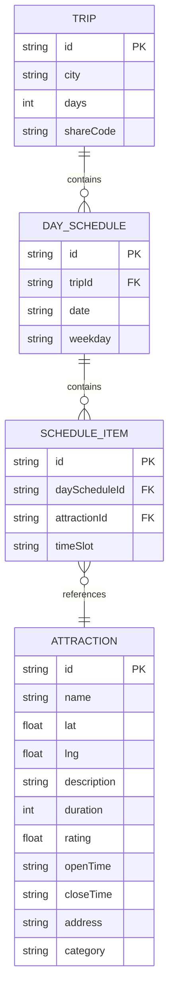

## 1. 架构设计



## 2. 技术说明

- 前端：React 18 + TypeScript + Vite + react-beautiful-dnd + axios + react-router-dom
- 后端：Node.js + Express + cors + uuid
- 构建工具：Vite，配置路径别名 @ 指向 src 目录
- 状态管理：React Hooks (useState, useEffect) 管理组件状态
- 样式方案：内联样式 + CSS 变量 + CSS 动画

## 3. 路由定义

| 路由 | 用途 |
|-------|---------|
| / | 主行程规划页面 |
| /share/:code | 分享行程查看页面 |

## 4. API 定义

### 4.1 TypeScript 类型定义

```typescript
interface Attraction {
  id: string;
  name: string;
  lat: number;
  lng: number;
  description: string;
  duration: number;
  rating: number;
  openTime: string;
  closeTime: string;
  address: string;
  category: string;
}

interface ScheduleItem {
  id: string;
  attractionId: string;
  attraction: Attraction;
}

interface DaySchedule {
  date: string;
  weekday: string;
  morning: ScheduleItem[];
  afternoon: ScheduleItem[];
  evening: ScheduleItem[];
}

interface Trip {
  id: string;
  city: string;
  days: number;
  schedules: DaySchedule[];
  shareCode?: string;
}
```

### 4.2 后端 API 端点

| 方法 | 路径 | 描述 | 请求体 | 响应 |
|------|------|------|--------|------|
| GET | /api/attractions | 获取景点列表 | - | Attraction[] |
| POST | /api/share | 创建分享链接 | Trip | { shareCode: string, shareUrl: string } |
| GET | /api/share/:code | 获取分享行程 | - | Trip |

## 5. 服务器架构图



## 6. 数据模型

### 6.1 数据模型定义



### 6.2 预置数据

景点库预置50个景点数据，涵盖不同城市和分类，包含完整的经纬度、开放时间、评分等信息。
