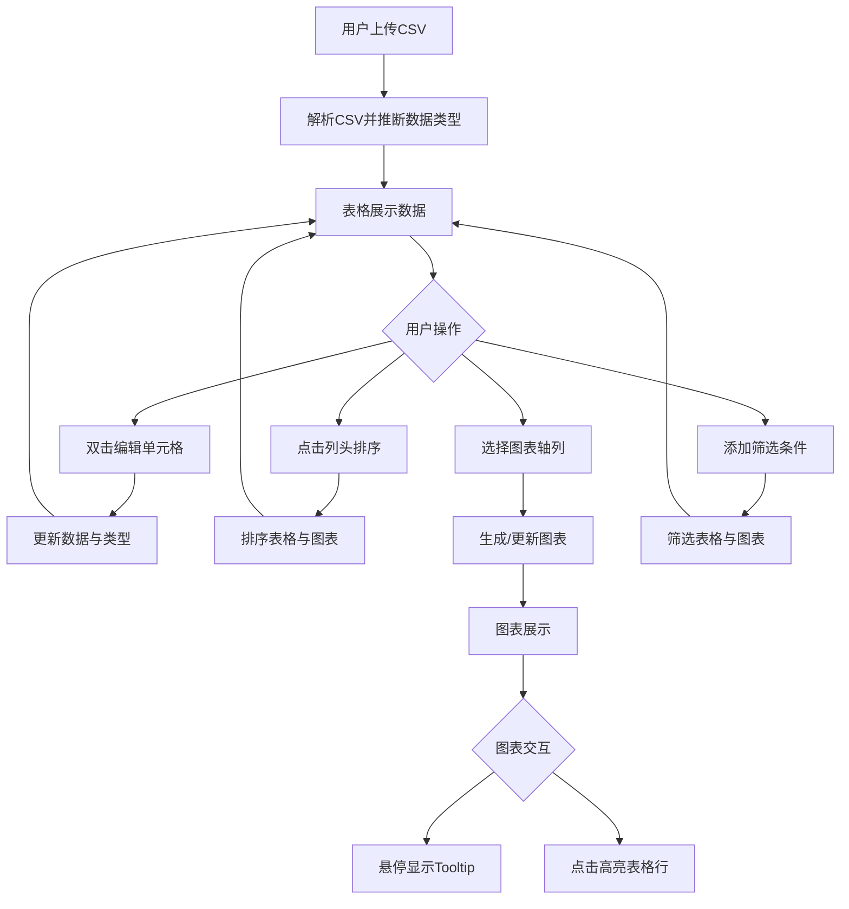

## 1. 产品概述

在线交互式数据表格与图表联动分析应用，让用户上传CSV数据后在表格中浏览和编辑数据，同时对选定列生成动态图表并进行多维筛选。目标用户为数据分析师、业务人员和需要快速探索数据的普通用户。

## 2. 核心功能

### 2.1 功能模块

1. **主页面**：CSV上传、数据表格浏览与编辑、图表联动展示、多维筛选

### 2.2 页面详情

| 页面名称 | 模块名称 | 功能描述 |
|----------|----------|----------|
| 主页面 | 导航栏 | 深蓝色导航条，左侧应用名称和上传按钮，右侧当前数据行数和选中行数 |
| 主页面 | FilterBar | 多条件组合筛选，每行包含列名、运算符、输入值，行间"与"逻辑，最多5行条件 |
| 主页面 | DataTable | 可编辑表格，行内编辑、多列排序、分页，列头显示列名和数据类型标签 |
| 主页面 | ChartPanel | 基于选定列生成柱状图/折线图/散点图，支持多系列叠加，tooltip和行高亮 |

## 3. 核心流程

1. 用户点击"上传CSV"按钮选择CSV文件（支持UTF-8和GBK编码）
2. 系统解析CSV数据，自动推断每列数据类型（字符串、数字、日期）
3. 表格展示所有数据，列头显示列名和数据类型标签
4. 用户可双击单元格编辑数据，修改后自动重新检测数据类型并更新图表
5. 用户可点击列头进行多列排序（Shift+点击设置次级排序）
6. 用户可选择X轴、Y轴和系列分组列生成动态图表
7. 用户可通过FilterBar添加多条件组合筛选，实时更新表格和图表

## 4. 界面设计

### 4.1 设计风格

- 主色调：深蓝色 #1a237e，搭配白色和浅灰色
- 强调色：淡蓝色 #e3f2fd 用于行悬停，浅黄色 #fff9c4 用于筛选栏
- 字体：思源黑体 / Noto Sans SC，表格12-14px，标题16-18px
- 布局：顶部导航 + 左右两栏（表格左50% / 图表右50%）
- 交互动画：0.2-0.3秒平滑过渡

### 4.2 页面设计概览

| 页面名称 | 模块名称 | UI元素 |
|----------|----------|--------|
| 主页面 | 导航栏 | 深蓝色背景，白色文字，左侧Logo+上传按钮，右侧数据统计 |
| 主页面 | FilterBar | 浅黄色背景#fff9c4，每行3个输入框组合，右侧删除按钮(0.2s淡出) |
| 主页面 | DataTable | 白色背景，深蓝表头白字，行交错色#f5f5f5/#ffffff，悬停#e3f2fd |
| 主页面 | ChartPanel | 浅灰背景#fafafa，内嵌图表区域，支持tooltip和高亮交互 |

### 4.3 响应式设计

- 桌面优先设计，1280px以上左右两栏布局
- 1280px以下改为上下布局（表格在上，图表在下）
- 筛选栏在窄屏下垂直排列条件行

## 5. 性能要求

- 表格在500行×20列数据规模下，排序和筛选操作响应时间 ≤ 200ms
- 图表在数据点 ≤ 1000个时渲染时间 ≤ 1s
- 所有交互动画0.2-0.3秒平滑过渡
