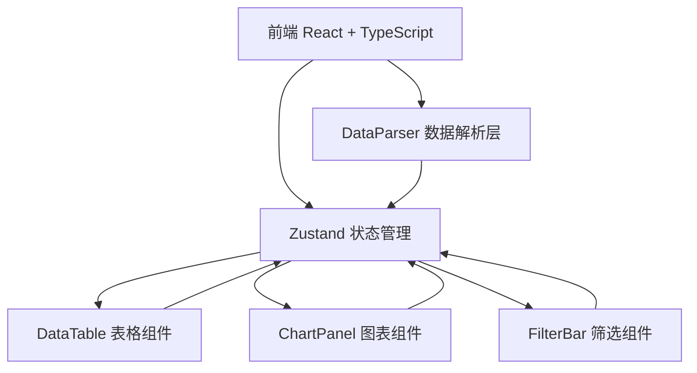

## 1. 架构设计



## 2. 技术说明

- 前端：React@18 + TypeScript + Vite
- 状态管理：Zustand
- 图表库：Recharts
- CSV解析：PapaParse（支持UTF-8和GBK）
- 工具库：Lodash（排序、筛选等高性能操作）
- 初始化工具：vite-init（react-ts模板）
- 后端：无
- 数据库：无（纯前端应用，数据存储在内存中）

## 3. 路由定义

| 路由 | 用途 |
|------|------|
| / | 主页面，包含所有功能模块 |

## 4. 文件结构

```
├── index.html                    # 入口页面
├── package.json                  # 依赖配置
├── vite.config.js                # Vite构建配置
├── tsconfig.json                 # TypeScript严格模式配置
├── src/
│   ├── main.tsx                  # 应用入口
│   ├── App.tsx                   # 主应用组件
│   ├── store.ts                  # Zustand全局状态
│   ├── DataParser.ts             # CSV解析与类型推断
│   ├── DataTable.tsx             # 可编辑表格组件
│   ├── ChartPanel.tsx            # 图表面板组件
│   ├── FilterBar.tsx             # 筛选栏组件
│   ├── types.ts                  # 类型定义
│   └── index.css                 # 全局样式
```

## 5. 核心数据流

1. **上传解析流**：用户上传CSV → PapaParse解析 → DataParser推断类型 → Zustand store存储
2. **编辑流**：双击单元格 → 进入编辑模式 → 确认/取消 → 更新store → 重新推断类型 → 图表更新
3. **排序流**：点击列头 → 更新排序条件 → lodash排序 → 表格和图表同步更新
4. **图表流**：选择轴列 → 推断图表类型 → Recharts渲染 → 支持tooltip和行高亮
5. **筛选流**：添加/删除筛选条件 → lodash过滤 → 表格和图表同步更新

## 6. 数据模型

### 6.1 核心类型定义

```typescript
type ColumnType = 'string' | 'number' | 'date';

interface Column {
  name: string;
  type: ColumnType;
}

interface DataRow {
  [key: string]: string | number | null;
}

interface SortCondition {
  column: string;
  direction: 'asc' | 'desc' | null;
}

interface FilterCondition {
  id: string;
  column: string;
  operator: 'eq' | 'neq' | 'gt' | 'lt' | 'contains' | 'between';
  value: string;
  valueEnd?: string;
}

interface ChartConfig {
  xAxis: string;
  yAxis: string;
  seriesColumn?: string;
  chartType: 'bar' | 'line' | 'scatter';
}
```
