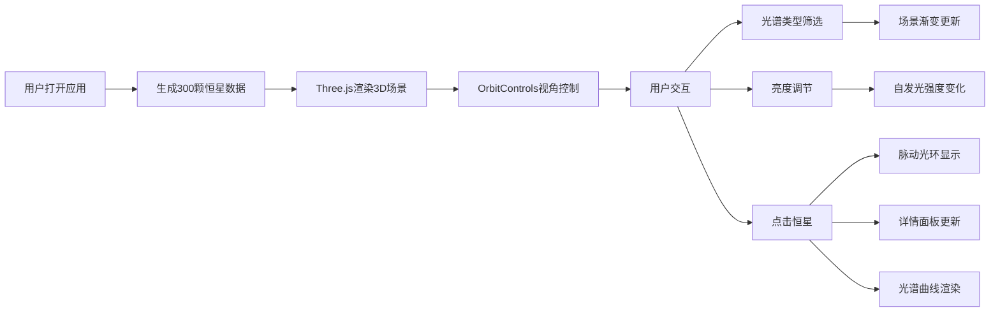

## 1. 产品概述

StellarSpectra 是一款面向天文爱好者的交互式三维恒星光谱可视化应用，通过真实天文数据算法模拟300颗恒星的光谱类型、温度、颜色分布，让用户沉浸式探索虚拟星域并学习恒星光谱知识。

- 核心目标：将抽象的恒星光谱概念转化为直观可交互的3D可视化体验
- 目标用户：天文爱好者、学生、科普教育工作者
- 市场价值：填补天文科普类3D交互应用的空白，提供兼具科学性和观赏性的学习工具

## 2. 核心功能

### 2.1 用户角色

| 角色 | 注册方式 | 核心权限 |
|------|---------|---------|
| 普通用户 | 无需注册 | 自由探索星域、筛选恒星类型、调节亮度、查看恒星详情与光谱曲线 |

### 2.2 功能模块

1. **3D星域场景**：300颗恒星三维分布、5000个银河背景粒子、OrbitControls视角控制
2. **光谱类型筛选器**：7种光谱类型(O/B/A/F/G/K/M)复选框筛选，带渐变过渡动画
3. **亮度调节器**：0.5-2.0范围滑块控制恒星自发光强度
4. **恒星详情面板**：显示恒星名称、光谱类型、温度、绝对星等
5. **光谱曲线可视化**：基于黑体辐射公式的模拟光谱曲线，Canvas 2D绘制
6. **选中动效**：脉动光环、平滑过渡动画

### 2.3 页面详情

| 页面名称 | 模块名称 | 功能描述 |
|---------|---------|---------|
| 主页面 | 3D场景模块 | Three.js渲染300颗恒星，球体几何体，颜色大小由光谱数据决定，背景银河粒子 |
| 主页面 | 控制面板 | 左上角半透明毛玻璃UI，包含光谱筛选、亮度滑块、恒星信息、光谱曲线 |
| 主页面 | 交互系统 | 射线检测点击恒星、OrbitControls旋转缩放、筛选/亮度实时响应 |

## 3. 核心流程

用户打开应用 → 自动加载300颗恒星的3D场景 → 鼠标拖拽旋转视角/滚轮缩放 → 勾选光谱类型筛选器 → 场景实时更新对应恒星可见度 → 拖拽亮度滑块 → 恒星发光强度变化 → 点击任意恒星 → 显示脉动光环 + 详情面板展示恒星信息 + 光谱曲线渲染

## 4. 用户界面设计

### 4.1 设计风格
- **设计主题**：深空科幻风格，沉浸式宇宙探索体验
- **主色调**：深空蓝 `#0a0a2e` 背景，恒星光谱渐变色系
- **光谱类型色卡**：
  - O型：`#9bb0ff` 蓝白色
  - B型：`#aabfff` 淡蓝色
  - A型：`#cad8ff` 蓝白色
  - F型：`#f8f7ff` 近白色
  - G型：`#fff4e8` 淡黄色（太阳型）
  - K型：`#ffd2a1` 橙黄色
  - M型：`#ffcc6f` 红橙色
- **强调色**：亮青色 `#00e5ff` 用于数据高亮
- **文字颜色**：浅灰 `#e0e0e0`、白色 `#ffffff`
- **UI风格**：半透明毛玻璃效果（`rgba(10,10,46,0.7)`），圆角12px，1px白色半透明边框
- **动效风格**：所有元素平滑过渡 `transition: all 0.3s ease`，筛选动画500ms

### 4.2 页面设计概述

| 页面名称 | 模块名称 | UI元素 |
|---------|---------|--------|
| 主页面 | 3D场景 | 全屏Canvas，深空背景，300颗发光球体，5000背景粒子，雾效 |
| 主页面 | 控制面板 | 左上角绝对定位，毛玻璃背景，圆角卡片布局，分区块展示 |
| 主页面 | 筛选区域 | 7个圆角复选框，选中时填充光谱色，未选中灰色边框，横向排列 |
| 主页面 | 亮度滑块 | 自定义渐变轨道（深蓝到亮白），圆形滑块手柄 |
| 主页面 | 信息面板 | 细线分隔各行，数据值用亮青色突出，标题与值两列布局 |
| 主页面 | 光谱曲线 | Canvas绘制，波长横轴380-780nm，强度纵轴，渐变填充，曲线平滑 |
| 主页面 | 选中动效 | 白色半透明脉动光环，边缘羽化发光，周期2秒 |

### 4.3 响应式
- 桌面端优先设计，UI面板固定尺寸320px宽
- 小屏幕适配：控制面板最小宽度280px，字体自适应缩放
- 触摸设备：支持双指缩放、单指旋转视角

### 4.4 3D场景指引
- **环境**：纯深空背景色 `#0a0a2e`，添加指数雾效（FogExp2）增强空间感
- **光照**：环境光强度0.3，每颗恒星使用自发光材质（MeshStandardMaterial + emissive）
- **相机**：PerspectiveCamera，初始位置(0, 50, 100)，看向场景中心
- **视角控制**：OrbitControls，minDistance=50，maxDistance=200，zoom范围0.5-3.0
- **合成**：选中恒星添加光圈Sprite，使用AdditiveBlending实现发光效果
- **性能**：300颗恒星使用InstancedMesh优化，背景粒子使用Points几何体
