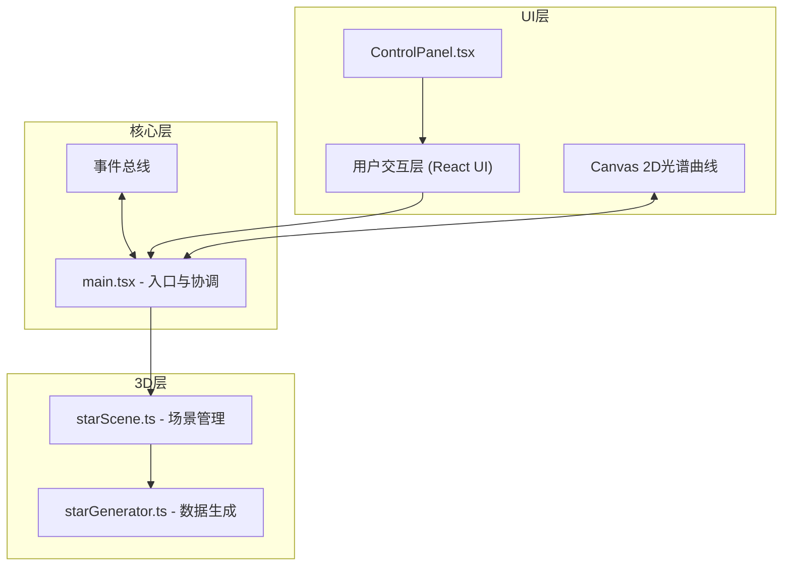
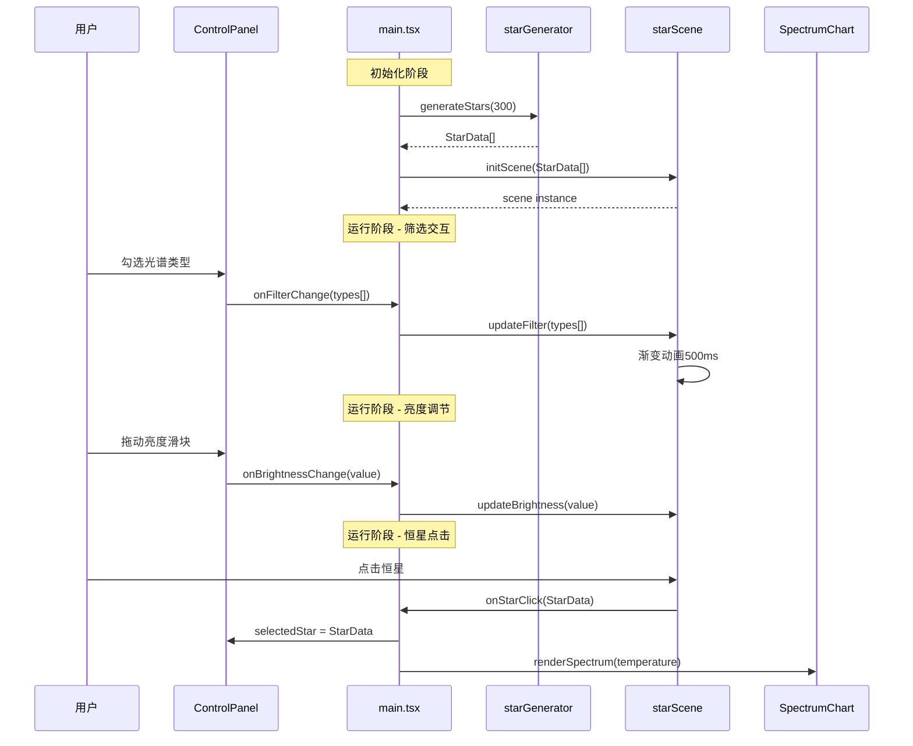

## 1. 架构设计



## 2. 技术描述

- **前端框架**：React 18 + TypeScript 5
- **3D引擎**：Three.js 0.160 + @types/three
- **构建工具**：Vite 5 + @vitejs/plugin-react
- **状态管理**：React useState + 自定义事件回调（轻量级，无需额外状态库）
- **样式方案**：原生CSS + CSS变量，不引入Tailwind（项目特定视觉需求）
- **渲染方式**：Three.js WebGLRenderer 3D渲染 + Canvas 2D光谱曲线

## 3. 技术栈版本

| 依赖包 | 版本 | 用途 |
|-------|------|------|
| react | ^18.2.0 | UI框架 |
| react-dom | ^18.2.0 | React DOM渲染 |
| three | ^0.160.0 | 3D渲染引擎 |
| typescript | ^5.3.0 | 类型安全 |
| vite | ^5.0.0 | 构建工具 |
| @vitejs/plugin-react | ^4.2.0 | Vite React插件 |
| @types/three | ^0.160.0 | Three.js类型定义 |

## 4. 目录结构

```
auto101/
├── index.html                    # 入口HTML，全屏Canvas + UI挂载点
├── package.json                  # 依赖配置
├── vite.config.js                # Vite配置，路径别名@
├── tsconfig.json                 # TypeScript配置
└── src/
    ├── main.tsx                  # React入口，协调UI与3D
    ├── App.tsx                   # 根组件，渲染ControlPanel
    ├── stars/
    │   ├── starGenerator.ts      # 恒星数据生成算法
    │   ├── starScene.ts          # Three.js场景管理
    │   └── types.ts              # 恒星相关类型定义
    ├── ui/
    │   ├── ControlPanel.tsx      # 主控制面板
    │   ├── SpectrumChart.tsx     # 光谱曲线组件
    │   └── styles.css            # UI样式
    └── utils/
        ├── blackbody.ts          # 黑体辐射公式
        └── color.ts              # 颜色转换工具
```

## 5. 数据流向图



## 6. 核心数据模型

### 6.1 恒星数据类型

```typescript
// src/stars/types.ts
export type SpectralType = 'O' | 'B' | 'A' | 'F' | 'G' | 'K' | 'M';

export interface StarData {
  id: string;
  name: string;                    // HD-12345 格式
  spectralType: SpectralType;
  temperature: number;             // 开尔文
  absoluteMagnitude: number;       // 绝对星等
  color: { r: number; g: number; b: number };  // RGB 0-1
  size: number;                    // 相对大小 0.3-2.0
  position: { x: number; y: number; z: number };
}

export interface SceneConfig {
  brightness: number;              // 0.5-2.0
  activeFilters: SpectralType[];   // 选中的光谱类型
  selectedStarId: string | null;
}
```

### 6.2 光谱类型分布算法

基于真实天文数据的初始质量函数（IMF）近似：
- O型：~0.3%
- B型：~3%  
- A型：~10%
- F型：~15%
- G型：~20%
- K型：~25%
- M型：~26.7%

温度范围：
- O型：30000-60000K
- B型：10000-30000K
- A型：7500-10000K
- F型：6000-7500K
- G型：5200-6000K
- K型：3700-5200K
- M型：2400-3700K

## 7. 核心算法

### 7.1 黑体辐射近似（光谱曲线）

```typescript
// Planck定律近似，用于生成光谱曲线
function blackbodyIntensity(wavelength: number, temperature: number): number {
  const h = 6.626e-34;  // Planck常数
  const c = 3e8;        // 光速
  const k = 1.38e-23;   // Boltzmann常数
  const lambda = wavelength * 1e-9;
  const exponent = (h * c) / (lambda * k * temperature);
  return (2 * h * c * c) / (Math.pow(lambda, 5) * (Math.exp(exponent) - 1));
}
```

### 7.2 温度转RGB颜色

```typescript
// 基于有效温度的恒星颜色转换
function temperatureToRGB(temperature: number): RGB {
  // 使用Tanner Helland算法近似
  // 380nm-780nm波长积分转换到sRGB空间
}
```

## 8. 性能优化策略

| 优化点 | 方案 | 预期效果 |
|-------|------|---------|
| 300颗恒星渲染 | 使用InstancedMesh合并绘制 | Draw Call从300降到1 |
| 背景粒子 | Points几何体 + BufferGeometry | 5000粒子高效渲染 |
| 筛选动画 | TWEEN.js + requestAnimationFrame | 平滑500ms过渡 |
| 射线检测 | 距离预筛选 + 层级化检测 | 点击响应<100ms |
| 光谱曲线 | Canvas 2D离屏缓存 | 重绘开销最小化 |
| 状态更新 | 批量更新 + requestAnimationFrame节流 | UI与3D同步<200ms |

## 9. 调用关系表

| 模块 | 依赖模块 | 调用方向 | 数据传递 |
|-----|---------|---------|---------|
| main.tsx | starGenerator.ts | main → starGenerator | 调用generateStars获取恒星数组 |
| main.tsx | starScene.ts | main → starScene | 传递恒星数组、配置更新 |
| main.tsx | ControlPanel.tsx | main ↔ ControlPanel | 事件回调、selectedStar props |
| ControlPanel.tsx | SpectrumChart.tsx | ControlPanel → SpectrumChart | 传递temperature、color |
| starScene.ts | starGenerator.ts | 无直接依赖 | - |
| starGenerator.ts | utils/blackbody.ts | starGenerator → blackbody | 计算颜色、光谱 |

## 10. 构建配置要点

### vite.config.js
- 路径别名：`@` → `src`
- 开发服务器端口：5173
- Three.js优化：external排除不必要的模块

### tsconfig.json
- 严格模式：`strict: true`
- 目标：`ES2020`
- JSX：`react-jsx`
- 模块解析：`bundler`
