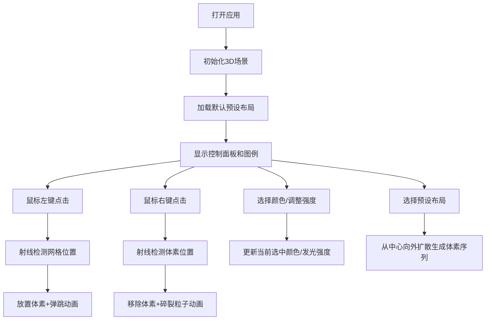

## 1. 产品概述
VoxelBloom是一款交互式体素粒子雕塑工具，用户可以在三维空间中通过点击和拖拽来放置或移除彩色发光体素方块，创造流动的粒子云雕塑效果。
- 主要面向数字艺术家、创意设计师和3D爱好者，提供直观的体素创作体验
- 市场价值：填补轻量化Web端体素创作工具的空白，无需安装即可在浏览器中进行3D体素艺术创作

## 2. 核心功能

### 2.1 功能模块
1. **体素编辑模块**：30x30x30三维网格空间，左键放置/右键移除体素，含放置弹跳动画和移除碎裂动画
2. **色彩系统模块**：12种彩虹光谱预设颜色，HSL拾色器，发光强度滑块（0.5-2.0），选中颜色脉冲动画
3. **预设管理模块**：5种预设布局（球体、螺旋、心形、星云、随机云），中心向外扩散式生成动画

### 2.3 页面详情
| 页面名称 | 模块名称 | 功能描述 |
|-----------|-------------|---------------------|
| 主场景页面 | 3D画布 | Three.js渲染的30x30x30体素网格空间，支持鼠标交互编辑 |
| 主场景页面 | 控制面板 | 左上角半透明磨砂玻璃风格面板，集成颜色选择、发光强度、预设布局功能 |
| 主场景页面 | 图例面板 | 右侧边缘可收起面板，鼠标悬停滑出，显示操作说明 |

## 3. 核心流程
用户打开应用 → 看到深空背景和预设体素布局 → 通过鼠标左键点击网格放置彩色发光体素 → 右键点击移除体素（碎裂效果）→ 使用左上角控制面板调整颜色和发光强度 → 选择预设布局一键生成体素造型 → 拖拽旋转视角欣赏作品

## 4. 用户界面设计

### 4.1 设计风格
- **主色调**：深空蓝 #0B0C10（背景）、霓虹青 #45A29E（主交互色）、霓虹粉 #C5C6C7（辅助色）
- **按钮风格**：半透明磨砂玻璃效果，背景模糊12px，霓虹边框高亮
- **字体**：现代无衬线字体，标题16px加粗，正文12px常规
- **布局风格**：左上角固定控制面板，右侧边缘自动隐藏图例面板，中央全屏3D画布
- **视觉效果**：体素自发光、网格线轻微发光、面板毛玻璃效果、动画过渡流畅

### 4.2 页面设计概述
| 页面名称 | 模块名称 | UI元素 |
|-----------|-------------|-------------|
| 主场景页面 | 3D画布 | 深空背景、发光网格线、发光体素方块、环境光+点光源 |
| 主场景页面 | 控制面板 | 毛玻璃背景、12色色块矩阵、发光强度滑块、5个预设按钮、汉堡菜单图标（窄屏） |
| 主场景页面 | 图例面板 | 半透明黑色背景、操作说明文字、鼠标悬停滑入动画 |

### 4.3 响应式
- 桌面优先设计，适配1920x1080到1440x900屏幕
- 窄屏下（<1440px宽度）控制面板自动折叠为汉堡菜单，点击展开
- 所有交互元素确保触摸设备可操作
- 3D画布自适应窗口大小，保持正确的相机投影比例

### 4.4 3D场景指导
- **环境**：纯深空蓝背景，无HDRI，营造赛博空间氛围
- **光照**：环境光（强度0.3）+ 两个点光源（位置分别在(10,10,10)和(-10,10,-10)，强度0.8）
- **相机**：PerspectiveCamera，fov 75，近裁剪面0.1，远裁剪面1000，初始位置(20, 15, 20)
- **交互**：OrbitControls轨道控制器，支持旋转、缩放、平移，禁用阻尼以保证性能
- **动画**：体素放置缩放弹跳（0.3秒），移除碎裂为8个小立方体飞散渐隐，预设生成间隔80ms
- **后处理**：无额外后处理，依赖MeshStandardMaterial的emissive实现发光效果
- **性能**：最多800个体素同时活跃，使用单一几何体实例化或对象池优化，编辑响应<16ms
