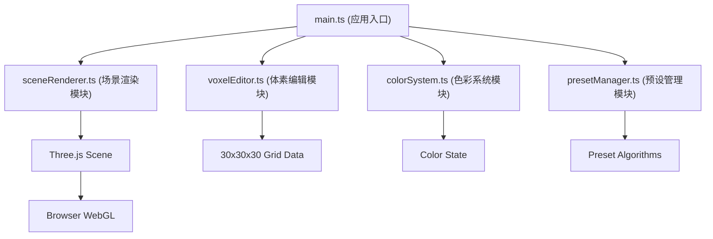

## 1. 架构设计


## 2. 技术描述
- 前端框架：原生 TypeScript + Three.js 0.160
- 构建工具：Vite 5.x
- 状态管理：模块内局部状态，无全局状态管理库
- 3D渲染：Three.js WebGLRenderer，MeshStandardMaterial实现发光效果
- 交互：Three.js Raycaster进行射线检测，OrbitControls实现相机控制
- 动画：requestAnimationFrame驱动的自定义动画循环，TWEEN-like手动插值

## 3. 模块文件结构
| 文件路径 | 用途 |
|-------|---------|
| package.json | 项目依赖配置（three, typescript, vite, @types/three） |
| index.html | 入口页面，全屏布局，背景色#0B0C10 |
| tsconfig.json | TypeScript配置（严格模式，ES2020） |
| vite.config.js | Vite配置（@路径别名） |
| src/main.ts | 应用入口，初始化Three.js场景、相机、控制器、光源、动画循环 |
| src/voxelEditor.ts | 体素编辑模块，网格数据管理，射线检测，放置/移除逻辑 |
| src/colorSystem.ts | 色彩系统模块，12种预设颜色，HSL拾色器，发光强度管理 |
| src/presetManager.ts | 预设管理模块，5种布局生成算法（球体/螺旋/心形/星云/随机云） |
| src/sceneRenderer.ts | 场景渲染模块，体素Mesh管理，批量增删，动画控制 |

## 4. 核心类型定义
```typescript
// 体素位置
interface VoxelPosition {
  x: number;
  y: number;
  z: number;
}

// 体素数据
interface VoxelData {
  position: VoxelPosition;
  color: string;
  emissiveIntensity: number;
}

// 预设类型
type PresetType = 'sphere' | 'spiral' | 'heart' | 'nebula' | 'cloud';

// 动画回调
type AnimationCallback = (position: VoxelPosition, type: 'add' | 'remove') => void;
```

## 5. 性能优化策略
1. **网格数据结构**：使用一维数组`Float32Array`存储30x30x30网格，索引计算`index = x + y*30 + z*30*30`
2. **体素对象池**：预分配体素Mesh池，避免频繁创建销毁
3. **射线检测优化**：仅对当前活跃体素进行射线检测，使用BVH或空间划分
4. **动画性能**：使用requestAnimationFrame，批量更新matrix，避免逐帧修改material
5. **内存管理**：移除体素时及时dispose几何体和材质，避免内存泄漏

## 6. 数据模型

### 6.1 网格数据模型
```
Grid[27000] (30×30×30)
├─ 每个元素存储: color (uint32) + emissive (float32)
└─ 0表示空位置，非0表示体素存在
```

### 6.2 颜色系统数据
```
预设颜色数组 [12]
├─ 按彩虹光谱排列: 红→橙→黄→绿→青→蓝→紫...
├─ 每种颜色: HSL(色相0-360, 饱和度85%, 亮度90%)
└─ 当前选中颜色索引 + 发光强度(0.5-2.0)
```

### 6.3 预设布局算法
- **球体**：球面方程 x²+y²+z² ≤ r²，半径10
- **螺旋**：参数方程 x=t*cos(t), y=t*sin(t), z=t, t∈[0, 8π]
- **心形**：3D心形参数方程，基于心脏曲线扩展
- **星云**：多层球面随机分布，中心密集外围稀疏
- **随机云**：三维空间内正态分布随机点
