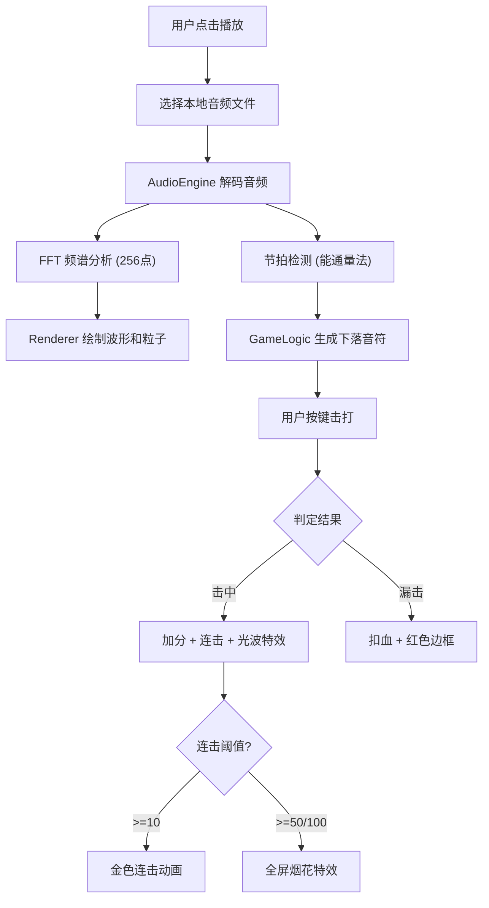

## 1. 产品概述

SoundWave 是一款在浏览器中运行的交互式音频可视化与节奏游戏工具，用户可以播放本地音乐文件，实时观看彩色波形和频谱粒子动画，同时根据音乐节拍进行节奏游戏。

- **主要用途**：音乐可视化欣赏 + 节奏游戏体验
- **目标用户**：音乐爱好者、节奏游戏玩家
- **市场价值**：结合音频可视化与互动游戏，提供沉浸式音乐体验

## 2. 核心功能

### 2.1 功能模块

1. **音频分析模块**：解析音频文件、FFT频谱分析、节拍检测
2. **可视化渲染模块**：Canvas绘制波形、频谱粒子、音符合成效果
3. **节奏游戏模块**：音符生成、击打判定、得分与连击计算
4. **UI控制模块**：播放控制、音量调节、进度显示、得分展示

### 2.2 页面详情

| 页面名称 | 模块名称 | 功能描述 |
|-----------|-------------|---------------------|
| 主界面 | 音频可视化区 | 全屏Canvas，绘制三条波形曲线（左声道、右声道、混合声道），频谱粒子动态效果 |
| 主界面 | 节奏游戏区 | 下落式音符、判定线、击打光波特效、漏击红色边框警告 |
| 主界面 | 信息显示区 | 左上角歌曲名称和进度条，右上角得分和连击数 |
| 主界面 | 控制栏 | 底部中央播放/暂停、停止按钮，音量滑块 |

## 3. 核心流程

用户点击播放按钮 → 选择本地音频文件（mp3/wav） → 音频引擎开始解码分析 → 可视化模块实时渲染波形和粒子 → 节拍检测模块识别节拍并生成下落音符 → 用户按键（F/D/S/J/K/L）击打音符 → 判定击中/漏击并更新得分和连击 → 连击达到阈值触发烟花特效。

## 4. 用户界面设计

### 4.1 设计风格

- **主题**：深色科技风格，背景色 `#0a0a1a`，文字色 `#e0e0ff`
- **色彩方案**：
  - 低频段：红色 → 橙色渐变
  - 中频段：绿色 → 青绿渐变
  - 高频段：蓝色 → 紫色渐变
  - 进度条：青色 → 紫色线性渐变
  - 连击>=10：金色
- **按钮样式**：圆角矩形（圆角8px），悬停亮色光晕效果
- **字体**：等宽类字体，确保数字显示整齐
- **布局**：全屏Canvas作为背景，UI元素悬浮于Canvas之上

### 4.2 页面设计概述

| 页面名称 | 模块名称 | UI元素 |
|-----------|-------------|-------------|
| 主界面 | 可视化区 | 三条波形曲线（2px粗细，0.5秒拖尾残影），频谱粒子随频段强度爆发 |
| 主界面 | 游戏区 | 半透明方框音符从顶部下落，底部15%位置判定线，击中时圆形光波扩散特效 |
| 主界面 | 信息区 | 左上角：歌曲名称（16px）+ 进度条（500px×4px，青紫渐变）；右上角：得分（白色50px）+ 连击数（>=10时金色淡入） |
| 主界面 | 控制栏 | 底部中央：播放/暂停按钮、停止按钮、音量滑块，圆角8px，悬停光晕 |

### 4.3 响应式设计

- 桌面优先设计，最小宽度 1024px
- Canvas 自适应窗口大小，保持正确的绘制比例
- 控制栏位置固定在底部中央，响应窗口宽度调整
- 进度条宽度固定500px，小屏幕下居中显示

### 4.4 动画与特效

- **波形拖尾**：每条曲线保留0.5秒历史数据，形成渐变拖尾效果
- **粒子爆发**：根据频段能量生成彩色粒子，向外扩散
- **击中光波**：半径从10px膨胀到60px，持续0.3秒
- **漏击警告**：界面边缘红色边框闪烁0.1秒
- **连击动画**：连击>=10时金色数字淡入
- **烟花特效**：连击50/100时全屏50个彩色粒子，持续1秒
- **按钮悬停**：亮色光晕扩散效果

## 5. 性能要求

- 播放期间帧率稳定在 30FPS 以上
- 频谱计算和节拍检测在 Web Worker 中执行，不阻塞主线程
- Canvas 绘制采用分层优化，减少重绘区域
- 粒子系统使用对象池复用，避免频繁GC
