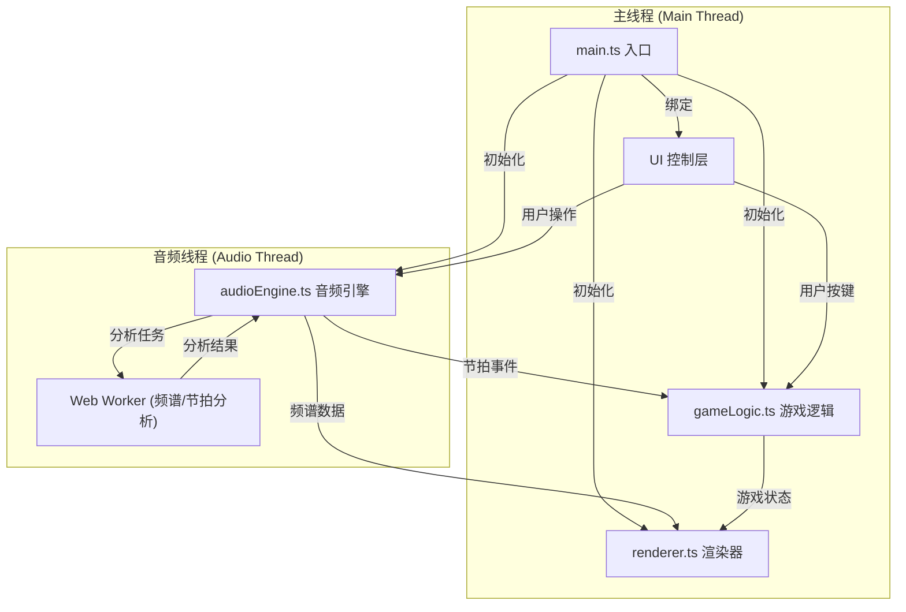

## 1. 架构设计



## 2. 技术描述

- **前端技术栈**：TypeScript + Canvas 2D API + Web Audio API
- **构建工具**：Vite 5.x
- **语言标准**：ES2020
- **类型系统**：TypeScript 严格模式
- **无外部UI框架**：纯原生 DOM 操作 + Canvas

### 核心技术点

1. **Web Audio API**：
   - `AudioContext` 音频上下文
   - `AnalyserNode` FFT频谱分析（fftSize=256）
   - `AudioBufferSourceNode` 音频源
   - `GainNode` 音量控制

2. **Canvas 2D API**：
   - 波形曲线绘制（贝塞尔曲线平滑）
   - 粒子系统（半透明圆形粒子）
   - 拖尾效果（`globalAlpha` 渐变叠加）
   - 光波特效（径向渐变 + 动态半径）

3. **Web Worker**：
   - 频谱频段能量计算
   - 节拍检测算法（能通量法）
   - 避免阻塞主线程

4. **性能优化**：
   - `requestAnimationFrame` 动画循环
   - 粒子对象池复用
   - 离屏Canvas预渲染静态元素
   - 时间戳驱动的动画，与帧率解耦

## 3. 目录结构

```
auto109/
├── package.json
├── index.html
├── tsconfig.json
├── vite.config.js
└── src/
    ├── audioEngine.ts    # 音频解析、频谱分析、节拍检测
    ├── renderer.ts       # Canvas渲染：波形、粒子、音符、特效
    ├── gameLogic.ts      # 音符生成、击打判定、得分连击
    └── main.ts           # 入口：初始化、事件绑定、主循环
```

## 4. 模块接口定义

### 4.1 AudioEngine 接口

```typescript
interface FrequencyBand {
  low: number;     // 低频能量 20-250Hz
  mid: number;     // 中频能量 250-2000Hz
  high: number;    // 高频能量 2000-20000Hz
}

interface AudioAnalysis {
  spectrum: Uint8Array;           // 256点频谱数据
  timeDomain: Float32Array;       // 时域波形数据
  timeDomainLeft: Float32Array;   // 左声道
  timeDomainRight: Float32Array;  // 右声道
  bands: FrequencyBand;           // 三频段能量
}

interface BeatEvent {
  time: number;       // 节拍时间
  strength: number;   // 节拍强度
  bpm: number;        // 当前BPM估计
}

type AudioState = 'idle' | 'loading' | 'playing' | 'paused' | 'ended';
```

### 4.2 Renderer 接口

```typescript
interface RenderConfig {
  trailTime: number;        // 波形拖尾时间 0.5s
  waveLineWidth: number;    // 波形线宽 2px
  judgeLineRatio: number;   // 判定线位置 0.85 (底部15%)
}

interface NoteVisual {
  id: number;
  y: number;
  lane: number;     // 0-5 对应 F/D/S/J/K/L
  alpha: number;
}

interface HitEffect {
  id: number;
  x: number;
  y: number;
  radius: number;
  maxRadius: number;
  startTime: number;
  duration: number;
  color: string;
}

interface Particle {
  x: number;
  y: number;
  vx: number;
  vy: number;
  life: number;
  maxLife: number;
  color: string;
  size: number;
}
```

### 4.3 GameLogic 接口

```typescript
interface GameState {
  score: number;
  combo: number;
  maxCombo: number;
  health: number;      // 0-100
  isPlaying: boolean;
}

interface Note {
  id: number;
  lane: number;        // 0-5 对应 F/D/S/J/K/L
  hitTime: number;     // 应击打时间
  spawnTime: number;   // 生成时间
  hit: boolean;
  missed: boolean;
}

type JudgeResult = 'perfect' | 'good' | 'miss';
```

## 5. 关键算法

### 5.1 频谱频段划分

```typescript
// FFT大小256，采样率44100Hz
// 频率分辨率 = 采样率 / FFT大小 = 44100 / 256 ≈ 172.27 Hz
// 频段索引计算：
// - 低频 (20-250Hz): bin 1 ~ bin 1
// - 中频 (250-2000Hz): bin 2 ~ bin 11
// - 高频 (2000-20000Hz): bin 12 ~ bin 127
```

### 5.2 节拍检测（能通量法）

```typescript
// 1. 计算频谱能量的一阶差分（能通量）
// 2. 应用阈值检测（局部最大值 + 历史平均）
// 3. 间隔过滤（最小间隔 200ms，对应BPM上限 300）
// 4. BPM估计：最近N个节拍间隔的加权平均
```

### 5.3 击打判定

```typescript
// 判定窗口：
// - Perfect: ±50ms
// - Good: ±100ms
// - Miss: > ±100ms 或未按键
// 判定线位置：窗口高度 * 0.85
// 音符下落速度：根据BPM动态调整 (100-200 BPM)
```

## 6. 性能优化策略

1. **Web Worker 分离计算**：频谱分析和节拍检测在Worker中执行
2. **动画与帧率解耦**：使用 `deltaTime` 计算位置，确保不同帧率下表现一致
3. **粒子对象池**：预分配粒子数组，避免频繁创建销毁
4. **波形历史缓冲**：环形缓冲区存储0.5秒历史数据，高效绘制拖尾
5. **Canvas 状态缓存**：减少 `save()`/`restore()` 调用，批量绘制同类型元素
6. **`requestAnimationFrame` 调度**：确保绘制与浏览器刷新率同步
