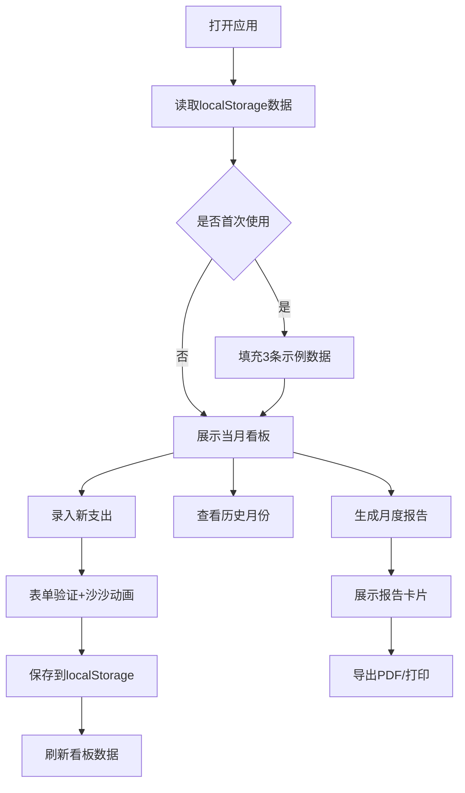

## 1. 产品概述

家庭支出管理应用，帮助家庭成员记录日常开支并自动生成月度消费报告，解决家庭记账零散、月度汇总困难的问题。

- 目标用户：需要管理家庭日常支出的用户
- 核心价值：便捷的支出录入、直观的月度看板、一键生成分析报告

## 2. 核心功能

### 2.1 用户角色
| 角色 | 注册方式 | 核心权限 |
|------|----------|----------|
| 普通用户 | 无需注册，本地使用 | 录入支出、查看看板、生成报告 |

### 2.2 功能模块
1. **录入页面**：支出录入表单（金额、类别、日期、备注）、类别图标颜色展示、沙沙动画反馈
2. **看板页面**：月度环形图占比展示、支出明细列表（按日期降序）、卡片展开编辑备注
3. **报告页面**：月份选择、报告生成卡片、PDF导出功能

### 2.3 页面详情
| 页面名称 | 模块名称 | 功能描述 |
|----------|----------|----------|
| 录入页面 | 表单模块 | 金额输入、类别选择（带图标颜色）、日期选择、备注输入、保存按钮、沙沙动画反馈 |
| 看板页面 | 环形图模块 | 展示各类别支出占比，支持hover交互 |
| 看板页面 | 明细列表 | 按日期降序展示每笔支出，卡片圆角阴影，点击展开编辑备注 |
| 报告页面 | 报告卡片 | 月度总支出、类别占比、日均支出、最高支出日期 |
| 报告页面 | 导出模块 | 打印支持、导出为PDF按钮 |

## 3. 核心流程

用户打开应用 → 浏览当月看板（环形图+明细）→ 录入新支出（表单填写，动画反馈）→ 切换月份查看历史 → 选择月份生成报告 → 导出PDF/打印

## 4. 用户界面设计

### 4.1 设计风格
- 主色：#F5A623（暖橙色），辅助色：#4A90D9（天蓝色）
- 背景色：#FFF8F0（浅米色）
- 卡片圆角：12px，阴影：柔和投影，悬停上浮效果（transition: 0.2s ease-out）
- 字体：使用现代无衬线字体，标题bold，正文regular
- 图标：类别对应emoji图标，配颜色标签
- 折叠动画：弹性缓动 ease-out

### 4.2 页面设计概述
| 页面名称 | 模块名称 | UI元素 |
|----------|----------|--------|
| 录入页面 | 表单模块 | 大输入框、彩色类别标签、日期选择器、提交按钮（主色渐变）、成功动画 |
| 看板页面 | 环形图模块 | 中心显示总额、环形分类着色、hover高亮扇区 |
| 看板页面 | 明细列表 | 卡片式布局、类别色标、金额右对齐、展开箭头 |
| 报告页面 | 报告卡片 | 白色大卡片、数据指标网格、分类进度条、底部操作按钮栏 |

### 4.3 响应式
- 大屏（≥1024px）：表单与看板左右分栏布局
- 中屏（768-1023px）：上下堆叠，各模块全宽
- 小屏（<768px）：上下堆叠，优化触控区域，字号适配
- 折叠过渡：弹性缓动 ease-out，动画时长 300-400ms
