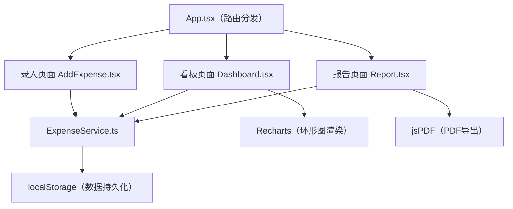
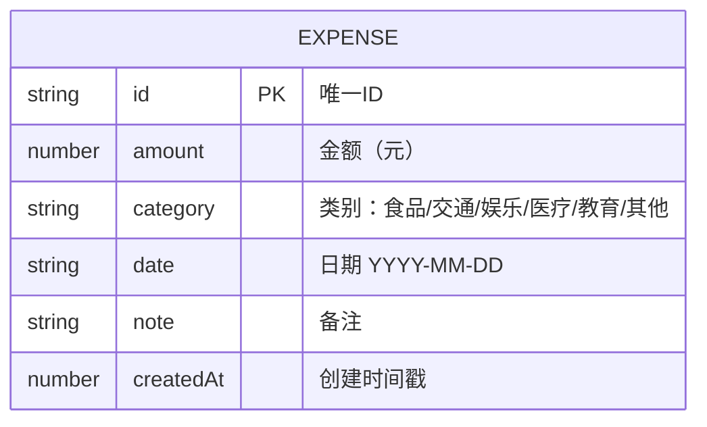

## 1. 架构设计



## 2. 技术说明

- 前端框架：React@18 + TypeScript（严格模式）
- 构建工具：Vite
- 路由管理：react-router-dom@6
- 图表库：recharts（环形图）
- PDF导出：jspdf
- 数据存储：localStorage（浏览器本地存储）
- 状态管理：React Hooks（useState, useEffect），无需额外状态库

## 3. 路由定义

| 路由 | 用途 |
|------|------|
| / | 看板页面（默认首页，展示当月数据） |
| /add | 支出录入页面 |
| /report | 报告生成页面 |

## 4. 数据模型

### 4.1 数据模型定义



### 4.2 类别配置

| 类别 | 图标 | 颜色 |
|------|------|------|
| 食品 | 🍔 | #E74C3C |
| 交通 | 🚗 | #3498DB |
| 娱乐 | 🎮 | #9B59B6 |
| 医疗 | 💊 | #2ECC71 |
| 教育 | 📚 | #F39C12 |
| 其他 | 📦 | #95A5A6 |

## 5. 性能指标

- localStorage 读写：≤5ms（同步操作，直接API调用）
- 环形图渲染：≤100ms（使用recharts优化渲染）
- 页面切换：无感知，CSS过渡动画

## 6. 文件结构

```
├── package.json          # 依赖与脚本
├── index.html            # 入口HTML
├── tsconfig.json         # TS配置（严格模式）
├── vite.config.js        # Vite配置
└── src/
    ├── App.tsx           # 根组件（路由）
    ├── services/
    │   └── ExpenseService.ts  # 数据服务层
    └── pages/
        ├── Dashboard.tsx      # 月度看板页
        ├── AddExpense.tsx     # 支出录入页
        └── Report.tsx         # 报告生成页
```
