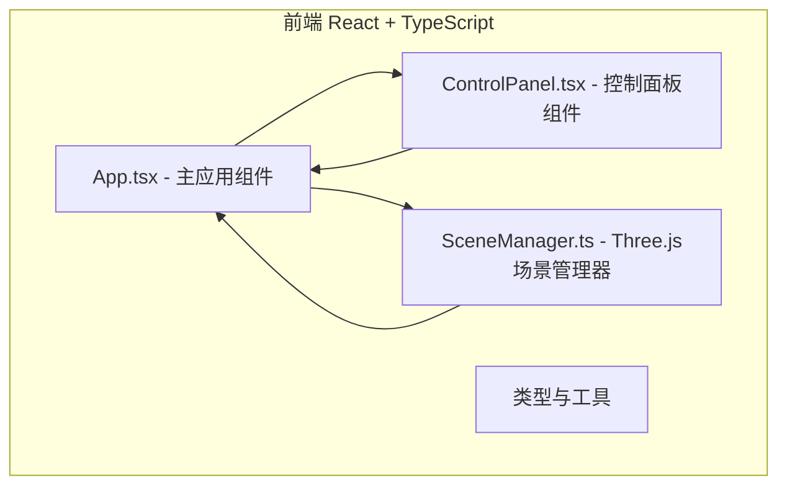

# ArtPlacer 三维画作布局预览应用 - 技术架构文档

## 1. 架构设计



## 2. 技术栈描述

- **前端框架**：React 18 + TypeScript
- **3D渲染引擎**：Three.js
- **构建工具**：Vite
- **状态管理**：React useState/useReducer（本地状态）
- **其他依赖**：@types/three、file-saver、@vitejs/plugin-react

## 3. 文件结构

```
auto111/
├── package.json
├── index.html
├── vite.config.js
├── tsconfig.json
├── src/
│   ├── main.tsx          # React入口，挂载App组件
│   ├── App.tsx           # 主应用组件，状态管理、UI布局
│   ├── scene/
│   │   └── SceneManager.ts  # Three.js场景管理器
│   └── components/
│       └── ControlPanel.tsx # React控制面板组件
```

## 4. 模块职责与数据流向

### 4.1 App.tsx - 主应用组件

**职责**：
- 管理画作列表状态（画作数据、位置、缩放、旋转）
- 管理场景状态（墙面材质、灯光预设）
- 管理撤销/重做历史记录
- 布局Three.js画布和控制面板UI

**数据流向**：
```
用户操作(拖拽/上传/切换)
    ↓
App.tsx 更新state
    ↓
调用SceneManager方法(addPainting/movePainting等)
    ↓
Three.js渲染更新
```

### 4.2 SceneManager.ts - Three.js场景管理器

**职责**：
- 创建Three.js场景、相机、渲染器
- 创建墙面、地面、光照系统
- 管理画作3D对象的增删改查
- 处理射线检测、拖拽交互
- 实现吸附检测与高亮动画
- 导出高清截图

**暴露接口**：
- `addPainting(id, imageData, position, scale, rotation, frameColor)`
- `movePainting(id, position)`
- `scalePainting(id, scale)`
- `rotatePainting(id, rotationY)`
- `setWallMaterial(materialType)`
- `setLightPreset(preset)`
- `resetCamera()`
- `screenshot()` → Promise<Blob>

### 4.3 ControlPanel.tsx - 控制面板组件

**职责**：
- 画作图片上传区域（支持拖拽和点击，1-8张）
- 墙面材质选择下拉菜单
- 灯光预设按钮组
- 撤销/重做/重置视角/导出截图按钮
- 响应式折叠（移动端底部抽屉）

**数据流向**：
```
用户UI操作
    ↓
调用App.tsx传入的回调函数
    ↓
App.tsx更新状态并调用SceneManager
```

## 5. 类型定义

```typescript
interface PaintingData {
  id: string;
  imageUrl: string;
  position: { x: number; y: number };
  scale: number;
  rotationY: number;
  frameColor: 'gold' | 'black' | 'white';
  aspectRatio: number;
}

type WallMaterial = 'white' | 'brick' | 'wood' | 'marble';
type LightPreset = 'warm' | 'cool' | 'spot' | 'natural';

interface HistoryState {
  paintings: PaintingData[];
  wallMaterial: WallMaterial;
  lightPreset: LightPreset;
}
```

## 6. 核心算法

### 6.1 吸附检测

画作边缘距离其他画作或墙面边界 < 5像素时自动吸附对齐，播放300ms脉冲高亮动画。

### 6.2 撤销/重做

使用双向栈结构，最多保存20步历史状态，Ctrl+Z撤销，Ctrl+Shift+Z重做。

### 6.3 画作初始排列

根据画作数量均分排列在正面墙前，自动计算水平间距和垂直居中。

## 7. 性能优化

- 纹理压缩与懒加载
- Raycaster优化（只在鼠标移动时检测）
- 画作材质复用
- requestAnimationFrame渲染循环
