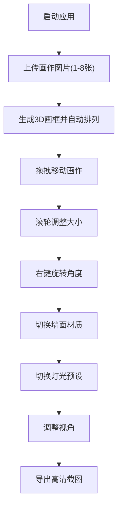

# ArtPlacer 三维画作布局预览应用 - 产品需求文档

## 1. 产品概述

ArtPlacer 是一个面向线上数字画廊策展平台的交互式三维画作布局预览工具，帮助用户在虚拟画廊空间中自由组合、预览画作陈列效果，提升策展决策效率。

- 核心功能：三维画作拖拽放置、尺寸调整、旋转、墙面材质切换、灯光预设、高清截图导出
- 目标用户：画廊策展人、艺术收藏爱好者、室内设计师

## 2. 核心功能

### 2.1 用户角色

| 角色 | 注册方式 | 核心权限 |
|------|---------|---------|
| 普通用户 | 无需注册，浏览器直接使用 | 上传画作、三维布局调整、导出截图 |

### 2.2 功能模块

1. **主场景页面**：三维画廊渲染、画作交互、视角控制、截图导出
2. **控制面板**：画作图片上传、墙面材质选择、灯光预设切换、撤销重做

### 2.3 页面详情

| 页面名称 | 模块名称 | 功能描述 |
|---------|---------|---------|
| 主场景页面 | 三维画廊渲染 | 渲染墙面、地面、光影、画作，支持拖拽移动、滚轮缩放、右键旋转 |
| 主场景页面 | 视角控制 | 中键拖拽平移、滚轮缩放视距、重置视角按钮 |
| 主场景页面 | 截图导出 | 1920x1080 PNG高清截图一键导出下载 |
| 控制面板 | 画作上传 | 支持1-8张图片上传，拖拽和点击两种方式 |
| 控制面板 | 材质选择 | 四种墙面材质切换（白墙、砖墙、木板墙、大理石墙），1秒渐变过渡 |
| 控制面板 | 灯光预设 | 四种灯光预设（暖光、冷光、聚光灯、自然光） |
| 控制面板 | 撤销重做 | Ctrl+Z撤销、Ctrl+Shift+Z重做，最多20步历史记录 |

## 3. 核心流程

用户启动应用 → 上传1-8张画作图片 → 画作自动生成3D画框并排列在墙面 → 用户拖拽/缩放/旋转调整画作位置 → 切换墙面材质和灯光预设 → 调整视角 → 导出高清截图

## 4. 用户界面设计

### 4.1 设计风格

- **主色调**：浅蓝到白色渐变背景（天空），浅灰色网格地面
- **按钮样式**：圆角9px，抬升阴影 `0 4px 12px rgba(0,0,0,0.2)`，悬浮时阴影加深 `0 6px 18px rgba(0,0,0,0.3)` 并上移2px
- **字体**：现代无衬线字体，清晰简约
- **布局风格**：右侧固定控制面板（280px宽），主场景全屏展示
- **视觉风格**：现代极简主义，磨砂玻璃效果

### 4.2 页面设计概述

| 页面名称 | 模块名称 | UI元素 |
|---------|---------|--------|
| 主场景页面 | 三维画廊 | 渐变天空背景、浅灰网格地面、可交互画作、相机控制 |
| 控制面板 | 上传区域 | 虚线边框，拖入文件时变实线并显示蓝色光晕 |
| 控制面板 | 材质选择 | 图标+文字样式，选中时显示对应材质缩略图色块 |
| 控制面板 | 灯光预设 | 圆形按钮，中心显示emoji（☀️❄️💡🌥），选中时发光扩散动画 |
| 控制面板 | 整体样式 | 半透明磨砂玻璃效果 `rgba(255,255,255,0.15)`，模糊15px，圆角12px |

### 4.3 响应式设计

- 桌面端（≥768px）：控制面板固定在屏幕右侧，宽度280px
- 移动端（<768px）：控制面板折叠为底部可收起抽屉，点击展开/收起按钮切换

### 4.4 3D场景指导

- **环境**：渐变天空（浅蓝到白色），浅灰色网格地面
- **光照设置**：支持四种预设（暖光3500K/冷光6500K/聚光灯/自然光）
- **相机设置**：初始距离5米，支持缩放范围3-15米，中键平移
- **交互**：左键拖拽画作、滚轮缩放画作大小、右键旋转画作
- **动画**：吸附高亮脉冲（300ms），材质渐变过渡（1秒），灯光切换发光扩散（0.5秒）
- **性能**：55FPS+稳定帧率，纹理加载≤2秒，截图导出≤3秒
