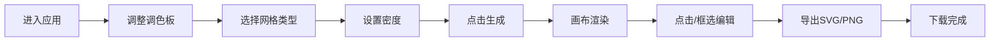

## 1. 产品概述

NeonMosaic 是一款生成式像素画创作工具，用户通过配置色彩调色板、拼贴密度和几何网格规则，让程序自动生成复杂的新艺术风格马赛克图案，并支持导出为 SVG 或 PNG 格式。

- 核心价值：将算法美学与创意控制结合，让用户无需专业设计技能即可生成独特的马赛克艺术作品
- 目标用户：数字艺术爱好者、设计师、创意工作者

## 2. 核心功能

### 2.1 功能模块

1. **图案生成模块**：基于噪声算法和海浪波纹函数，根据用户参数自动生成马赛克图案
2. **交互编辑模块**：支持单格点击修改颜色、区域框选批量换色，实时预览效果
3. **导出分享模块**：支持 SVG 矢量导出和 PNG 高清导出

### 2.3 页面详情

| 页面名称 | 模块名称 | 功能描述 |
|----------|----------|----------|
| 主界面 | 左侧控制面板 | 调色板选择（最多6色，可拖拽排序）、网格类型切换（正方形/六边形/三角形）、密度滑块（10x10~50x50）、生成按钮 |
| 主界面 | 右侧画布预览 | 实时渲染马赛克格子，支持点击单格换色、框选批量换色，0.2秒淡入过渡动画 |
| 主界面 | 导出功能区 | SVG/PNG 导出按钮，下载进度条动画，成功提示 |

## 3. 核心流程

用户进入应用 → 调整调色板颜色与顺序 → 选择网格类型 → 拖动密度滑块 → 点击生成按钮 → 画布实时渲染图案 → 点击/框选格子进行编辑 → 选择导出格式 → 下载文件

## 4. 用户界面设计

### 4.1 设计风格

- **主题配色**：紫黑金主题，深灰(#1a1a2e)到深紫(#16213e)线性渐变背景
- **主色调**：紫色系 (#9d4edd, #7b2cbf, #5a189a)
- **强调色**：金色 (#ffd700, #ffb700)
- **中性色**：深灰、深紫、黑色
- **按钮风格**：圆角卡片设计，悬停有微光效果
- **字体**：现代无衬线字体，清晰易读
- **布局**：左侧可折叠控制面板 + 右侧画布预览区

### 4.2 视觉细节

- 每个马赛克格子有 0.5px 微弱内阴影和 2px 圆角
- 格子排列紧密形成连续视觉整体
- 控制面板收起时为窄条形图标按钮，悬停平滑展开（transition 0.3s ease）
- 格子切换时有 0.2秒淡入过渡动画
- 导出时底部浮现脉冲进度条（持续0.8秒）

### 4.3 页面设计概览

| 页面名称 | 模块名称 | UI元素 |
|----------|----------|--------|
| 主界面 | 控制面板 | 调色板卡片、网格类型切换按钮组、密度滑块、生成按钮、导出按钮组 |
| 主界面 | 画布区域 | 渐变背景、马赛克格子阵列、选框工具、颜色拾取器弹窗 |
| 主界面 | 状态提示 | 生成进度、下载进度条、成功提示 |

### 4.4 响应式

- 桌面端优先设计
- 左侧面板可折叠，最大化画布空间
- 画布区域自适应容器大小

### 4.5 性能要求

- 50x50（2500个格子）图案生成在2秒内完成计算和渲染
- 交互帧率保持在30FPS以上
