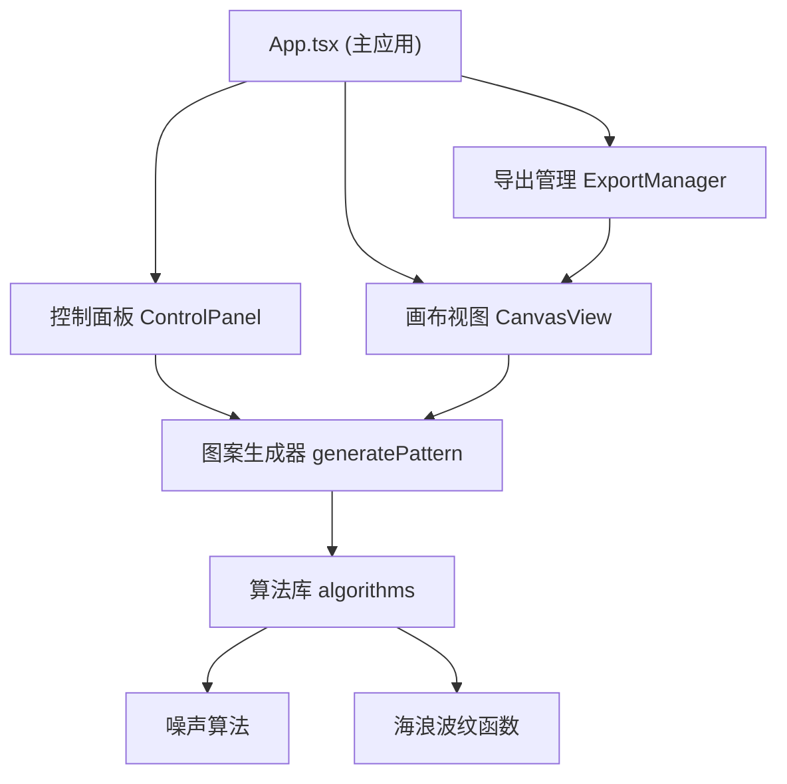

## 1. 架构设计



## 2. 技术描述

- **前端框架**：React 18 + TypeScript
- **构建工具**：Vite
- **SVG 操作**：svg.js
- **文件下载**：file-saver
- **状态管理**：React useState/useReducer（轻量级，无需额外状态库）
- **路径别名**：@ -> src/

## 3. 文件结构

```
src/
├── App.tsx                          # 主应用组件，全局状态与布局
├── modules/
│   ├── generator/
│   │   ├── index.ts                 # generatePattern 导出
│   │   └── algorithms.ts            # 噪声与海浪波纹算法
│   ├── editor/
│   │   ├── CanvasView.tsx           # 画布渲染与交互组件
│   │   └── ControlPanel.tsx         # 参数控制面板组件
│   └── export/
│       └── ExportManager.ts         # 导出工具模块
```

## 4. 核心数据模型

### 4.1 格子数据结构

```typescript
interface MosaicCell {
  id: string;
  x: number;
  y: number;
  width: number;
  height: number;
  color: string;
  shape: 'square' | 'hexagon' | 'triangle';
  rotation?: number;
  scale?: number;
}
```

### 4.2 生成参数

```typescript
interface GenerateParams {
  palette: string[];      // 调色板颜色数组，最多6种
  gridType: 'square' | 'hexagon' | 'triangle';
  density: number;        // 10-50
  seed?: number;          // 随机种子
}
```

## 5. 核心算法

### 5.1 噪声算法 (Simplex Noise)
- 用于生成自然的颜色分布
- 多层噪声叠加产生丰富细节

### 5.2 海浪波纹函数
- 基于正弦波的叠加
- 为图案增添流动感

### 5.3 颜色分配策略
- 根据噪声值和波纹值映射到调色板索引
- 支持邻近色渐变和跳色对比两种模式

## 6. 性能优化

- Canvas 或 SVG 批量渲染，避免单元素重绘
- 图案计算使用 requestIdleCallback 或 Web Worker（如必要）
- 格子重用与 diff 更新策略
- 导出时离屏渲染
