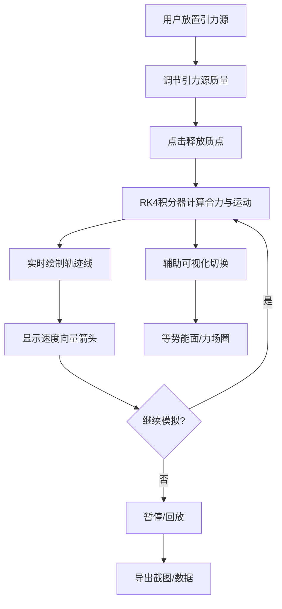

## 1. 产品概述

VortexPath 是一个交互式三维质点运动轨迹可视化应用，面向线上物理教学平台，帮助用户直观理解平面内质点在多个引力源作用下的受力与运动轨迹关系。用户可在二维平面上放置可调质量的引力源（支持正负质量/引力与斥力），释放测试质点后实时模拟并绘制其运动轨迹，配合速度向量、等势能面等辅助可视化，使抽象的物理概念变得可感知、可交互。

- 目标用户：物理教师、学生、物理爱好者
- 核心价值：将抽象的万有引力场与质点运动关系转化为直观、可操作的交互体验

## 2. 核心功能

### 2.1 功能模块

1. **主场景页**：3D渲染画布 + 左侧控制面板，承载全部交互与可视化

### 2.2 页面详情

| 页面名称 | 模块名称 | 功能描述 |
|----------|----------|----------|
| 主场景页 | 3D渲染画布 | 三维场景渲染网格地面、引力源、质点轨迹线、速度向量箭头、等势能面网格、力场指示圈 |
| 主场景页 | 控制面板 | 引力源添加/删除、质量调节滑块、质点释放按钮、暂停/继续、重置、速度缩放滑块、时间轴回放、等势能面切换、截图导出、轨迹数据导出 |
| 主场景页 | 交互区域 | 点击画布放置引力源、拖动已有引力源调整位置、点击设置质点起始位置 |

## 3. 核心流程

1. 用户在网格平面上点击放置引力源，通过面板调节每个引力源的质量（-10到10整数，负值为排斥力）
2. 点击"释放质点"按钮，从原点（或用户指定的点击位置）释放测试质点
3. 系统使用RK4积分器实时计算所有引力源合力下的质点运动轨迹
4. 轨迹线根据速度大小从蓝色渐变到红色，速度向量以箭头实时显示
5. 用户可暂停/继续模拟、调整速度缩放、通过时间轴回放轨迹历史
6. 可切换显示等势能面网格和力场指示圈辅助理解
7. 支持导出当前视角截图（PNG）和轨迹数据（JSON）

## 4. 用户界面设计

### 4.1 设计风格

- 主题：深色科技风格
- 主色调：深色背景 #1a1a2e，网格 #2d2d44
- 强调色：霓虹青色系 #00d4ff（主）、#33e0ff（悬停）、#00a8cc（点击）
- 按钮风格：圆角12px，霓虹青色，悬浮阴影
- 控制面板：玻璃态毛玻璃效果（rgba(255,255,255,0.08)背景，模糊滤镜15px，rgba(255,255,255,0.2)边框）
- 字体：科技感显示字体 + 清晰的正文字体
- 布局：左侧面板（320px，可折叠至60px）+ 右侧3D画布

### 4.2 页面设计概览

| 页面名称 | 模块名称 | UI元素 |
|----------|----------|--------|
| 主场景页 | 控制面板 | 毛玻璃背景、霓虹青色按钮、质量滑块（带数值显示）、图标按钮（添加/删除）、可折叠/展开、速度缩放滑块 |
| 主场景页 | 3D画布 | 深色背景、灰色坐标网格（带标签）、引力源球体（正质量青色/负质量红色）、质点白色小球、轨迹线（蓝到红渐变）、速度箭头、半透明等势能面、力场指示圈 |
| 主场景页 | 时间轴 | 底部滑动条，可拖动查看任意时刻质点位置 |

### 4.3 响应式设计

- 桌面优先（1366x768以上分辨率自适应）
- 左侧面板可折叠/展开（折叠时仅显示图标，宽度60px）
- 3D画布自适应填充剩余空间

### 4.4 3D场景指导

- 环境：深色空间感背景，微弱环境光
- 光照：方向光 + 环境光，避免过亮破坏深色氛围
- 相机：透视相机，可鼠标旋转/缩放/平移（OrbitControls）
- 焦点元素：引力源球体（发光效果）、轨迹线（速度渐变色）
- 交互：鼠标点击放置、拖拽移动、滚轮缩放
- 后期效果：引力源可加发光(Bloom)效果增强视觉冲击
