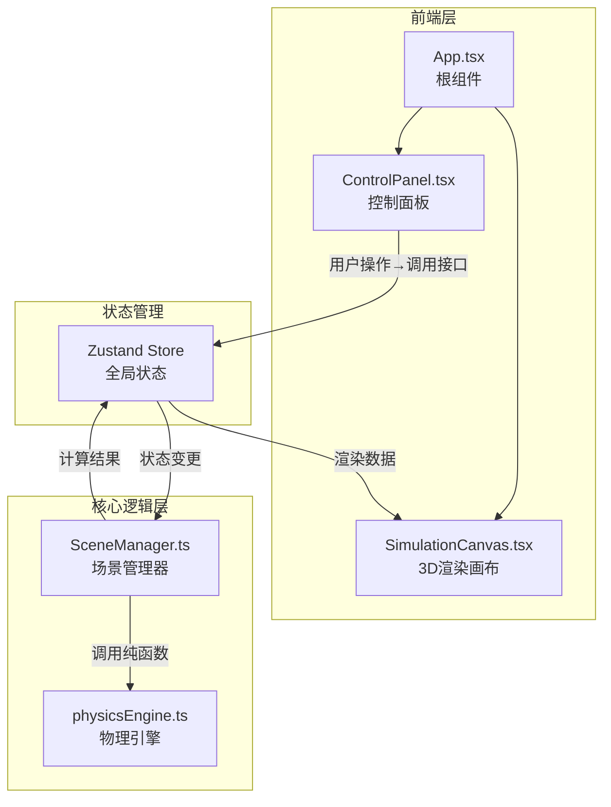

## 1. 架构设计



数据流向：用户输入（ControlPanel）→ Zustand Store → SceneManager（读取配置、计算轨迹）→ physicsEngine（纯函数计算）→ Store更新 → SimulationCanvas（渲染更新）

## 2. 技术说明

- 前端框架：React 18 + TypeScript
- 3D渲染：Three.js + @react-three/fiber + @react-three/drei
- 状态管理：Zustand
- 构建工具：Vite
- 样式方案：Tailwind CSS + CSS变量
- 物理计算：自定义RK4积分器（纯函数，无副作用）
- 初始化工具：vite-init (react-ts模板)

## 3. 路由定义

| 路由 | 用途 |
|------|------|
| / | 主场景页，承载全部交互与可视化 |

单页应用，无需多路由。

## 4. 文件结构与调用关系

```
├── package.json
├── vite.config.js          ← 构建配置，路径别名@/src，端口3000
├── tsconfig.json            ← 严格模式，ES2020，jsx: react-jsx
├── index.html               ← 入口HTML，全屏渲染
├── src/
│   ├── App.tsx              ← 根组件，组合ControlPanel和SimulationCanvas
│   ├── main.tsx             ← React入口，挂载App
│   ├── components/
│   │   ├── SimulationCanvas.tsx  ← Three.js 3D渲染器
│   │   │                        ← 调用: Store(读取引力源/质点/轨迹数据)
│   │   │                        ← 被调: App.tsx
│   │   ├── ControlPanel.tsx     ← 控制面板UI
│   │   │                        ← 调用: Store(读写引力源/质点/模拟状态)
│   │   │                        ← 被调: App.tsx
│   │   ├── GravitySourceMesh.tsx ← 单个引力源3D渲染
│   │   ├── ParticleMesh.tsx      ← 单个质点3D渲染
│   │   ├── TrajectoryLine.tsx    ← 轨迹线渲染
│   │   ├── VelocityArrow.tsx     ← 速度向量箭头
│   │   ├── PotentialGrid.tsx     ← 等势能面网格
│   │   ├── FieldIndicator.tsx    ← 力场指示圈
│   │   └── TimelineSlider.tsx    ← 时间轴回放滑块
│   ├── core/
│   │   └── SceneManager.ts      ← 核心物理场景管理
│   │                           ← 调用: physicsEngine.ts(RK4积分/合力计算)
│   │                           ← 被调: Store/useSimulation hook
│   ├── utils/
│   │   └── physicsEngine.ts     ← 物理引擎纯函数
│   │                           ← 被调: SceneManager.ts
│   └── store/
│       └── useSimulationStore.ts ← Zustand全局状态
│                                 ← 被调: 所有组件
```

## 5. 核心数据模型

### 5.1 引力源 (GravitySource)

```typescript
interface GravitySource {
  id: string;
  position: [number, number]; // x, z坐标（平面内）
  mass: number; // -10到10整数，负值产生排斥力
}
```

### 5.2 测试质点 (Particle)

```typescript
interface Particle {
  id: string;
  position: [number, number]; // 当前x, z位置
  velocity: [number, number]; // 当前速度分量
  trajectory: [number, number, number][]; // 轨迹历史 [x, z, speed]
  startTime: number; // 释放时间戳
  active: boolean; // 是否仍在运动
}
```

### 5.3 模拟状态 (SimulationState)

```typescript
interface SimulationState {
  gravitySources: GravitySource[];
  particles: Particle[];
  isRunning: boolean;
  speedScale: number; // 0.1到5
  showPotentialGrid: boolean;
  showFieldIndicators: boolean;
  playbackTime: number; // 回放时间轴位置
  panelCollapsed: boolean;
}
```

### 5.4 物理引擎接口 (physicsEngine)

```typescript
// 计算某点所受合力
function computeNetForce(
  position: [number, number],
  sources: GravitySource[]
): [number, number];

// RK4积分单步推进
function rk4Step(
  position: [number, number],
  velocity: [number, number],
  sources: GravitySource[],
  dt: number // 默认0.01秒
): { position: [number, number]; velocity: [number, number] };

// 计算某点势能
function computePotential(
  position: [number, number],
  sources: GravitySource[]
): number;
```
