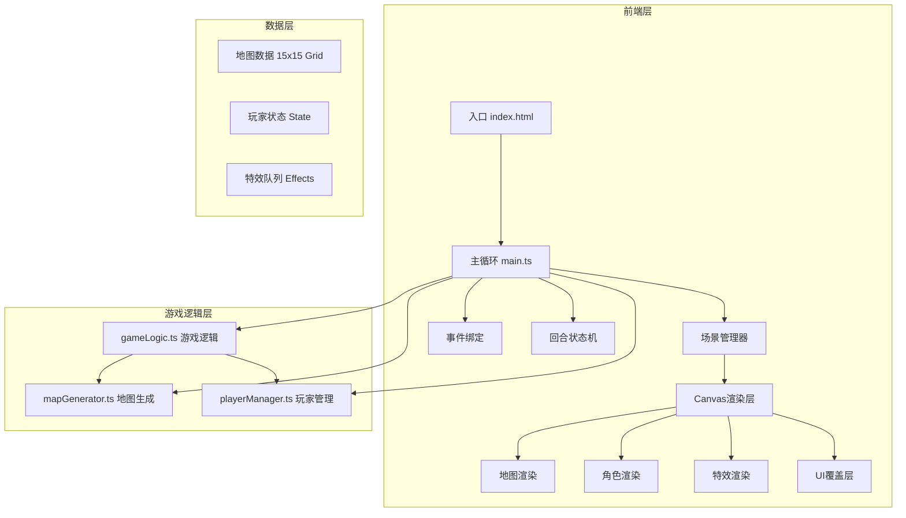

## 1. 架构设计



## 2. 技术描述

- **前端**：TypeScript + Vite + Canvas API（无框架，纯Canvas渲染）
- **构建工具**：Vite 5.x
- **语言**：TypeScript 5.x（严格模式，ES2020）
- **渲染**：HTML5 Canvas 2D API
- **音频**：Web Audio API（警报声、攻击音效）

**项目依赖**：
```json
{
  "devDependencies": {
    "typescript": "^5.0.0",
    "vite": "^5.0.0"
  }
}
```

## 3. 文件结构

| 文件 | 职责 |
|------|------|
| `package.json` | 项目依赖与脚本配置 |
| `index.html` | 入口页面，Canvas容器与UI结构 |
| `tsconfig.json` | TypeScript严格模式配置 |
| `vite.config.js` | Vite构建配置 |
| `src/main.ts` | 游戏主循环、场景初始化、事件绑定、状态机 |
| `src/mapGenerator.ts` | 15x15网格地图生成、元素分布逻辑 |
| `src/playerManager.ts` | 双玩家状态管理、属性计算、背包系统 |
| `src/gameLogic.ts` | 回合逻辑、移动计算、战斗判定、陷阱效果 |
| `src/types.ts` | 全局类型定义（可选） |
| `src/utils.ts` | 工具函数（可选） |

## 4. 核心数据模型

### 4.1 地图格子类型
```typescript
enum TileType {
  EMPTY = 0,      // 空地
  OBSTACLE = 1,   // 障碍物（不可通过）
  COVER = 2,      // 掩体（50%减伤）
  TRAP = 3,       // 警报陷阱
  CHEST = 4       // 宝箱
}

interface MapTile {
  type: TileType;
  revealed: boolean;       // 是否已探索
  trapTriggered: boolean;  // 陷阱是否已触发
  chestCollected: boolean; // 宝箱是否已收集
}

type GameMap = MapTile[][]; // 15x15
```

### 4.2 玩家状态
```typescript
interface Player {
  id: 1 | 2;
  x: number;
  y: number;
  targetX: number;
  targetY: number;
  hp: number;              // 初始100
  maxHp: number;
  attack: number;          // 基础10
  stealth: boolean;        // 潜行状态
  turnsWithoutMoving: number;
  inventory: Item[];       // 背包
  stats: PlayerStats;
  color: string;
  heroType: 1 | 2;
  extraAction: boolean;    // 额外行动机会
  revealed: boolean;       // 被警报暴露
  revealTimer: number;     // 暴露剩余时间
}

interface PlayerStats {
  totalMoves: number;
  totalAttacks: number;
  chestsCollected: number;
}
```

### 4.3 特效系统
```typescript
interface Particle {
  x: number;
  y: number;
  vx: number;
  vy: number;
  life: number;
  maxLife: number;
  color: string;
  size: number;
}

interface Effect {
  type: 'trail' | 'slash' | 'alert' | 'pickup' | 'stealth';
  x: number;
  y: number;
  duration: number;
  elapsed: number;
  playerId: 1 | 2;
  data?: any;
}
```

## 5. 核心算法

### 5.1 BFS移动范围计算
```
输入: 玩家位置(x,y), 最大移动距离(3), 地图
输出: 可到达格子集合
1. 初始化队列，起点入队，距离0
2. BFS遍历，每层距离+1
3. 检查相邻格子：非障碍物、未越界、未访问
4. 距离<=3的格子加入结果集
```

### 5.2 战斗伤害计算
```
基础伤害 = 攻击者攻击力
if 攻击者潜行: 伤害 *= 0.5
if 防御者在掩体后(上回合未移动且在掩体上): 伤害 *= 0.5
if 防御者潜行: 伤害 *= 0.5
最终伤害 = floor(基础伤害)
```

### 5.3 潜行状态判定
```
每回合开始时:
if 玩家连续2回合未移动且未攻击:
    进入潜行状态（半透明、星光特效）
if 玩家移动或攻击:
    解除潜行状态
    turnsWithoutMoving = 0
else:
    turnsWithoutMoving += 1
```

## 6. 性能优化策略

1. **对象池模式**：Particle和Effect对象复用，避免GC
2. **离屏渲染**：地图静态元素缓存到离屏Canvas
3. **脏矩形渲染**：仅重绘变化区域
4. **空间索引**：碰撞检测使用网格空间划分
5. **帧率控制**：使用requestAnimationFrame，逻辑与渲染分离
6. **CSS transform**：Canvas缩放使用GPU加速
