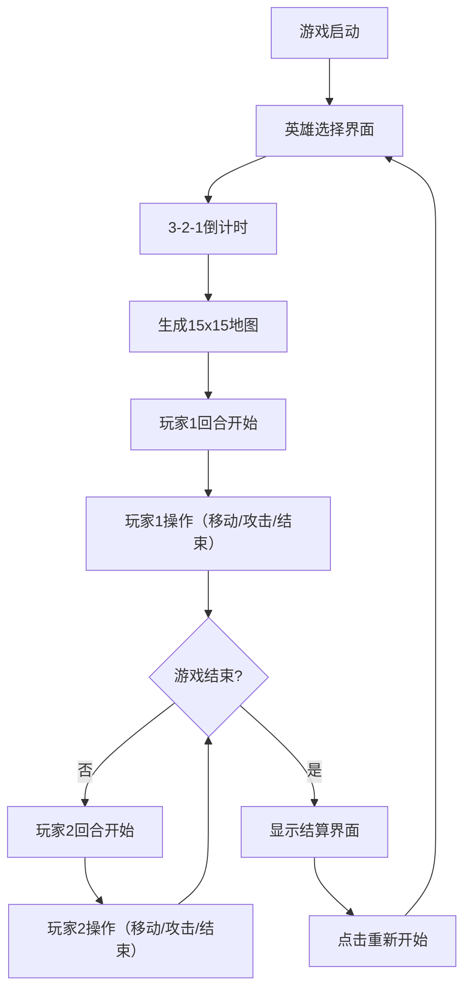

## 1. 产品概述

EchoPhase 是一款双人回合制潜行对战游戏，两位玩家在俯视网格地图上控制刺客角色，利用掩体进行潜行、移动和攻击，通过策略性地使用地图元素（掩体、陷阱、宝箱）来击败对手。

- 核心玩法：回合制潜行对战，强调战术移动和利用环境优势
- 目标用户：喜欢策略对战和潜行类游戏的玩家
- 市场价值：提供纯粹的本地双人对战体验，结合潜行机制与回合制策略

## 2. 核心功能

### 2.1 用户角色

| 角色 | 参与方式 | 核心能力 |
|------|----------|----------|
| 玩家1 | 本地键盘控制（WASD） | 移动、攻击、潜行、拾取宝箱 |
| 玩家2 | 本地键盘控制（方向键） | 移动、攻击、潜行、拾取宝箱 |

### 2.2 功能模块

1. **游戏主界面**：15x15网格地图、角色渲染、特效渲染、UI覆盖层
2. **地图生成系统**：随机生成障碍物、掩体、警报陷阱、宝箱
3. **回合管理系统**：玩家轮流操作、行动点数管理、回合切换
4. **战斗系统**：移动范围计算、攻击判定、伤害计算、潜行减伤
5. **交互系统**：宝箱拾取、陷阱触发、道具效果
6. **游戏结束系统**：胜负判定、统计展示、重新开始

### 2.3 页面详情

| 页面名称 | 模块名称 | 功能描述 |
|-----------|-------------|---------------------|
| 游戏主界面 | 地图渲染 | 15x15网格地图，含障碍物、掩体、陷阱、宝箱 |
| 游戏主界面 | 角色系统 | 双玩家角色渲染、平滑移动、攻击动画、潜行特效 |
| 游戏主界面 | UI面板 | 回合信息、生命值、背包物品、行动提示 |
| 游戏主界面 | 特效系统 | 拖尾粒子、刀光、红圈警报、拾取特效 |
| 游戏结束界面 | 结算面板 | 胜利展示、统计信息、重新开始按钮 |
| 开始界面 | 英雄选择 | 2种像素风格角色选择、倒计时动画 |

## 3. 核心流程

## 4. 用户界面设计

### 4.1 设计风格
- **主色调**：深灰到黑色渐变背景，暗色哥特风格
- **强调色**：玩家1蓝色（#4A90D9）、玩家2红色（#D94A4A）、掩体灰蓝色（#5A6B7A）、宝箱琥珀色（#D4A853）、陷阱红色（#FF4444）
- **字体**：等宽像素风格字体，白色带微光效果
- **UI风格**：半透明毛玻璃效果面板，圆角设计
- **特效**：粒子拖尾、刀光动画、闪烁红圈、星光闪烁

### 4.2 页面设计概述

| 页面名称 | 模块名称 | UI元素 |
|-----------|-------------|-------------|
| 游戏主界面 | 地图区域 | 15x15网格、渐变背景、雾效边缘、障碍物/掩体/陷阱/宝箱渲染 |
| 游戏主界面 | 左侧UI | 玩家1信息面板（生命值、潜行状态、背包、统计） |
| 游戏主界面 | 右侧UI | 玩家2信息面板（生命值、潜行状态、背包、统计） |
| 游戏主界面 | 底部UI | 当前回合提示、操作说明、结束回合按钮 |
| 游戏主界面 | 角色 | 彩色像素风格、平滑移动动画、拖尾粒子、潜行半透明星光 |
| 游戏结束界面 | 结算面板 | 渐入动画、胜利玩家展示、统计数据、重新开始按钮 |
| 开始界面 | 英雄选择 | 2种角色预览、选择按钮、倒计时动画 |

### 4.3 响应式
- 桌面优先设计，适配1920x1080分辨率
- UI元素使用固定比例定位，窗口缩放时保持相对位置
- Canvas使用CSS缩放保持显示比例

### 4.4 性能优化
- 主循环维持60FPS
- 粒子系统使用对象池避免频繁GC
- 地图渲染使用离屏Canvas缓存
- 碰撞检测优化为单帧5ms内完成
