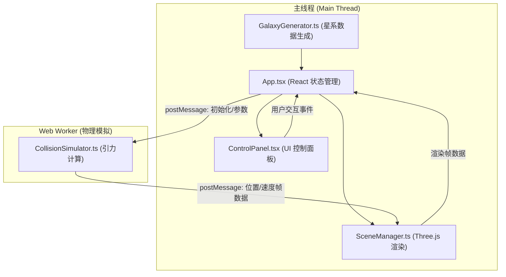

## 1. 架构设计



## 2. 技术说明
- **前端框架**：React@18 + TypeScript@5
- **构建工具**：Vite@5 + @vitejs/plugin-react
- **三维渲染**：Three.js@0.160 + @types/three
- **物理计算**：Web Worker 独立线程，简化 N-body 引力模型
- **状态管理**：React useState/useRef（轻量场景，无需 Zustand）
- **样式方案**：内联 CSS-in-JS + 原生 CSS（避免额外依赖）

## 3. 文件结构定义
| 路径 | 职责 |
|------|------|
| `src/core/GalaxyGenerator.ts` | 星系生成：根据参数生成恒星位置、速度、质量、颜色初始数据 |
| `src/core/CollisionSimulator.ts` | Web Worker：引力物理模拟，每帧计算加速度/位置/速度更新 |
| `src/rendering/SceneManager.ts` | Three.js 场景管理：相机、渲染器、粒子系统、轨迹线、背景星空 |
| `src/ui/ControlPanel.tsx` | React 控制面板组件：参数输入、滑块、按钮、悬停动画 |
| `src/ui/App.tsx` | React 根组件：全局状态、模块协调、Worker 消息通信 |
| `src/main.tsx` | React 入口：挂载 DOM |
| `src/index.css` | 全局样式：毛玻璃面板、按钮、滑块 |
| `index.html` | Vite 入口页面 |
| `vite.config.js` | Vite 配置：路径别名 @ → src |
| `tsconfig.json` | TypeScript 配置：严格模式、ES2020 |

## 4. 核心数据类型

```typescript
interface StarData {
  x: number; y: number; z: number;
  vx: number; vy: number; vz: number;
  mass: number;
  galaxy: 0 | 1; // 0=星系A(蓝), 1=星系B(橙)
}

interface GalaxyParams {
  starCount: number;       // 100-500
  morphology: 'spiral' | 'elliptical';
  rotation: 'cw' | 'ccw';
}

interface SimulationParams {
  collisionAngle: number;  // 0-180 度
  relativeSpeed: number;   // 50-200
}

type SimStatus = 'idle' | 'running' | 'paused' | 'finished';
```

## 5. Worker 通信协议

**主线程 → Worker:**
```typescript
{ type: 'init'; stars: StarData[]; params: SimulationParams }
{ type: 'start' }
{ type: 'pause' }
{ type: 'reset'; stars: StarData[]; params: SimulationParams }
```

**Worker → 主线程:**
```typescript
{ type: 'frame'; positions: Float32Array; velocities: Float32Array; elapsed: number }
{ type: 'finished' }
```

## 6. 物理模型说明
- **引力公式（简化）**：对每颗恒星，累加其他所有恒星的引力加速度 `a = G * Σ(mj * r̂ij / |rij|² + ε²)`，软ening因子 `ε=2` 避免奇点
- **Barnes-Hut 优化**：粒子数 ≤ 1000 时使用 O(N²) 直接求和（保证精度与简洁），满足 30 FPS 性能要求
- **积分器**：半隐式欧拉（Semi-implicit Euler），dt 固定 1/60 秒
- **模拟时长**：60 秒 = 3600 帧
- **轨迹缓存**：主线程维护每颗粒子最近 300 帧（5秒 @60fps）的位置环形缓冲区
