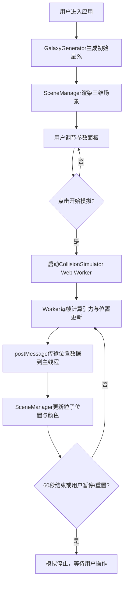

## 1. 产品概述

星系碰撞三维可视化模拟器，面向天文爱好者、学生和科普教育场景，通过交互式三维渲染实时展示两个星系在引力作用下的碰撞、潮汐尾形成与融合过程。用户可自由调节星系数目、分布形态、碰撞角度与速度，沉浸式体验宇宙动力学的视觉奇观。

## 2. 核心功能

### 2.1 用户角色
| 角色 | 注册方式 | 核心权限 |
|------|----------|----------|
| 访客用户 | 无需注册 | 浏览场景、调节参数、启动/暂停/重置模拟 |

### 2.2 功能模块
1. **主场景页面**：深空背景三维画布、实时粒子渲染、相机交互控制
2. **控制面板**：星系参数配置、碰撞参数滑块、模拟控制按钮、视角控制

### 2.3 页面详情
| 页面名称 | 模块名称 | 功能描述 |
|----------|----------|----------|
| 主场景 | 三维画布 | Three.js渲染星系粒子、实时物理模拟、背景星光 |
| 主场景 | 相机控制 | 鼠标拖拽旋转、滚轮缩放、右键平移、平滑跟随碰撞中心 |
| 控制面板 | 星系A配置 | 恒星数量(100-500)、分布形态(螺旋/椭圆)、旋转方向(顺/逆) |
| 控制面板 | 星系B配置 | 恒星数量(100-500)、分布形态(螺旋/椭圆)、旋转方向(顺/逆) |
| 控制面板 | 碰撞参数 | 碰撞角度滑块(0-180°)、相对速度滑块(50-200) |
| 控制面板 | 模拟控制 | 开始/暂停/重置按钮、视角复位按钮、轨迹模式切换 |

## 3. 核心流程

用户打开应用 → 默认生成两个星系（相距200单位）→ 用户调节星系参数与碰撞参数 → 点击"开始模拟" → Web Worker实时计算引力物理 → 场景渲染粒子运动与轨迹 → 用户可随时暂停/重置/切换视角 → 模拟60秒后自动结束。

## 4. 用户界面设计

### 4.1 设计风格
- **主色调**：深空黑 `#05060F` 背景，蓝色系 `RGB(50,100,255)` 星系A，橙色系 `RGB(255,150,50)` 星系B
- **辅助色**：粒子根据速率从冷色(蓝)渐变到暖色(红)，轨迹半透明渐变
- **按钮样式**：圆角矩形，毛玻璃半透明背景，悬停上浮2px动画（200ms过渡）
- **字体**：现代无衬线字体，数值标签使用等宽字体
- **布局风格**：全屏沉浸式画布 + 右下角悬浮控制面板（毛玻璃模糊10px）

### 4.2 页面设计概览
| 页面名称 | 模块名称 | UI元素 |
|----------|----------|--------|
| 主场景 | 三维画布 | 黑色深空背景、稀疏星光粒子、发光恒星点、可选轨迹线、平滑相机动画 |
| 主场景 | 控制面板 | 半透明白色毛玻璃面板、滑块控件、数字输入框、功能按钮、分组折叠 |

### 4.3 响应式
桌面优先设计，在 1920×1080 与 1280×720 分辨率下完整显示。控制面板宽度固定320px，内部布局自适应面板高度。

### 4.4 3D场景指引
- **环境**：纯黑深空背景 + 200颗随机分布的背景星光点精灵
- **光照**：使用 PointsMaterial 的自发光颜色 + Additive Blending，无需额外光源
- **相机**：PerspectiveCamera (fov 60)，初始位置 (0, 80, 300)，OrbitControls 交互，目标点平滑缓动跟随两星系中心（0.8秒缓动）
- **渲染优化**：BufferGeometry 批量渲染粒子，FrustumCulled 关闭，PixelRatio 限制 ≤2
- **后期**：可选 Bloom 效果增强辉光感，保证性能前提下启用
