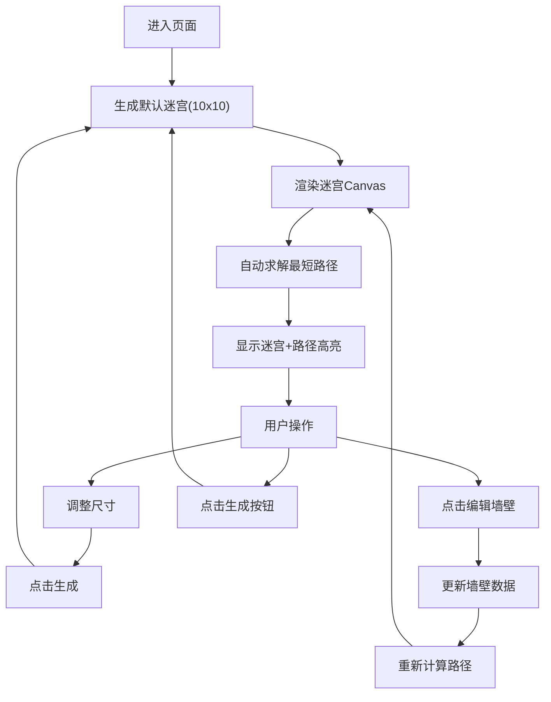

## 1. 产品概述

PixelMaze是一款在线迷宫生成与解谜应用，用户可随机生成可交互迷宫、手动编辑墙壁布局，并自动获得最短路径可视化提示。

- 核心用途：迷宫游戏娱乐、算法可视化教学、迷宫设计工具
- 目标用户：编程学习者、游戏爱好者、算法研究者
- 产品价值：结合美观的视觉效果与流畅的交互体验，将枯燥的路径搜索算法以动态可视化方式呈现

## 2. 核心功能

### 2.1 用户角色

| 角色 | 注册方式 | 核心权限 |
|------|----------|----------|
| 普通用户 | 无需注册 | 全部功能：生成迷宫、编辑墙壁、查看路径 |

### 2.2 功能模块

1. **迷宫生成模块**：基于DFS回溯算法随机生成迷宫，支持5x5至20x20尺寸调节
2. **迷宫编辑模块**：鼠标左键添加墙壁、右键删除墙壁，带平滑动画与波纹效果
3. **路径求解模块**：基于BFS算法求解最短路径，带探索过程可视化
4. **Canvas渲染模块**：径向渐变背景、发光墙壁、流动金色路径、动画效果
5. **控制面板模块**：尺寸选择器、生成按钮、状态显示

### 2.3 页面详情

| 页面名称 | 模块名称 | 功能描述 |
|----------|----------|----------|
| 主应用页 | 顶部工具栏 | 迷宫尺寸下拉选择器(5-20)、"生成新迷宫"圆角发光按钮 |
| 主应用页 | Canvas迷宫区域 | 全屏Canvas，深蓝→黑紫径向渐变背景，承载迷宫渲染与交互 |
| 主应用页 | 路径求解系统 | 自动求解并高亮BFS最短路径，带探索格子闪烁动画 |
| 主应用页 | 编辑交互系统 | 左键加墙、右键删墙，200ms平滑过渡，点击波纹扩散效果 |

## 3. 核心流程

用户进入页面后自动生成默认尺寸迷宫，可调节尺寸后点击按钮重新生成，通过点击编辑迷宫布局，系统实时重新计算并可视化最短路径。

## 4. 用户界面设计

### 4.1 设计风格

- **主色调**：深蓝(#0a0e27) → 黑紫(#1a0a2e) 径向渐变背景
- **辅助色**：银灰墙壁(#b8c0d4)带白色辉光、流动金色(#ffd700→#ffaa00)路径、半透明蓝(#4aa8ff)探索格
- **按钮风格**：圆角矩形(12px)，背景半透明深蓝，悬停时蓝紫光晕外发光，金色文字
- **字体**：采用现代无衬线字体，标题加粗，正文中等字重
- **布局**：顶部固定工具栏(高度64px) + 下方全屏Canvas区域

### 4.2 页面设计概览

| 页面名称 | 模块名称 | UI元素 |
|----------|----------|--------|
| 主应用页 | 工具栏 | 半透明深蓝背景、毛玻璃模糊、内阴影、标签"迷宫尺寸"、下拉选择器、发光按钮"生成新迷宫" |
| 主应用页 | 迷宫Canvas | 径向渐变背景、银灰发光墙壁、金色流光路径、蓝色闪烁探索格、点击波纹动画 |
| 主应用页 | 交互反馈 | 墙壁200ms淡入淡出、鼠标悬停墙壁高亮、路径流光随时间流动 |

### 4.3 响应式

- 桌面端优先设计
- Canvas迷宫区域自适应窗口高度（减去工具栏）
- 迷宫单元格尺寸根据窗口尺寸动态计算，保持居中与正方形比例
- 工具栏元素横向排列，最小宽度支持到1024px

### 4.4 性能约束

- 20x20迷宫BFS求解时间 ≤ 100ms
- 每次墙壁编辑后重算+重绘 ≤ 50ms
- Canvas渲染使用requestAnimationFrame驱动动画
- 墙体带有轻微随机偏移，路径视觉更自然
