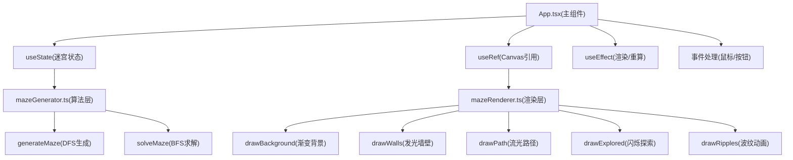

## 1. 架构设计



## 2. 技术描述

- **前端框架**：React 18 + TypeScript 5（严格模式）
- **构建工具**：Vite 5 + @vitejs/plugin-react
- **渲染方案**：HTML5 Canvas 2D API（非DOM，高性能）
- **状态管理**：React useState/useRef/useEffect（轻量，无需zustand）
- **样式方案**：原生CSS + CSS变量（无需tailwindcss）
- **动画驱动**：requestAnimationFrame + CSS transitions
- **算法实现**：DFS回溯生成 + BFS最短路径搜索

## 3. 核心文件定义

### 3.1 文件结构

| 文件路径 | 职责 |
|----------|------|
| `package.json` | 依赖声明：react, react-dom, typescript, vite, @vitejs/plugin-react |
| `index.html` | Vite入口，挂载#app节点，引入Google Fonts |
| `tsconfig.json` | strict:true, 目标ES2020, 模块Resolution:bundler |
| `vite.config.js` | 基础Vite配置+React插件 |
| `src/main.tsx` | React入口，挂载App到DOM |
| `src/App.tsx` | 主组件：游戏状态、事件系统、UI面板、渲染调度 |
| `src/mazeGenerator.ts` | 迷宫生成(DFS回溯)与求解(BFS)算法，墙壁随机偏移数据 |
| `src/mazeRenderer.ts` | Canvas渲染：背景、墙壁辉光、路径流光、探索闪烁、波纹扩散 |
| `src/styles.css` | 全局样式：工具栏、按钮、选择器、布局 |

### 3.2 数据结构

```typescript
interface Cell {
  x: number;
  y: number;
  walls: { top: boolean; right: boolean; bottom: boolean; left: boolean };
  wallOffsets: { top: number; right: number; bottom: number; left: number };
}

interface MazeState {
  grid: Cell[][];
  width: number;
  height: number;
  start: { x: number; y: number };
  end: { x: number; y: number };
}

interface SolveResult {
  path: Array<{ x: number; y: number }>;
  explored: Array<{ x: number; y: number }>;
  found: boolean;
}

interface Ripple {
  x: number;
  y: number;
  radius: number;
  opacity: number;
  startTime: number;
}
```

## 4. 核心算法定义

### 4.1 迷宫生成（DFS回溯）

```
函数 generateMaze(width, height):
  初始化所有单元格四面有墙
  stack = [起始单元格]
  visited = 集合{起始单元格}
  while stack非空:
    current = stack顶
    neighbors = current未访问的相邻格
    if neighbors非空:
      next = 随机选一个neighbor
      移除current与next之间的墙
      为4面墙生成[-1.5, 1.5]像素随机偏移
      visited加入next
      push next到stack
    else:
      pop stack
  设置start=(0,0), end=(width-1, height-1)
  返回MazeState
```

### 4.2 最短路径求解（BFS）

```
函数 solveMaze(maze):
  queue = [maze.start]
  cameFrom = Map()
  explored = []
  visited = 集合{maze.start}
  while queue非空:
    current = 队列首
    explored.push(current)
    if current == maze.end:
      break
    for 每个无墙阻挡的相邻格next:
      if next未访问:
        visited.add(next)
        cameFrom.set(next, current)
        queue.push(next)
  回溯cameFrom重建path
  返回SolveResult{path, explored, found}
```

## 5. 渲染流程（mazeRenderer.ts）

每帧（requestAnimationFrame）按顺序绘制：

1. **drawBackground(ctx, w, h, t)**
   - 径向渐变：中心深蓝→外围黑紫，时间t驱动轻微色漂
2. **drawWalls(ctx, maze, cellSize, offsetX, offsetY, wallAnimStates, t)**
   - 每面墙先绘制辉光(shadowBlur=12, shadowColor=rgba(255,255,255,0.3))
   - 再绘制银灰墙体，带偏移值
   - 根据wallAnimStates{0..1}插值透明度，实现200ms淡入淡出
3. **drawExplored(ctx, maze, explored, cellSize, offsetX, offsetY, t)**
   - 半透明蓝色填充，sin(t*2π*2)驱动0.5s闪烁
4. **drawPath(ctx, path, cellSize, offsetX, offsetY, t)**
   - 金色线性渐变，t驱动相位流动
   - 线段宽度3px，端点圆角(lineCap=round)
5. **drawRipples(ctx, ripples, t)**
   - 圆圈扩散，半径线性增长，透明度线性衰减至0（500ms完成）

## 6. 事件系统（App.tsx）

| 事件 | 处理 |
|------|------|
| Canvas mousedown(e) | 左键：addWall；右键：removeWall；都添加ripple；阻止右键菜单 |
| 尺寸select change | 更新size状态 |
| "生成新迷宫"按钮click | 调用generateMaze → solveMaze → 触发重绘 |
| 墙壁编辑后 | solveMaze重新求解，wallAnimStates启动动画插值 |
| window resize | 重新计算cellSize/offsetX/Y，触发重绘 |
